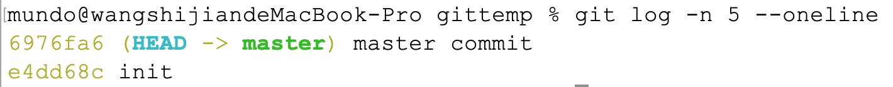

`git reset`命令用于重置`Git`仓库中的`HEAD`指针和暂存区的状态，常用于撤销提交、修改暂存状态或重写提交历史。该命令支持三种模式：`soft`、`mixed`（默认）和`hard`，下面我们将结合`Goland`演示这三种模式之间的差异。

### 1. `soft`模式

首先我们这里做了两次本地提交，第一次提交了`hello.go`文件，第二次提交了`duck.go`文件，使用`git reflog`查看操作记录：


使用`git log -n 5 --oneline`查看提交记录：


我们使用`soft`模式撤销最近两次本地提交，注意应使用这两次提交之前的提交的哈希值来进行操作：


命令如下所示：

```bash
git reset --soft 76d4ad5
```

在`soft`模式下，前两次提交涉及的文件会被“恢复”到暂存区，即处于`git add`后的状态。此时，可以直接执行`git commit`重新提交这些改动。在`Goland`中，工作区和暂存区没有明显区分，因此恢复后的状态是这样：


在查看了`git reflog`后，注意到下面这条`git reset`的操作记录：


接着使用`git log -n 5 --oneline`命令查看提交日志，发现之前的两条提交记录已经消失：


### 2. `mixed`模式

按照同样的步骤做两次提交，然后使用以下命令：

```sh
git reset <哈希值>
```

由于`mixed`模式是`git reset`的默认模式，所以可以不用加`--mixed`参数。使用的哈希值是这两次提交之前的提交的哈希值。

执行完成后，使用`git reflog`命令，看到这样的操作记录：


使用`git log`查看提交日志，发现两次提交记录已经消失：


在`mixed`模式下，前两次提交涉及的文件会被“恢复”到工作区，此时需要使用`git add`重新选择哪些文件添加到暂存区，然后再进行提交。在`GoLand`中，`Git`会将那些从暂存区移除的文件标记为`Unversioned Files`：


我们可以选择添加它们到`Git`管理，或者是丢弃它们：


### 3. `hard`模式

最后测试`hard`模式，使用以下的命令：

```sh
git reset --hard <哈希值>
```

这两次提交涉及的文件彻底被清除，不会出现在`commit`栏中：


### 4. 注意事项

如果在`git commit`后执行了`push`操作，那么`reset`操作只会影响本地，不会改变远程状态。然而，由于已经撤回了提交记录，下一次推送到远程时，会因为远程有本地不存在的提交记录而被拒绝。在这种情况下，可以使用以下命令进行强制推送：

```bash
git push --force
```

因此，`git reset`适合撤回那种已经`commit`但是没有`push`的提交记录，也就是撤回本地仓库的推送。

`git reset`不仅可以回退`commit`，还可以回退通过`merge`或`cherry-pick`从其他分支引入的变更。要回退其他分支`merge`操作引入的内容，需要指定当前分支的最后一条提交记录的哈希值，例如下图所示：


在这种情况下，所指定的哈希值应对应当前分支（即`master`分支）上的最新提交，无需关注`feature`分支上的提交（即`feature commit 1`和`feature commit 2`）。当将`HEAD`重置为`6976fa6`这一提交时，`feature`分支上的这两条提交也将被回退：

