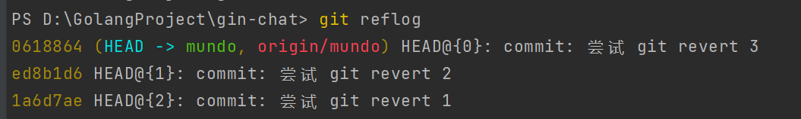
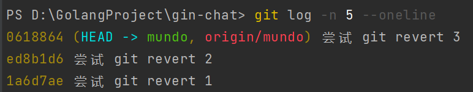
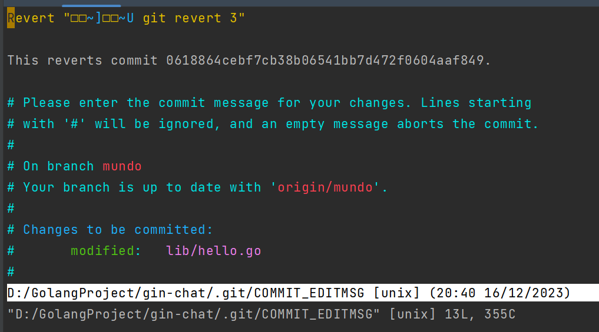
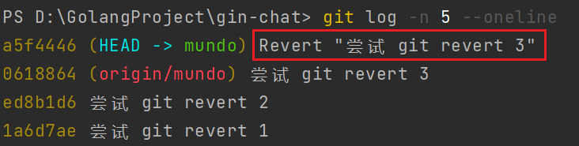
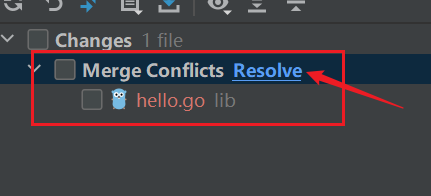
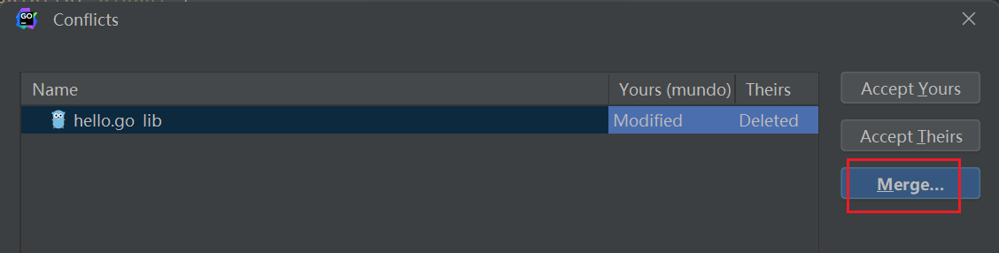

`git revert`用于撤销一个或多个已经`commit`和`push`的`Git`提交。它会创建一个新的提交，这个新提交是原有提交的逆操作，从而保留原有的提交记录。`git revert`是一种安全的回滚提交的方式。

我们进行了三次`commit`和`push`操作，可以通过`git reflog`查看这些提交记录：



`git log`查看的提交记录如下所示：



现在想撤销最近一条提交，使用下面命令（撤销哪条提交就使用哪条提交的哈希值）：

```bash
git revert 0618864
```

会出现一条类似的提示框，根据`Linux`下`vim`的退出操作，使用`:q`即可退出：



然后我们查看`git reflog`的结果，发现产生了一条新的`revert`记录：


`git log`中也是如此，产生了一条新的`revert`记录：



如果想撤回已经`push`到远程的提交，建议使用`git revert`代替`git reset`。`git revert`会在本地保留之前的提交记录，因此在再次`push`到远程时，不会出现因`git reset`操作而导致的提交拒绝问题。

如果要撤销剩余的两条提交，可以进行哈希值的多选：

```bash
git revert ed8b1d6 1a6d7ae
```

如果一开始就想一起撤销这三个提交，可以使用`^..`进行区间操作：

```bash
git revert <start-commit-SHA>^..<end-commit-SHA>
```

这里的顺序是：先提交的为`start`，后提交的为`end`。例如，若要撤销上面提到的三条提交，可以使用如下操作：

```
git revert 1a6d7ae^..0618864
```

每撤销一条提交时，都会出现需要使用`:q`退出的提示框，耐心操作即可。

当需要撤销的提交不是最近的一次，或者撤销的范围不包含最近的提交，或者中间跳过了某次提交时，可能会引发冲突问题。举个例子，如果三个提交都修改了同一个文件，撤销某个中间提交可能会导致冲突：



这里会弹出冲突文件，我们点击`resolve`，选择`merge`：



解决冲突后，我们使用下面命令，继续`revert`操作：

```bash
git revert --continue
```

当然，如果我们不想解决冲突，想撤回这次`revert`，也可以使用下面命令：

```bash
git revert --abort
```

如果有以下这样一个`merge`提交，其中`M`提交已经推送到远程仓库：

```mathematica
A --- B --- C ------- M  (release)
      \             /
       D --- E ----   (feature)
```

要使用`git revert`回滚这次操作，只需在`release`分支执行下面命令：

```sh
git revert -m 1 <M-hash>
```

或者可以使用如下命令代替：

```
git revert -m 1 HEAD
```

其中，`-m`用于指定父提交的序号：取值为`1`时，表示`merge`操作的目标分支，即`release`分支；取值为`2`时，表示被`merge`合并进来的分支，即`feature`分支。

回滚完成后，分支提交记录如下所示：

```mathematica
A --- B --- C ------ M --- R  (release)
      \            /
       D --- E ---   (feature)
```

其中，`R`是一个反向补丁提交。它会计算这次`merge`提交相对于指定父提交所引入的改动，再生成一组完全相反的改动，并将这组反向改动作为一条新的提交记录保存。接着我们正常推送该提交`R`到远程仓库即可。

不能使用`revert`操作回退`rebase`操作。因为`git revert`只能针对单个提交的内容差异生效，而`rebase`会生成一组新的提交，例如`D'`、`E'`。如果对这些提交逐个执行`revert`，会引入更多反向补丁，导致提交历史更加混乱。
