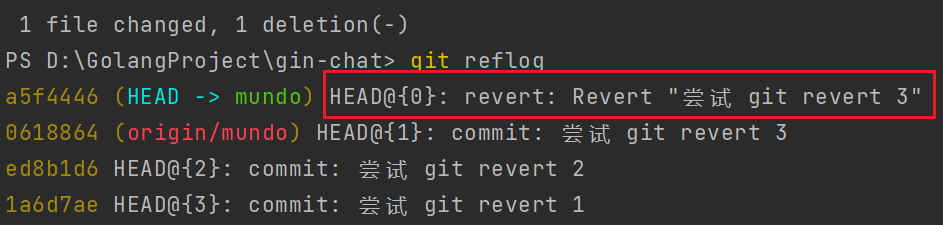
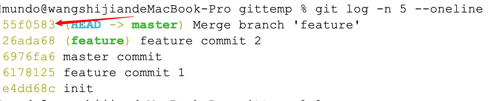
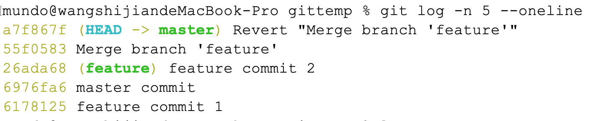

`git revert`用于撤销一个或多个已经`commit`和`push`的`Git`提交。它会创建一个新的提交，这个新提交是原有提交的逆操作，从而保留原有的提交记录。`git revert`是一种安全的回滚提交的方式。

我们进行了三次`commit`和`push`操作，可以通过`git reflog`和`git log`查看这些提交记录：


现在想撤销最近一条提交，使用下面命令（撤销哪条提交就使用哪条提交的哈希值）：

```bash
git revert 0618864
```

会出现一条类似的提示框，根据`Linux`下`vim`的退出操作，使用`:q`即可退出：


然后我们查看`git reflog`的结果，发现产生了一条新的`revert`记录：



`git log`中也是如此，产生了一条新的`revert`记录：


如果想撤回已经`push`到远程的提交，建议使用`git revert`代替`git reset`。`git revert`会在本地保留之前的提交记录，因此在再次`push`到远程时，不会出现因`git reset`操作而导致的提交拒绝问题。

如果要撤销剩余的两条提交，可以进行哈希值的多选：

```bash
git revert ed8b1d6 1a6d7ae
```

如果一开始就想一起撤销这三个提交，可以使用`^..`进行区间操作：

```bash
git revert <start-commit-SHA>^..<end-commit-SHA>
```

这里的顺序是：先提交的为`start`，后提交的为`end`。例如，若要撤销上面提到的三条提交，可以使用如下操作：

```
git revert 1a6d7ae^..0618864
```

每撤销一条提交时，都会出现需要使用`:q`退出的提示框，耐心操作即可。

当需要撤销的提交不是最近的一次，或者撤销的范围不包含最近的提交，或者中间跳过了某次提交时，可能会引发冲突问题。举个例子，如果三个提交都修改了同一个文件，撤销某个中间提交可能会导致冲突：


这里会弹出冲突文件，我们点击`resolve`，选择`merge`：


解决冲突后，我们使用下面命令，继续`revert`操作：

```bash
git revert --continue
```

当然，如果我们不想解决冲突，想撤回这次`revert`，也可以使用下面命令：

```bash
git revert --abort
```

如果要使用`git revert`回滚一个`merge`提交，只需回滚`merge`产生的合并提交标记，并带上`-m`参数，例如：



```sh
git revert -m 1 55f0583
```

其中，`-m`指定的是父提交的序号，一般来说，我们通常选择`-m 1`，因为我们通常要回滚当前分支的`merge`提交。

回滚完成后，再次查看操作记录，得到如下结果：



这样，`feature`分支上所有被`merge`到`master`分支的提交都已被回滚。

`git revert`会形成一条`commit`记录，