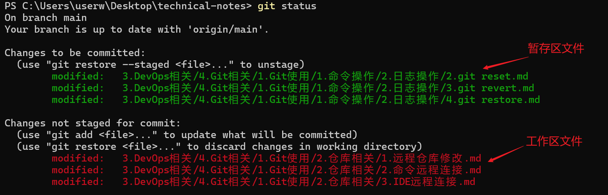

在讲解`git restore`命令之前，首先要理解下面这几个关键概念：

1. 工作区：任何对项目文件的修改都会直接反映在工作区中，它展示了计算机上实际的项目文件的变动。
2. 暂存区：又称为索引，是一个临时存储区域。通过使用`git add`命令，可以将指定的文件从工作区添加到暂存区。暂存区的存在使得用户能够灵活选择哪些更改应包含在下次提交（`commit`）中。
3. 本地仓库：存储在本地计算机上的完整项目版本库，包含项目的所有历史版本。每次使用`git commit`命令时，暂存区的内容会被提交到本地仓库中。用户可以通过`git log`命令查看本地仓库的提交历史。
4. 远程仓库：存储在服务器上的版本库，通常用于团队协作。用户可以将本地仓库的提交推送（`git push`）到远程仓库，也可以从远程仓库拉取（`git pull`）提交，并合并到本地仓库。常见的远程仓库托管服务包括`GitHub`、`GitLab`和`Gitee`等。

我们想回退所有在工作区的文件（也就是撤销文件修改）时，可以使用以下命令：

```sh
git restore .            # 撤销所有修改
git restore <file_name>  # 撤销指定文件修改（支持多选）
```

如果我们想把在暂存区的文件回退到工作区，可以使用以下命令：

```sh
git restore --staged .            # 撤销暂存区的所有文件
git restore --staged <file_name>  # 撤销暂存区指定文件（支持多选）
```

如果想直接一步到位，回退所有工作区、暂存区的文件，可以使用以下命令：

```sh
git reset --hard HEAD
```

我们可以使用下面的命令查看项目已修改文件在`Git`的哪个区域：

```sh
git status
```

展示的结果如下所示：



如果一个文件已经提交到本地或远程仓库，想从仓库中删除该文件，但要保留本地文件，可以使用以下命令：

```sh
git rm --cached <file_name>
```

如果要删除的是目录，需要添加`-r`参数以启用递归删除：

```sh
git rm -r --cached <dir_name>
```

通常情况下，执行此命令是为了删除本应添加到`.gitignore`中的文件或目录。然而，由于这些文件或目录已提交到仓库，需要先将其从仓库中移除，再将其添加到`.gitignore`文件中。这样可以将文件或目录在本地保留下来。
