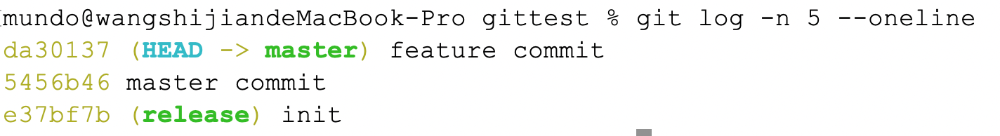

`git cherry-pick`命令用于选择其他分支某个提交并将其应用到当前分支上。与`git merge`合并整个分支不同，`git cherry-pick`只应用特定的提交到当前分支。

#### 1. 将某特性分支（`feature`）上的某个提交应用到主分支（`release`）上

首先，切换到主分支：

```bash
git checkout master
```

然后，查看特性分支上的提交历史，并找到要`cherry-pick`的提交的哈希值：

```bash
git log --oneline feature
```


最后，`cherry-pick`特性分支上的某个提交：

```bash
git cherry-pick <commit-hash>
```

#### 2. 一次选取多条提交

可以通过指定多个哈希值来一次性`cherry-pick`多个提交：

```bash
git cherry-pick <commit-hash1> <commit-hash2> <commit-hash3>
```

#### 3. 使用范围选择`cherry-pick`

使用范围选择将包括`start`和`end`提交（闭区间）：

```bash
git cherry-pick <start-commit>^..<end-commit>
```

#### 4. 处理冲突

如果出现冲突，`Git`会中止流程并提示冲突的文件。需要手动解决冲突，然后使用以下命令继续提交：

```bash
git cherry-pick --continue
```

或者使用以下命令放弃`cherry-pick`操作：

```bash
git cherry-pick --abort
```

#### 5. 注意事项

使用`cherry-pick`将`feature`分支某条提交合并到`master`后，这条提交记录会成为`master`最新的提交记录，而不是按照提交的时间顺序排列。例如，`feature`的提交在时间上在`master`的提交之前，但`cherry-pick`操作后，这条提交会成为`master`分支中最新的提交记录，即使它原本在时间上是较早的提交。


