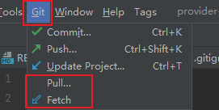
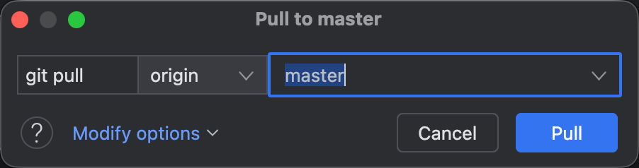
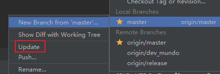

`fetch`的中文释义为「取来」。在本地执行`git fetch`命令时，`Git`会从远程仓库获取最新的提交，并更新本地的远程跟踪分支信息。通过该命令，我们可以在本地查看远程仓库的最新状态，同时不会影响当前的本地工作分支。需要注意的是，`git fetch`不会自动将远程分支的更新合并到本地分支中。如果需要将远程跟踪分支的最新内容合并到本地分支，则需要手动执行合并操作。

如果远程仓库新增或删除了分支，或者对已有分支进行了更新，这些变化也会同步反映到本地的远程跟踪分支中。换句话说，执行`git fetch`后，本地的远程跟踪分支信息会更新为远程仓库的最新状态。

通常，一个`Git`项目会关联一个远程仓库，默认情况下，该远程仓库通常被命名为`origin`。因此，`git fetch`可以理解为`git fetch origin`的简写形式。不过，在某些场景下，一个项目可能会关联多个远程仓库。如果需要从指定的远程仓库获取最新提交，就需要在命令中明确指定远程仓库名称，例如`git fetch origin`。

如果要获取所有远程仓库的最新提交，命令如下：

```sh
git fetch --all
```

`git fetch`操作也可以只更新一个具体分支的最新状态：

```
git fetch origin <branch-name>
```

`git pull`与`git fetch`的主要区别在于，`git pull`是一个复合操作。它会先确定当前检出分支所对应的远程分支，例如对应的远程分支为`origin/<branch-name>`，此时执行`git pull`，其效果等同于依次执行下面两个命令：

```sh
git fetch origin <branch-name>
git merge origin/<branch-name>
```

也就是说，`git pull`命令实际上等同于`git pull origin <branch-name>`，其中`<branch-name>`为当前检出分支名。

在`GoLand`中，可以通过上方操作栏的`Pull`和`Fetch`按钮来执行这两个操作，分别对应`git pull`和`git fetch`的功能：



点击上方`Pull`按钮后，系统会要求填写具体的分支名称，默认为当前检出的分支：



需要注意，`GoLand`中对某一本地分支的`Update`操作实际上等同于`git pull`的第二阶段，即执行`git merge`命令：



`git pull`命令第二步默认执行的是`merge`逻辑，如果我们需要执行变基逻辑，命令如下：

```sh
git pull --rebase
```

如果想在执行`git pull`时永远执行变基逻辑，可以运行以下命令：

```sh
git config --global pull.rebase true
```

如果执行了上述命令，将`git pull`的默认行为由`merge`改为`rebase`，可以进一步配置相关选项：

```
git config --global rebase.autoStash true
```

该配置的含义是：在执行`rebase`之前，自动对当前工作区的未提交修改执行`stash`，`rebase`完成后，自动将这些修改恢复回来。

这样，即使本地有未提交的改动，执行`git pull`与`git rebase`操作也不会被阻止。

本地没有任何新提交而远程有更新时，`merge`和`rebase`的结果完全一致，均为直接快进（`fast-forward`），不存在任何差异。

只有当本地存在未推送的提交、远程同时也有新提交时，两种策略才会产生实质区别。`merge`会生成一个合并提交，历史呈现分叉再汇聚的非线性结构；`rebase`则将本地提交重新接在远程最新提交之后，历史始终保持线性，`git log`因此更为整洁。

需要注意，`rebase`会改写本地提交的哈希值，若本地提交已推送至远程，后续`push`必须加`--force`，容易影响其他协作者。

在`Git`中，在执行`git pull`拉取远程分支，或是执行`git merge`合并本地其他分支时，如果当前分支存在未提交的修改：

- 若这些修改不会与远程或其他分支的内容产生冲突，`Git`会自动合并，并保留本地的未提交修改；

- 若这些修改存在冲突，`Git`会阻止操作，并提示你先处理本地改动，以避免在合并过程中导致修改被覆盖或丢失。

在实际操作中，在执行`pull`或`merge`操作之前，如果当前存在未提交的本地修改，建议按照以下流程操作：

1. 使用`git stash`暂存当前本地修改。
2. 执行`git pull`或`git merge`操作，合并代码。
3. 使用`git stash pop`恢复本地修改，如果有冲突，解决冲突。

这种流程能够最大程度地降低冲突风险，保证操作的顺利进行，并保持工作区的整洁与安全。
