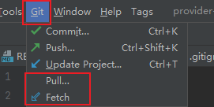
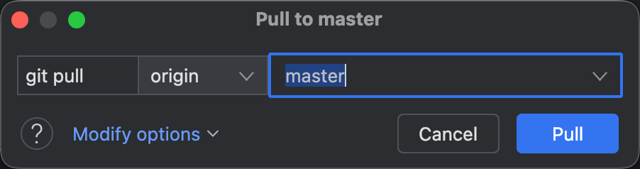
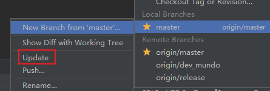

`fetch`的中文释义为“取来”。当在本地执行`git fetch`命令时，`Git`会从远程仓库下载所有分支的最新提交，并更新本地的远程跟踪分支信息。这让我们能够在本地查看远程仓库的最新状态，但不会影响本地工作分支。`git fetch`不会自动合并远程分支的更新，若要将远程跟踪分支的更新内容合并到本地分支中，在执行`git fetch`后，需要手动进行合并操作。

如果远程仓库新增、删除了分支，或对已有分支进行了更新，这些变化也会反映在本地的远程跟踪分支中。换句话说，执行`git fetch`后，本地的远程跟踪分支信息将与远程仓库保持一致。

通常，一个`Git`项目会关联到一个远程仓库，默认情况下，这个远程仓库被称为`origin`。不过，有时为了满足特定需求，项目可能需要连接到多个远程仓库。在这种情况下，如果要从指定的远程仓库获取最新的提交，可以使用以下命令：

```sh
git fetch origin
```

如果要获取所有远程仓库的最新提交，命令如下：

```sh
git fetch --all
```

`git fetch`操作也可以只更新一个具体分支的最新状态：

```
git fetch origin <branch-name>
```

`git pull`与`git fetch`的主要区别在于，`git pull`是一个复合操作。它会先确定当前检出分支所对应的远程分支，例如对应的远程分支为`origin/<branch-name>`，此时执行`git pull`，其效果等同于依次执行下面两个命令：

```sh
git fetch origin <branch-name>
git merge origin/<branch-name>
```

也就是说，`git pull`命令实际上等同于`git pull origin <branch-name>`，其中`<branch-name>`为当前检出分支名。

在`GoLand`中，可以通过上方操作栏的`Pull`和`Fetch`按钮来执行这两个操作，分别对应`git pull`和`git fetch`的功能：



点击上方`Pull`按钮后，系统会要求填写具体的分支名称，默认为当前检出的分支：



需要注意，`GoLand`中对某一本地分支的`Update`操作实际上等同于`git pull`的第二阶段，即执行`git merge`命令：



`git pull`命令第二步默认执行的是`merge`逻辑，如果我们需要执行变基逻辑，命令如下：

```sh
git pull --rebase
```

如果想在执行`git pull`时永远执行变基逻辑，可以运行以下命令：

```sh
git config --global pull.rebase true
```

在`Git`中，在执行`git pull`拉取远程分支，或是执行`git merge`合并本地其他分支时，如果当前分支存在未提交的修改：

- 若这些修改不会与远程或其他分支的内容产生冲突，`Git`会自动合并，并保留本地的未提交修改；

- 若这些修改存在冲突，`Git`会阻止操作，并提示你先处理本地改动，以避免在合并过程中导致修改被覆盖或丢失。

在实际操作中，在执行`pull`或`merge`操作之前，如果当前存在未提交的本地修改，建议按照以下流程操作：

1. 使用`git stash`暂存当前本地修改。
2. 执行`git pull`或`git merge`操作，合并代码。
3. 使用`git stash pop`恢复本地修改，如果有冲突，解决冲突。

这种流程能够最大程度地降低冲突风险，保证操作的顺利进行，并保持工作区的整洁与安全。