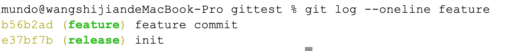

`git cherry-pick`命令用于选择其他分支的某个提交并将其应用到当前分支上。与`git merge`合并整个分支不同，`cherry-pick`命令只会应用特定的提交到当前分支。

假设我们有两个分支`release`和`feature`，它们的原始提交记录如下所示：

```mathematica
A --- B --- C  (release)
        \
         D --- E  (feature)
```

#### 1. 将`feature`分支上的某个提交应用到`release`分支

首先，切换到`release`分支：

```sh
git switch release
```

然后，查看`feature`分支上的提交历史，并找到要`cherry-pick`的提交的哈希值：

```sh
git log --oneline feature
```

命令运行结果如下所示：



最后，`cherry-pick`特性分支上的某个提交：

```sh
git cherry-pick <commit-hash>
```

#### 2. 一次选取多条提交

可以通过指定多个哈希值来一次性`cherry-pick`多个提交：

```sh
git cherry-pick <commit-hash1> <commit-hash2> <commit-hash3>
```

#### 3. 使用范围选择`cherry-pick`

使用范围选择将包括`start`和`end`提交（闭区间）：

```sh
git cherry-pick <start-commit>^..<end-commit>
```

#### 4. 冲突的处理

如果出现冲突，`Git`会中止流程并提示冲突的文件。手动解决冲突后使用以下命令继续提交：

```sh
git add .
git cherry-pick --continue
```

或者使用以下命令放弃`cherry-pick`操作：

```sh
git cherry-pick --abort
```

#### 5. 注意事项

使用`cherry-pick`将`feature`分支上的某个提交合并到`release`分支时，它会在`release`分支中表现为最新的一条提交，其`hash`值与在`feature`分支上的不同。这是因为`cherry-pick`是基于该提交的内容在目标分支重新生成了一次新的提交。

例如我们把`feature`分支的`D`提交，通过`cherry-pick`操作应用到`release`分支：

```mathematica
A --- B --- C --- D'  (release)
       \
        D --- E   (feature)
```

接着，我们可以使用`git push`命令将`release`分支被`pick`过来的提交推送到远程仓库。
