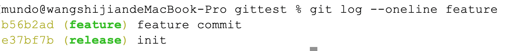

`git cherry-pick`命令用于选择其他分支的某个提交，并将其应用到当前分支。

与`git merge`合并整个分支不同，`cherry-pick`操作只会将指定的提交应用到当前分支。

假设我们有两个分支`release`和`feature`，它们的原始提交记录如下所示：

```mathematica
A --- B --- C  (release)
       \
         D --- E  (feature)
```

#### 1. 将`feature`分支上的某个提交应用到`release`分支

首先，切换到`release`分支：

```sh
git switch release
```

然后，查看`feature`分支上的提交历史，并找到要`cherry-pick`的提交的哈希值：

```sh
git log --oneline feature
```

命令运行结果如下所示：



最后，`cherry-pick`特性分支上的某个提交：

```sh
git cherry-pick <commit-hash>
```

#### 2. 一次选取多条提交

可以通过指定多个哈希值来一次性`cherry-pick`多个提交：

```sh
git cherry-pick <commit-hash1> <commit-hash2> <commit-hash3>
```

#### 3. 使用范围选择`cherry-pick`

使用范围选择将包括`start`和`end`提交（闭区间）：

```sh
git cherry-pick <start-commit>^..<end-commit>
```

#### 4. 冲突的处理

如果`cherry-pick`过程中发生冲突，`Git`会暂停操作并提示存在冲突的文件。

手动解决冲突后，将解决后的文件加入暂存区，并继续执行`cherry-pick`：

```sh
git add .
git cherry-pick --continue
```

如果希望放弃当前的`cherry-pick`操作，可以执行：

```sh
git cherry-pick --abort
```

#### 5. 注意事项

使用`cherry-pick`将`feature`分支上的某个提交应用到`release`分支后，该提交会作为新的提交出现在`release`分支上，其`hash`值也会与原提交不同。这是因为`cherry-pick`会将原提交引入的变更应用到当前分支，并基于当前分支的最新提交重新创建一个提交。由于父提交、提交时间等信息不同，即使代码变更相同，最终生成的`hash`值也会不同。

例如我们把`feature`分支的`D`提交，通过`cherry-pick`操作应用到`release`分支：

```mathematica
A --- B --- C --- D'  (release)
       \
         D --- E   (feature)
```

其中`D'`是`release`分支中新生成的提交，它与`feature`分支上的`D`包含的变更内容相同，但两者是不同的提交对象，因此`hash`值不同。完成`cherry-pick`后，可以使用`git push`将`release`分支上的新提交推送到远程仓库：
