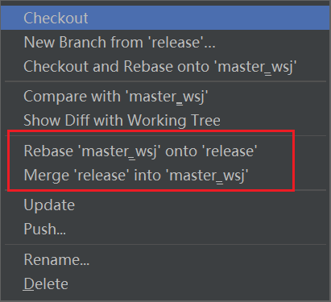
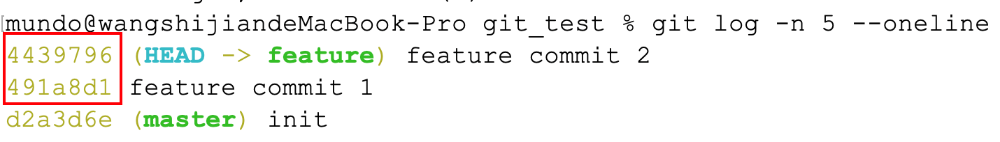
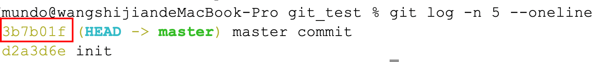
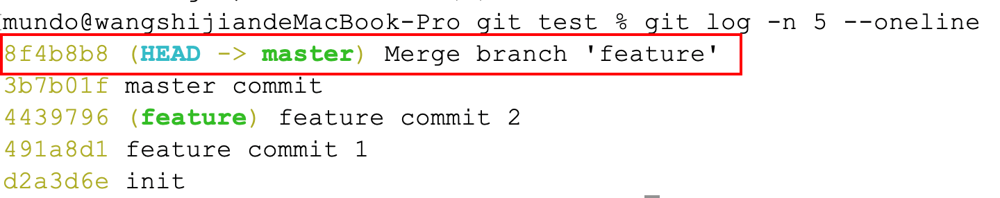
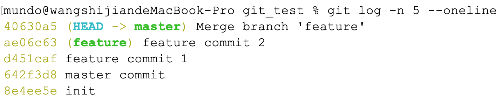
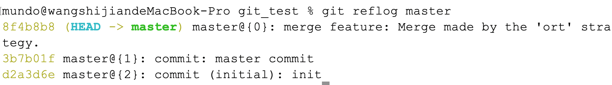
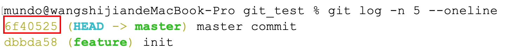
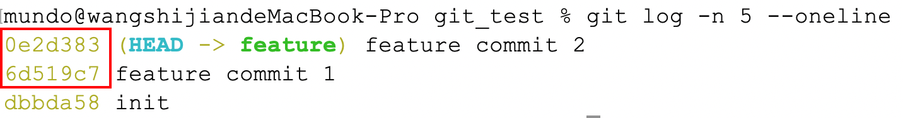
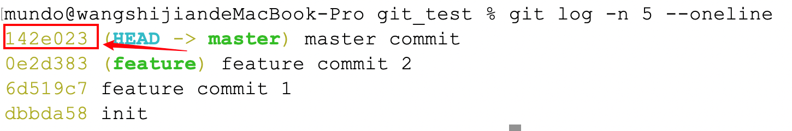
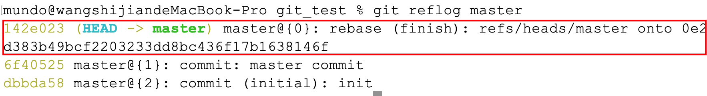

在进行分支合并时，常见的操作有两个：`git merge`和`git rebase`。它们的关联和区别可以通过它们所用的介词来理解：

- `merge`操作使用的是`into`，即将一个分支的更改合并到当前分支中。
- `rebase`操作使用的是`onto`，即将一个分支的更改应用到另一个基点上。



假设我们有两个分支：`master`和`feature`，它们的提交记录如下所示：

```mathematica
         A --- B --- C  (master)
              	\
                  D --- E  (feature)
```

`master`分支有提交`C`，`feature`分支有提交`D`和`E`，现在要将`feature`分支的更改合并到`master`分支上。

### 1. `Merge`操作

在使用`merge`操作时，`Git`会根据提交时间顺序，将两个分支的更改合并，并在`master`分支上生成一个新的合并提交。这个合并提交本身不包含实际代码变更，它仅作为一个标记，表明此时完成了一次分支合并。

要执行`merge`操作，首先需要切换到`master`分支，然后运行`git merge feature`命令，将`feature`分支的更改合并到`master`中。`Git`会自动尝试合并内容；如果发生冲突，则需要手动解决冲突后再完成合并。

使用`merge`合并完成后，`master`分支的提交历史就变成这样：

```mathematica
		（C、D、E三个提交的顺序，按照各自的提交时间来排序）
         A --- B --- D --- C --- E --- F  (master)
                \         
                  D --- E  (feature)
```

> **注意：**在`merge`操作后，`C`、`D`、`E`这三个提交的哈希值不会变化，且按照各自的提交时间顺序来排序。提交`F`就是`merge`操作创建的一个新的合并提交，它作为一个标记存在。

使用`merge`进行分支合并的好处就是，保留了完整的提交历史记录，显示了每条提交的时间顺序，并且可以清晰地看到在哪一个时间点进行了分支合并操作，又是从哪个分支合并到了当前分支。

### 2. `Rebase`操作

`rebase`操作会将`feature`分支的提交重新应用到`master`分支的最新提交之后，相当于把`feature`分支的每个提交逐一移到`master`分支上。执行`rebase`时，应先切换到`master`分支，然后运行`git rebase feature`命令，将`feature`分支的更改整合进`master`。在此过程中，`Git`会依次应用`feature`中的每个提交；若出现冲突，则需手动解决后继续`rebase`流程。

使用`rebase`合并完成后，`master`分支的提交历史就会变成这样：

```mathematica
         A --- B --- D --- E --- C'   (master)
                \
                  D --- E  (feature)
```

> **注意：**经过`rebase`操作后，`D`和`E`提交的`hash`值不变，但是`C`提交的哈希值改变了，这里我们使用`C'`进行表示。

使用`rebase`进行分支合并的好处在于，它能使提交历史更加线性和整洁，便于阅读和理解，并且避免了大量的合并提交，使历史记录更加简洁明了。然而，`rebase`会重写提交的`hash`值，因此在多人协作的环境中，可能会引发问题。

### 3. 操作示例

例如下面这个例子，模拟的就是上面的`merge`和`rebase`操作，首先是`feature`分支的两次提交：



然后是`master`分支的一次提交：



在`master`分支使用`git merge feature`后，再次使用`git log`查看`master`分支的提交记录：



我们再看一下`master`提交时间早于`feature`提交的情况，这种情况分支提交记录的顺序有变化：



使用`git reflog`命令展示出`master`分支所有的操作，这里看不到`feature`分支的提交记录，只能看到合并记录：



然后展示一下`rebase`操作，这里先给`master`分支一次提交：



然后是`feature`分支的两次提交：



在`master`分支使用`git rebase feature`后，再次使用`git log`查看`master`分支的提交记录：



我们注意到以下两点：

1. 虽然`master`分支的提交在时间上早于`feature`分支的提交，但在执行`rebase`操作后，`master`的提交会被移动到`feature`分支的提交之后。
2. `rebase`操作会导致`master`分支上的提交哈希值发生变化。如果这些提交已被推送到远程仓库，那么在`rebase`之后再次推送时，可能会因历史不一致而发生冲突。此时，需要先执行`git pull`以获取并合并远程的变更，然后再执行`git push`完成推送。

使用`git reflog`命令展示出`master`分支所有的操作，看不到`feature`分支的提交记录，只能看到变基记录：



