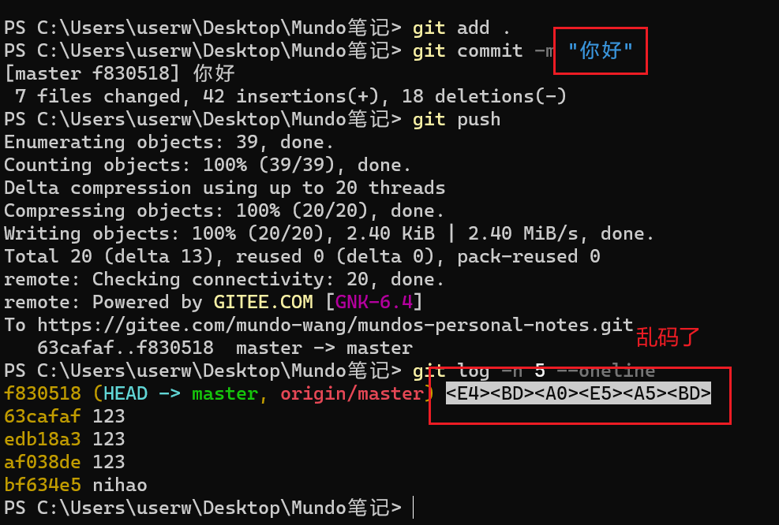
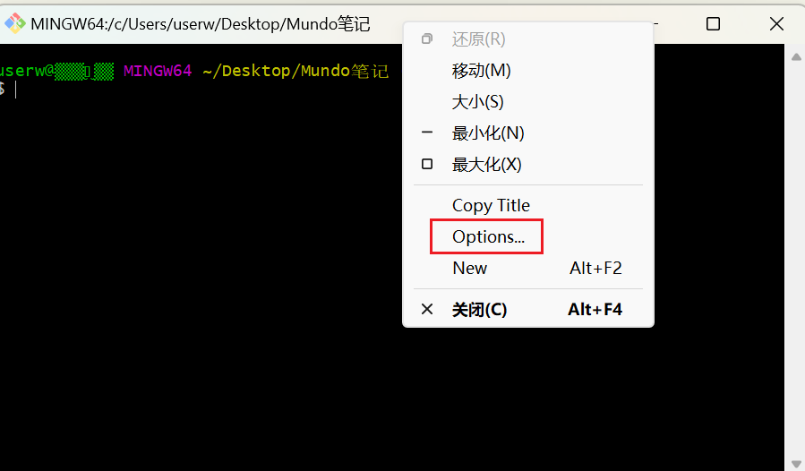
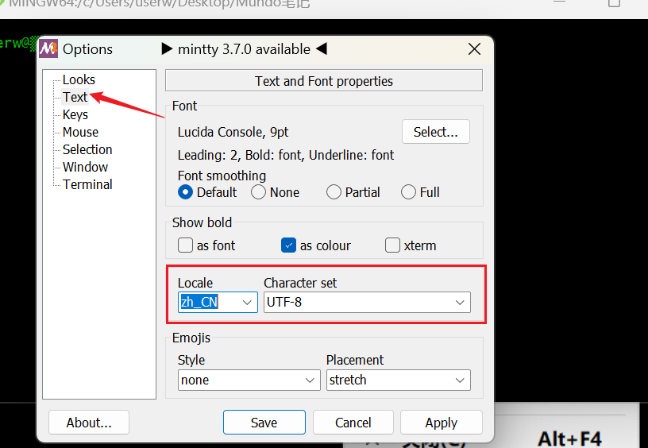
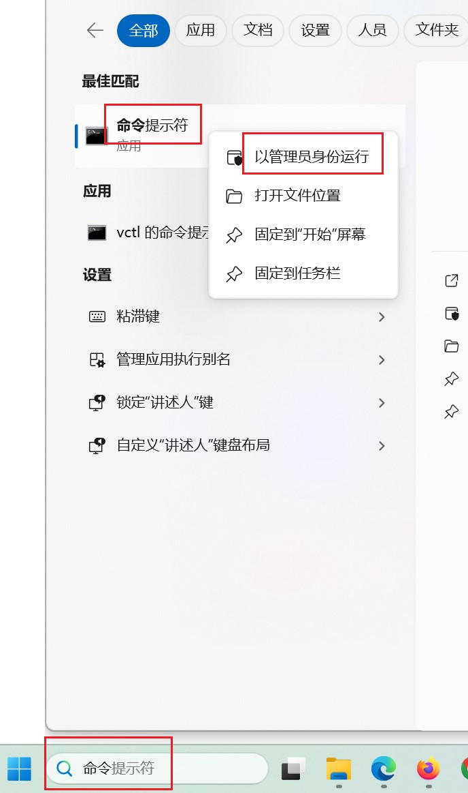
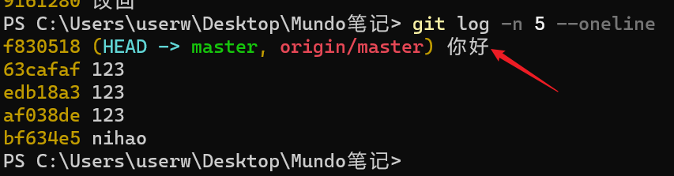
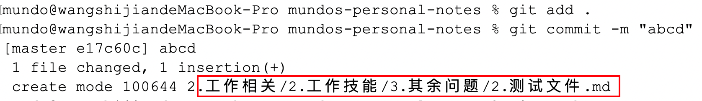

`Windows`环境中，使用`git commit`提交的内容如果有中文，在使用`git log`查看提交记录时，可能会出现乱码：



要解决这个问题，可以先打开`git bash`，然后在窗口顶部右键选择`options`选项：



按照下面的操作进行选择：



然后在终端执行以下几行命令：

```bash
git config --global core.quotepath false
git config --global gui.encoding utf-8
git config --global i18n.commit.encoding utf-8
git config --global i18n.logoutputencoding utf-8
```

进行下面操作使其在`Windows`的`cmd`环境永久生效。首先在`Windows11`搜索框搜索一下“命令提示符”，以管理员身份运行：



在出现的窗口执行以下的命令：

```sh
setx "LESSCHARSET" "utf-8" /m
```

重启`cmd`窗口或者`GoLand`编辑器，再次操作`git`命令，发现中文可以正常显示：



`Mac`环境如果出现同样的乱码问题，只需要执行下面这一行命令：

```bash
git config --global core.quotepath false
```

执行完成后重启终端，发现中文正常显示：



