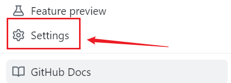
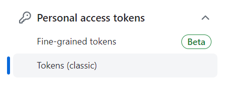
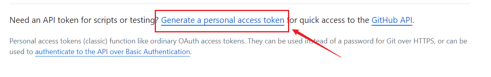
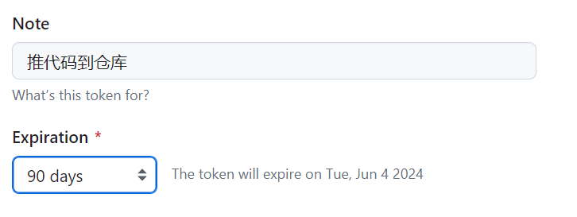
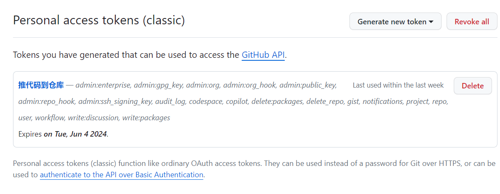

> 参考文章：
>https://docs.github.com/en/authentication/keeping-your-account-and-data-secure/managing-your-personal-access-tokens

当我把一些文件内容托给`GitHub`平台管理时，在初始化仓库时出现了这样的报错，报错信息如下：

```sh
remote: Support for password authentication was removed on August 13, 2021.
remote: Please see https://docs.github.com/get-started/getting-started-with-git/about-remote-repositories#cloning-with-https-urls for information on currently recommended modes of authentication.
fatal: Authentication failed for 'https://github.com/mundo-wang/technical-notes.git/'
```

查阅资料，分析到这个报错是因为`GitHub`为了提高安全性，在`2021`年`8`月`13`日停止了对密码验证的支持，转而变为更安全的认证方法，例如个人访问令牌或者`SSH`密钥（公钥和私钥）。我们这里采用个人访问令牌的方式。

具体要找到页面的这个地方，首先点击右上角的头像：


找到`settings`，点击：



拉到最后一个，找到开发者设置这一项：


选这个地方，第一个是细粒度`token`，不知道和第二个有什么区别，我先选第二个了：



点击这个地方进行`token`获取，这里需要输入密码：



设置备注和`token`有效期：



在底下选择这个`token`的权限，我这里就全选了。

然后点击生成，它自动给我们生成`token`，我们复制即可：


将这个`token`保存在一个安全的地方，因为一旦退出此页面，`token`将不再显示。如果忘记了`token`，需要重新生成。



这样，在将更改推送到远程库时，输入密码时可以输入上述`token`。

之后再推送时，有可能出现这样的报错信息：

```sh
fatal: unable to access 'https://github.com/mundo-wang/technical-notes.git/': Failed to connect to github.com port 443: Timed out
```

但是我们正常打开`GitHub`网页是没问题的。

这种情况，打开`Git Bash`，使用以下命令解决：

```sh
git config --global --unset http.proxy
git config --global --unset https.proxy
```

这两个命令，取消`Git`本身的`http`和`https`代理，再次推送，就成功了。

不过，由于`GitHub`是外网，推送速度不如`Gitee`快，可能需要耐心等待推送。

在`git fetch`或者`git pull`时，如果出现以下问题：

```sh
fatal: unable to access 'https://github.com/XXXX/': Empty reply from server
```

可以尝试使用以下命令解决（`prune`译为“修剪”）：

```sh
git fetch origin --prune
```

> 参考文章：https://stackoverflow.com/questions/28364023/gits-error-on-push-empty-reply-from-server

但是我发现偶尔还是会出现上面这个问题，并且使用上面命令也无法解决。等待之后更彻底的解决方案。