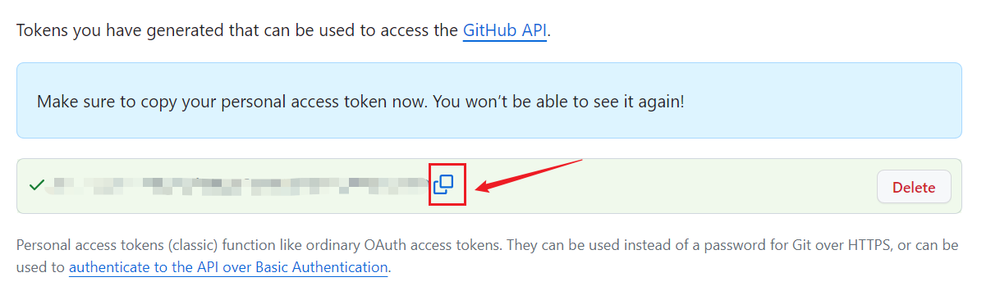

当我把一些文件内容托给`GitHub`平台管理时，在初始化仓库时出现了这样的报错，报错信息如下：

```sh
remote: Support for password authentication was removed on August 13, 2021.
remote: Please see https://docs.github.com/get-started/getting-started-with-git/about-remote-repositories#cloning-with-https-urls for information on currently recommended modes of authentication.
fatal: Authentication failed for 'https://github.com/mundo-wang/technical-notes.git/'
```

查阅资料，分析到这个报错是因为`GitHub`为了提高安全性，在`2021`年`8`月`13`日停止了对密码验证的支持，转而变为更安全的认证方法，例如个人访问令牌或者`SSH`密钥（公钥和私钥）。我们这里采用个人访问令牌的方式。

具体要找到页面的这个地方，首先点击右上角的头像：


找到`settings`，点击：


拉到最后一个，找到开发者设置这一项：


在这个地方，第一个是细粒度`token`，第二个是普通`token`，我们这里选择第二个：


点击这个地方进行`token`获取，注意要选择`classic`的选项：


设置备注和`token`的有效期：


在下方选择`token`的权限。根据具体需求进行选择，如果没有特殊要求，可以全部勾选。

点击生成，它会自动给我们生成`token`，我们复制即可：



请将`token`保存在安全的地方，因为一旦离开此页面，`token`将无法再次查看。如果遗忘`token`，需要重新生成。


这样，在将更改推送到远程仓库时，可以在输入密码的阶段输入上述`token`。

如果`token`过期了，或者我们手动删除了`token`，那么再次使用`git push`推送时会报错：

```sh
remote: Invalid username or password.
fatal: Authentication failed for 'https://github.com/mundo-wang/technical-notes.git/'
```

我们需要使用下面命令：

```sh
git push origin <branch-name>
```

这里的`<branch-name>`是对应的分支名称。使用此命令后，会要求重新输入用户名和密码：


这样就可以完成`token`的更改了。

推送代码到`GitHub`时，有可能出现这样的报错信息：

```sh
fatal: unable to access 'https://github.com/mundo-wang/technical-notes.git/': Failed to connect to github.com port 443: Timed out
```

这表示本地未能连接到`github.com`的`443`端口。`443`是`HTTPS`协议的默认端口，当你访问一个以`https://`开头的网址时，客户端会默认通过`443`端口与服务器建立连接。该端口用于基于`TLS`（或较早的`SSL`）加密的`HTTP`通信，确保数据在传输过程中不会被窃听或篡改，从而保障通信的安全性。

我们先使用以下命令，将`Git`的`HTTP`代理配置恢复为默认值：

```sh
git config --global --unset http.proxy
git config --global --unset https.proxy
```


在本机终端使用以下命令，测试一下`443`端口的连通性：

```sh
telnet github.com 443
```

对于中国内地用户而言，连接`github.com`的`443`端口经常不稳定，尚无较为有效的解决方案，仍需等待后续彻底的解决办法。

> `2025-3-24 16:53:48`更新：这个问题已解决，只需开启`Clash`的`TUN`模式或者增强模式即可。
> `2025-4-14 13:36:46`更新：目前`Clash`的`TUN`模式故障，不但连不上`443`端口，也会导致代理失效。

如果在`git fetch`或者`git pull`时，出现以下的报错：

```sh
fatal: unable to access 'https://github.com/mundo-wang/technical-notes.git/': Empty reply from server
```

可以尝试使用以下命令解决（`prune`译为“修剪”）：

```sh
git fetch origin --prune
```

该命令的作用是：从远程仓库`origin`拉取所有最新的分支和标签信息，并删除本地已不再存在于远程的分支引用。

> 参考文章：https://stackoverflow.com/questions/28364023/gits-error-on-push-empty-reply-from-server
