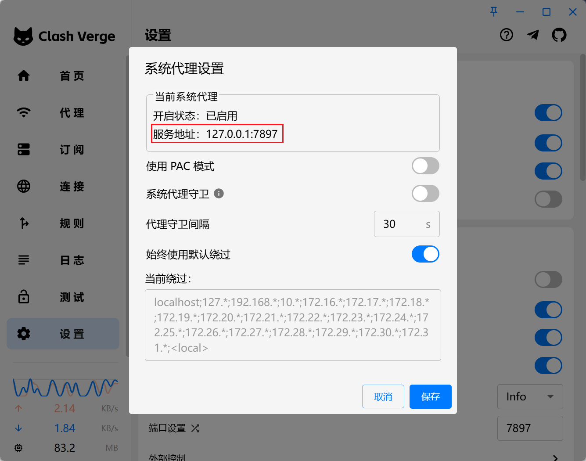

我们推送代码到`GitHub`时，有可能出现这样的报错信息：

```sh
fatal: unable to access 'https://github.com/mundo-wang/technical-notes.git/': Failed to connect to github.com port 443: Timed out
```

这表示本地未能连接到`github.com`的`443`端口。`443`是`HTTPS`协议的默认端口，当你访问一个以`https://`开头的网址时，客户端会默认通过`443`端口与服务器建立连接。由于`GitHub`是外网，连接不稳定，所以需要我们开启代理，并进行一些配置。

在本机终端使用以下命令，测试一下`443`端口的连通性：

```sh
telnet github.com 443
```

在`Mac`上，默认没有`telnet`命令，可以使用以下命令替代之：

```sh
nc -zv github.com 443
```

`nc`的全称是`netcat`，是一个功能强大的网络工具，用于读取和写入网络连接。`-z`选项的全称是`Zero I/O mode`，表示扫描端口而不进行数据传输；`-v`选项的全称是`Verbose`，启用详细模式，输出更多的信息，帮助分析端口扫描的结果。

执行命令后，一般会展示出下方的连接失败提示：


我们首先查看代理的服务地址信息：



接下来，我们可以设置所有`Git`操作都通过代理：

```sh
git config --global http.proxy http://127.0.0.1:7897
git config --global https.proxy http://127.0.0.1:7897
```

可以使用以下命令，将`Git`的`HTTP`代理配置恢复为默认值：

```sh
git config --global --unset http.proxy
git config --global --unset https.proxy
```


配置完成后，虽然使用`telnet`仍无法连接`443`端口，但`Git`在推送时会通过我们配置的代理，成功完成推送操作。

> `2025-3-24 16:53:48`更新：只需开启`Clash`的`TUN`模式（虚拟网卡模式）或者增强模式即可完成推送。
> `2025-4-14 13:36:46`更新：目前`Clash`的`TUN`模式故障，不但连不上`443`端口，也会导致代理失效。

如果在`git fetch`或者`git pull`时，出现以下的报错：

```sh
fatal: unable to access 'https://github.com/mundo-wang/technical-notes.git/': Empty reply from server
```

可以尝试使用以下命令解决（`prune`译为“修剪”）：

```sh
git fetch origin --prune
```

该命令的作用是：从远程仓库`origin`拉取所有最新的分支和标签信息，并删除本地已不再存在于远程的分支引用。

> 参考文章：https://stackoverflow.com/questions/28364023/gits-error-on-push-empty-reply-from-server