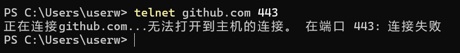

我们推送代码到`GitHub`时，有可能出现这样的报错信息：

```sh
fatal: unable to access 'https://github.com/mundo-wang/technical-notes.git/': Failed to connect to github.com port 443: Timed out
```

这表示本地未能连接到`github.com`的`443`端口。`443`是`HTTPS`协议的默认端口，当你访问一个以`https://`开头的网址时，客户端会默认通过`443`端口与服务器建立连接。由于`GitHub`是外网，连接不稳定，所以需要我们开启代理，并进行一些配置。

在本机终端使用以下命令，测试一下`443`端口的连通性：

```sh
telnet github.com 443
```



我们首先查看代理的服务地址信息：


接下来，我们可以设置所有`Git`操作都通过代理：

```sh
git config --global http.proxy http://127.0.0.1:7897
git config --global https.proxy http://127.0.0.1:7897
```

可以使用以下命令，将`Git`的`HTTP`代理配置恢复为默认值：

```sh
git config --global --unset http.proxy
git config --global --unset https.proxy
```


对于中国内地用户，连接`github.com`的`443`端口经常不稳定，尚无较为有效的解决方案，仍需等待后续彻底的解决办法。

> `2025-3-24 16:53:48`更新：这个问题已解决，只需开启`Clash`的`TUN`模式（虚拟网卡模式）或者增强模式即可。
> `2025-4-14 13:36:46`更新：目前`Clash`的`TUN`模式故障，不但连不上`443`端口，也会导致代理失效。

如果在`git fetch`或者`git pull`时，出现以下的报错：

```sh
fatal: unable to access 'https://github.com/mundo-wang/technical-notes.git/': Empty reply from server
```

可以尝试使用以下命令解决（`prune`译为“修剪”）：

```sh
git fetch origin --prune
```

该命令的作用是：从远程仓库`origin`拉取所有最新的分支和标签信息，并删除本地已不再存在于远程的分支引用。

> 参考文章：https://stackoverflow.com/questions/28364023/gits-error-on-push-empty-reply-from-server