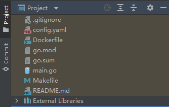
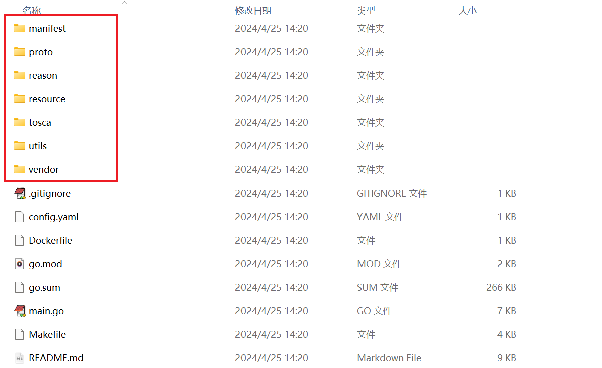
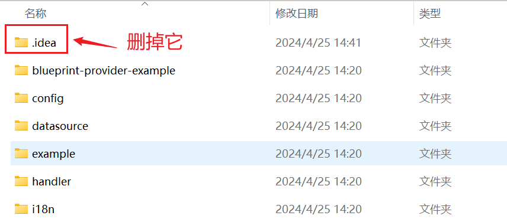
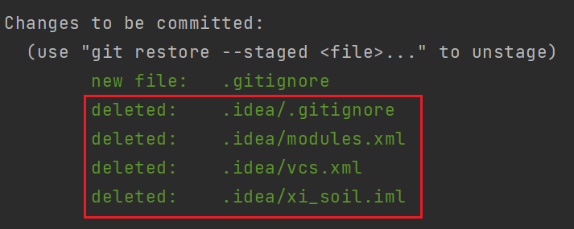
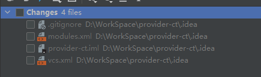

当我们从远程仓库拉取代码到本地，或在本地切换分支时，使用`Goland`打开项目有时会遇到这样一种情况。项目根目录下的所有子目录都不见了，仅能看到根目录下的文件，现象如下所示：



但是用电脑的文件夹打开这个项目，还是可以看到对应的目录的：



这种情况通常是由于`Goland`项目设置出现问题导致的。在`Goland`中，项目的目录结构和设置信息保存在根目录下的`.idea`文件夹中。如果这个文件夹出现问题，可能会导致`Goland`无法正确显示项目的目录结构。

换句话说，`.idea`文件夹可能已损坏。只需删除该文件夹，并重新用`Goland`打开项目即可。



再次打开项目时，`Goland`会在项目根目录下重新生成`.idea`文件夹。此操作不会影响代码和其他文件，只会重置`Goland`的项目设置。

出现这种情况是因为误操作将`.idea`文件夹上传到了远程仓库。我们需要将该文件夹从远程仓库中移除。如果已经提交了`.idea`文件夹，可以使用以下命令将其从暂存区中移除：

```sh
git rm -r --cached .idea
```

这将把`.idea`文件夹从`Git`的跟踪列表中移除，但不会删除本地的`.idea`文件夹。执行上述命令后，`Git`会删除以下四个文件：



在`Goland`可视化查看是这样的，这四个文件就是`.idea`文件夹的全部文件：



我们需要在`.gitignore`文件中添加`.idea/`这一行，以确保`.idea`文件夹不会被上传到远程仓库。然后，将删除`.idea`文件夹和更新`.gitignore`文件的更改提交到远程仓库：

```sh
git add .gitignore
git commit -m "Remove .idea directory and update .gitignore to ignore it"
git push
```

如果在项目提交时发现了上述四个文件，这表明`.idea`目录未被包含在`.gitignore`文件中。将`.idea/`这一行添加到`.gitignore`后，这四个文件将不再出现在`Git`的提交列表中。

