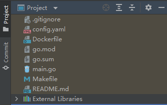
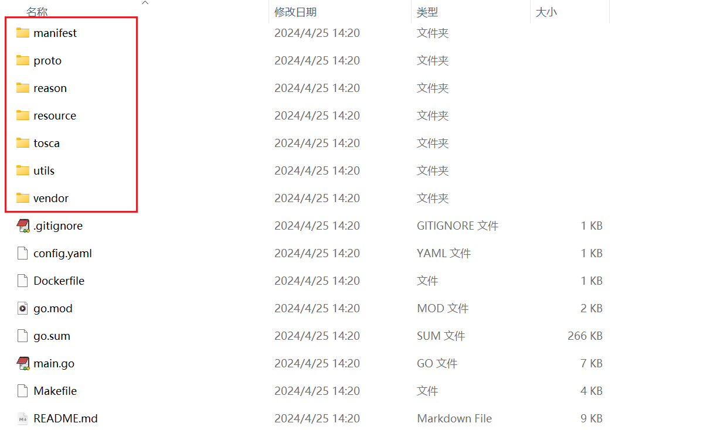
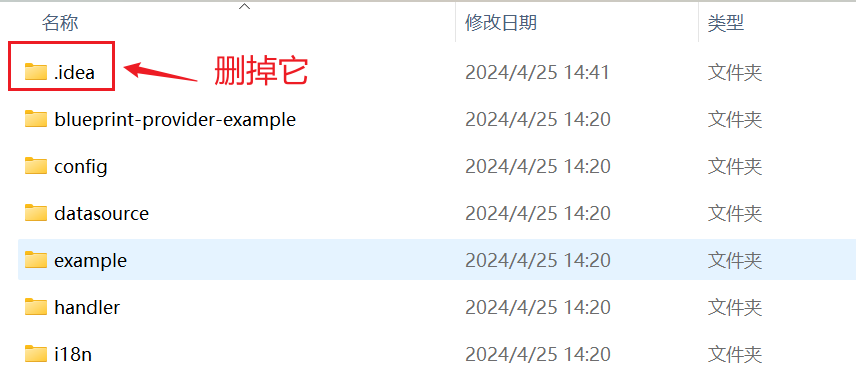
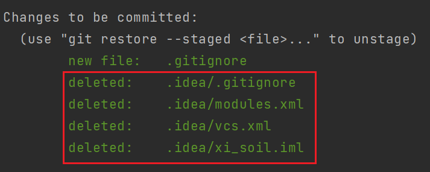
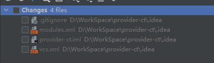

当我们从远程仓库拉取代码到本地，或在本地切换分支时，使用`GoLand`打开项目，有时会遇到一种情况，就是项目根目录下的所有子目录都不见了，只能看到根目录下的文件，现象如下所示：



但如果通过系统文件管理器打开该项目目录，仍然可以看到所有实际存在的子目录：



这种情况通常是由于`GoLand`的项目配置出现异常导致的。在`GoLand`中，项目的目录结构及相关配置信息保存在项目根目录下的`.idea`文件夹中。如果该文件夹中的配置文件出现问题，`GoLand`可能无法正确解析项目结构，从而只显示根目录文件。

换句话说，`.idea`文件夹很可能已经损坏。解决方法是删除该文件夹，然后重新使用`GoLand`打开项目：



重新打开项目时，`GoLand`会自动在项目根目录下重新生成`.idea`文件夹。

该操作不会影响代码或其他文件，仅会重置`GoLand`的项目配置。

之所以会出现这种问题，通常是因为曾经误操作将`.idea`文件夹提交到了远程仓库。因此需要将该目录从`Git`仓库中移除。如果`.idea`目录已经被提交，可以使用以下命令将其从`Git`的跟踪列表中移除：

```sh
git rm -r --cached .idea
```

该命令会将`.idea`文件夹从`Git`的版本控制中移除，但不会删除本地的`.idea`文件夹。执行命令后，`Git`会删除以下四个文件：



在`GoLand`的可视化界面中，可以看到这四个文件正是`.idea`目录中的全部内容：



随后，我们要在`.gitignore`文件中添加`.idea/`这一行，以确保`.idea`文件夹不会再次被提交到远程仓库。然后将删除`.idea`目录的操作和更新`.gitignore`的修改一起提交：

```sh
git add .gitignore
git commit -m "Remove .idea directory and update .gitignore to ignore it"
git push
```

如果已经在`.gitignore`文件中添加`.idea/`这一行，只需将删除文件提交到远程仓库，即可完成清理。
