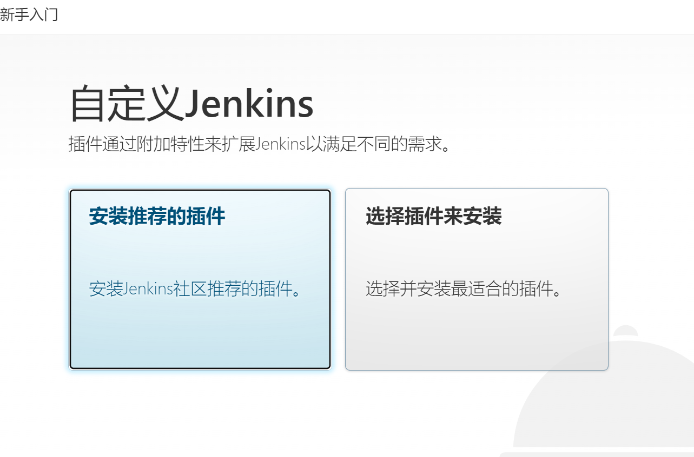
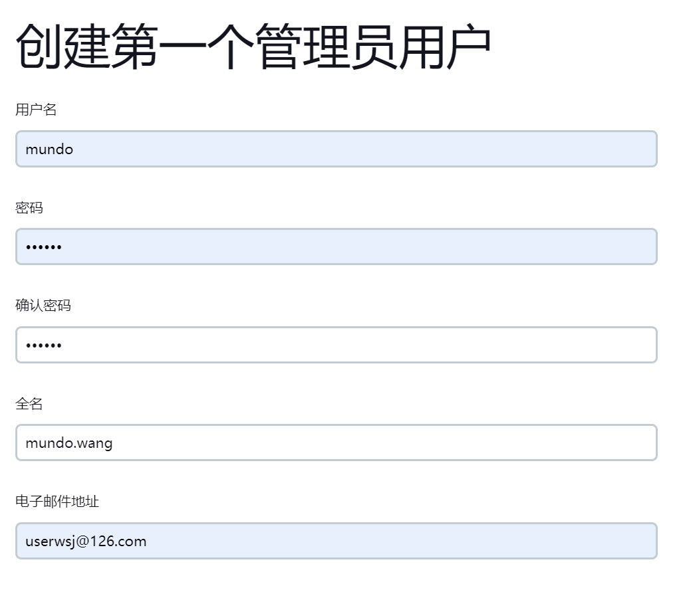
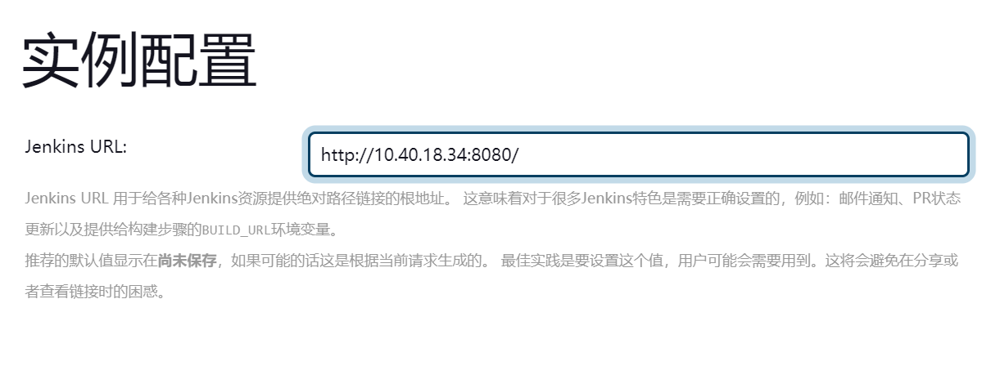

我们打开`Linux`终端，运行以下命令，拉取`Jenkins`镜像：

```shell
docker pull jenkins/jenkins:2.433
```

使用以下命令，创建`Jenkins`容器：

```shell
docker run -d --name my-jenkins \
  -p 50000:50000 \
  -p 8080:8080 \
  -v /srv/docker/jenkins:/var/jenkins_home \
  -v /var/run/docker.sock:/var/run/docker.sock \
  -v /usr/bin/docker:/usr/bin/docker \
  -u root \
  -e JAVA_OPTS=-Duser.timezone=Asia/Shanghai \
  --restart always \
  jenkins/jenkins:2.433
```

该命令指定参数的描述如下所示：
| 参数                                           | 描述                              |
| ---------------------------------------------- | --------------------------------- |
| `-p 50000:50000`                               | `50000`端口用于集群部署           |
| `-p 8080:8080`                                 | `8080`端口用于浏览器访问          |
| `-v /srv/docker/jenkins:/var/jenkins_home`     | 设置主要数据目录                  |
| `-v /var/run/docker.sock:/var/run/docker.sock` | 挂载宿主机的`Docker`套接字文件    |
| `-v /usr/bin/docker:/usr/bin/docker`           | 挂载宿主机的`Docker`可执行文件    |
| `-u root`                                      | 以`root`用户身份运行`Jenkins`容器 |
| `-e JAVA_OPTS=-Duser.timezone=Asia/Shanghai`   | 把时区修改为`Asia/Shanghai`       |

运行以下命令，获取`Jenkins`初始管理员密码：

```shell
docker exec my-jenkins cat /var/jenkins_home/secrets/initialAdminPassword
```

打开浏览器访问宿主机的`8080`端口（这里替换为自己的`IP`地址）：

```
http://10.40.18.34:8080
```

输入上面获取到的初始管理员密码，完成登录，在如下页面点击“安装推荐的插件”：



安装完成，我们创建管理员账户：



实例配置这里它会回显我们访问`Jenkins`的`URL`信息，不用动：



完成后，就可以使用`Jenkins`了。