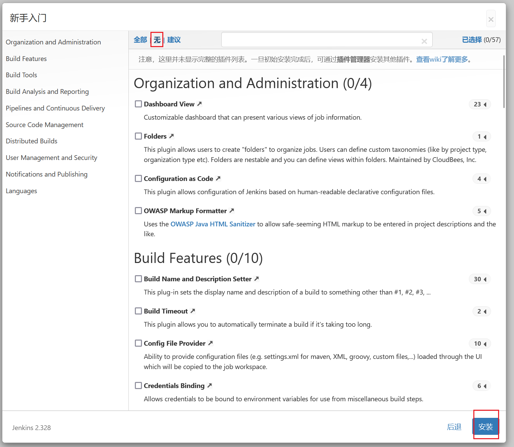
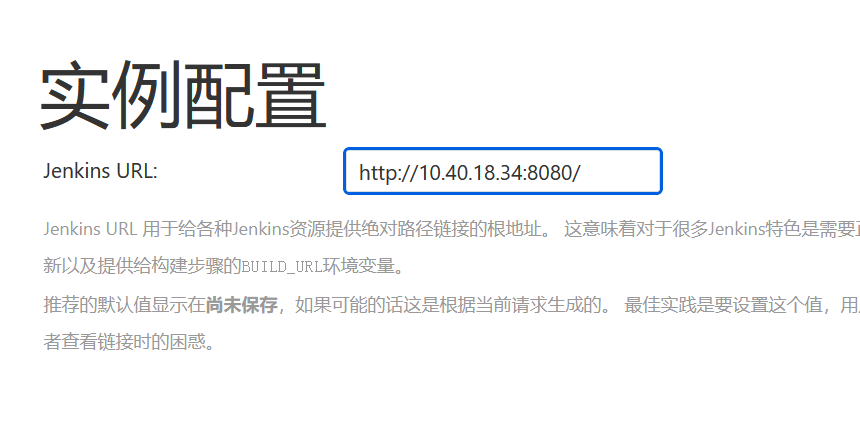
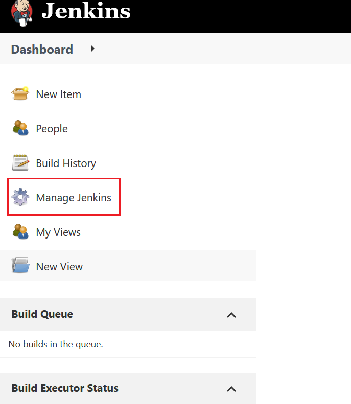
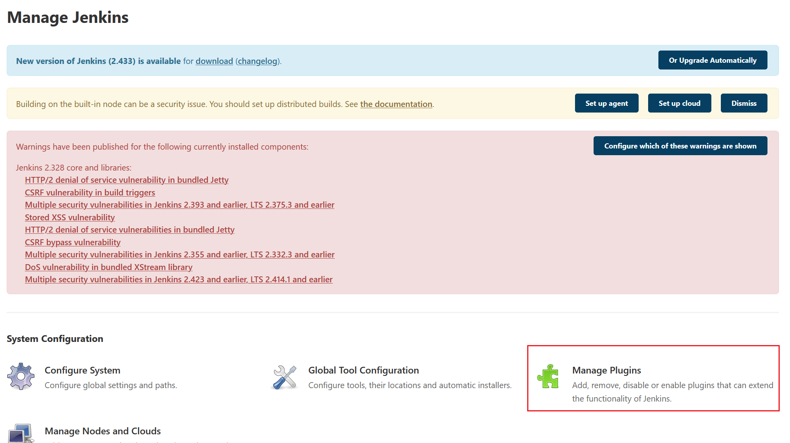
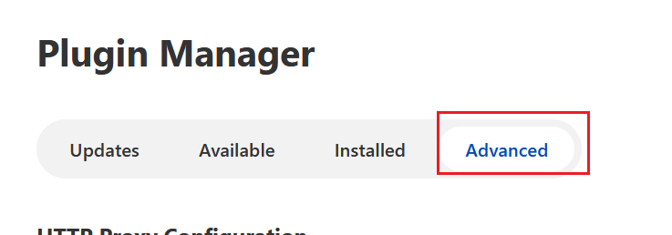
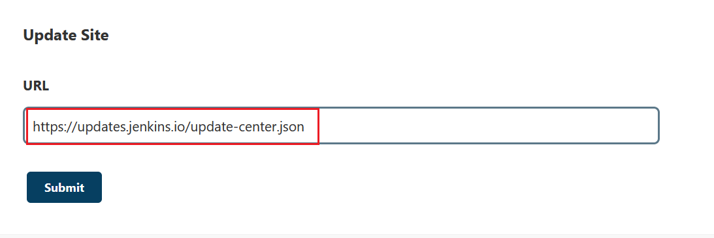
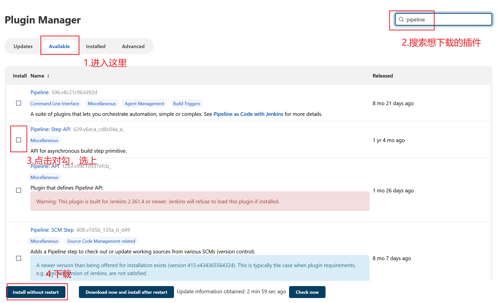

如果点击“安装推荐的插件”时出现插件安装失败的问题，应该先检查是否由于`Jenkins`版本不兼容所导致。如果排除版本问题，可以参考以下方法进行排查和处理。

我们重新启动一个容器，先点击“选择插件来安装”，然后点击“无”，先不安装任何插件：



接下来要我们创建管理员用户，自行创建即可。实例配置这里依然不用动：



`Jenkins`启动后，我们修改`Jenkins`插件安装设置。点击下方选项：



进入该界面，点击`Manage Plugins`：




点击`Advanced`：



翻到最底下，修改如下配置信息：



改成下方内容：

```http
https://mirrors.tuna.tsinghua.edu.cn/jenkins/updates/update-center.json
```

接着修改服务器设置。在宿主机终端执行以下命令：

```shell
docker exec -it my-jenkins /bin/bash
cd /var/jenkins_home/updates
sed -i 's|updates.jenkins-ci.org/download|mirrors.tuna.tsinghua.edu.cn/jenkins|g' default.json
sed -i 's|updates.jenkins.io/download|mirrors.tuna.tsinghua.edu.cn/jenkins|g' default.json
sed -i 's|www.google.com|www.baidu.com|g' default.json
```

重启容器，重新登录`Jenkins`。按照上方步骤进入到插件管理，按照下面步骤操作：



这样我们即可手动安装对应的插件。
