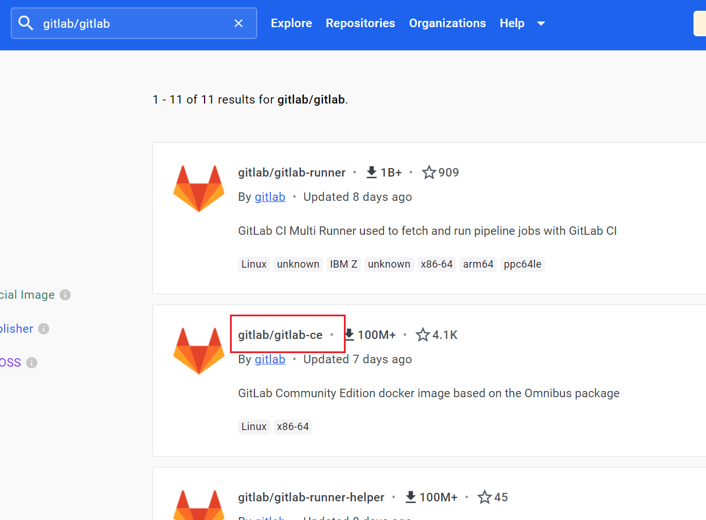
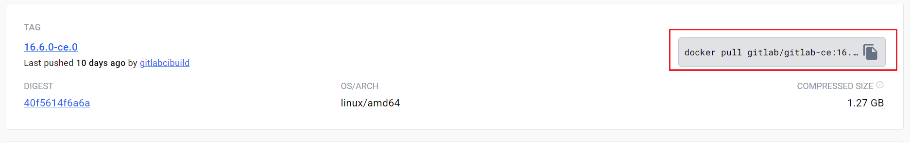
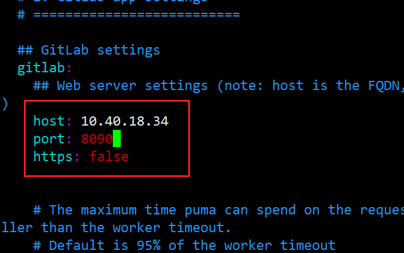
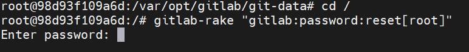
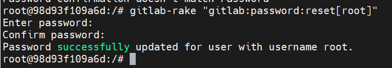
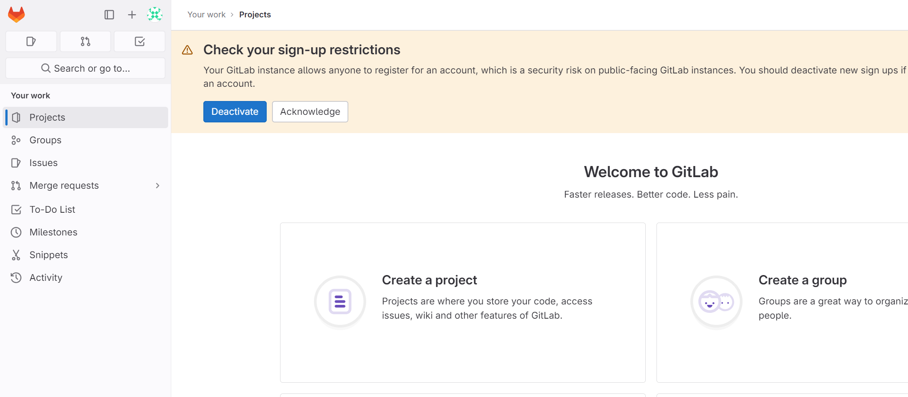
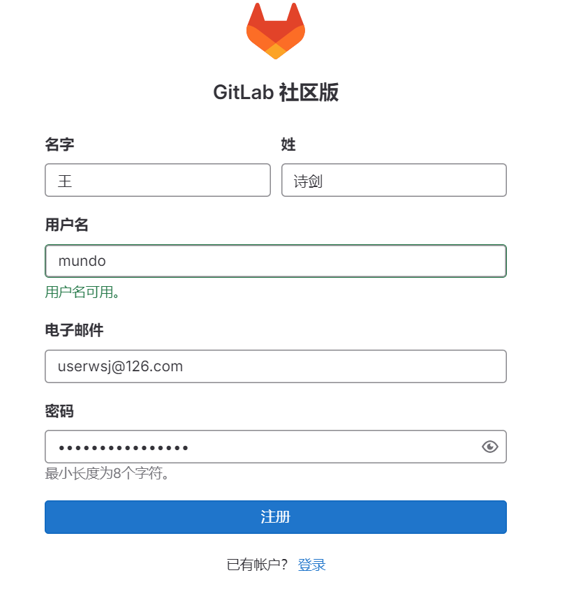
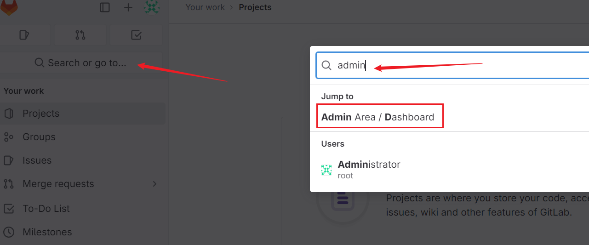
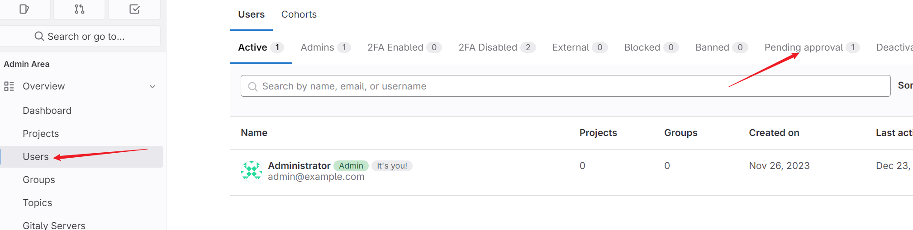
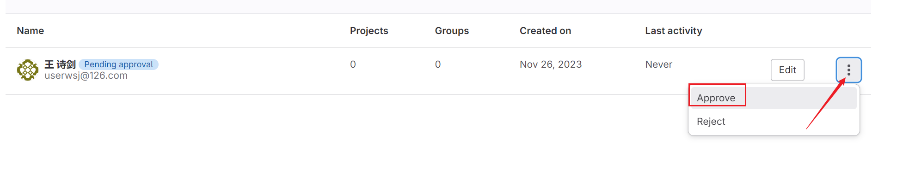

`GitLab`是一个基于`Git`的版本控制与协作平台，提供代码仓库管理、`CI/CD`集成、问题跟踪和团队协作等功能，支持敏捷开发和持续集成等多种工作流程。开源项目通常托管在`GitHub`上，而企业内部项目则更倾向于使用`GitLab`。

以下是通过`Docker`安装`GitLab`的步骤。首先我们去`DockerHub`上搜索一下`GitLab`的`Docker`镜像：



我们使用如上版本，这也是`star`数最多的版本。复制其`docker pull`命令：



在终端执行：

```sh
docker pull gitlab/gitlab-ce:16.6.0-ce.0
```

使用以下命令，启动`GitLab`容器：

```sh
docker run -d --name my-gitlab \
    -p 8443:443 \
    -p 8090:80 \
    -p 8022:22 \
    -v /srv/docker/gitlab/etc:/etc/gitlab \
    -v /srv/docker/gitlab/log:/var/log/gitlab \
    -v /srv/docker/gitlab/opt:/var/opt/gitlab \
    --restart always \
    --privileged=true \
    gitlab/gitlab-ce:16.6.0-ce.0
```

该命令指定参数的描述如下所示：

| 参数                | 描述                       |
| ------------------- | -------------------------- |
| `-p 8443:443`       | `https`通信通道            |
| `-p 8090:80`        | `http`访问`GitLab`的端口   |
| `-p 8022:22`        | `SSH`访问`GitLab`的端口    |
| `--privileged=true` | 让容器获取宿主机`root`权限 |

由于`80`端口通常被宿主机上的其他服务占用，可能会引发端口冲突，因此我将容器的`80`端口映射到了宿主机的`8090`端口上。

接下来对`GitLab`进行一些配置，首先，我们进入到容器，执行下面命令安装`vim`：

```shell
docker exec -it my-gitlab /bin/bash
apt-get update
apt-get install vim
```

接下来执行如下命令：

```shell
cd /etc/gitlab
vim gitlab.rb
```

在文件最上方添加如下配置，修改其`IP`和端口号：

```shell
external_url 'http://10.40.18.34'
gitlab_rails['gitlab_ssh_host'] = '10.40.18.34'
gitlab_rails['gitlab_shell_ssh_port'] = 8022
```

`host`就是宿主机的`ip`地址，`port`就是上面创建容器时设置的`SSH`访问端口。

然后配置`gitlab.yml`文件：

```shell
cd /opt/gitlab/embedded/service/gitlab-rails/config
vim gitlab.yml
```

修改如下信息，`host`是宿主机的`IP`地址，`port`是创建容器时设置的`HTTP`访问端口：



执行下面命令，在容器内重启服务：

```shell
gitlab-ctl restart
```

我们改一下管理员的密码，因为第一次进入页面需要管理员登录。首先，进入`GitLab`容器内部：

```bash
docker exec -it my-gitlab /bin/bash
```

执行下面命令，执行后需要等待一段时间：

```bash
gitlab-rake "gitlab:password:reset[root]"
```

出现下图界面，连续输入两次密码：



执行成功后显示如下内容：



改密成功后，输入`http://10.40.18.34:8090`登录`GitLab`，管理员的用户名为`root`。出现此页面，表示登录成功：



这里注册一个普通用户账号：



注册后，登录管理员账号进行审核，审核通过后即可登录。

如何进行用户注册的审核？登录`admin`账号，按照下面步骤操作，点击进入这个页面：



按照下方图片进行操作：



就可以看到刚才注册的那个账号，选择`Approve`即可：



退出`admin`账号，登录刚才新注册的账号，即可进入`GitLab`。

`GitLab`容器的启动比较慢，开启宿主机后需要等待`5`分钟再访问。
