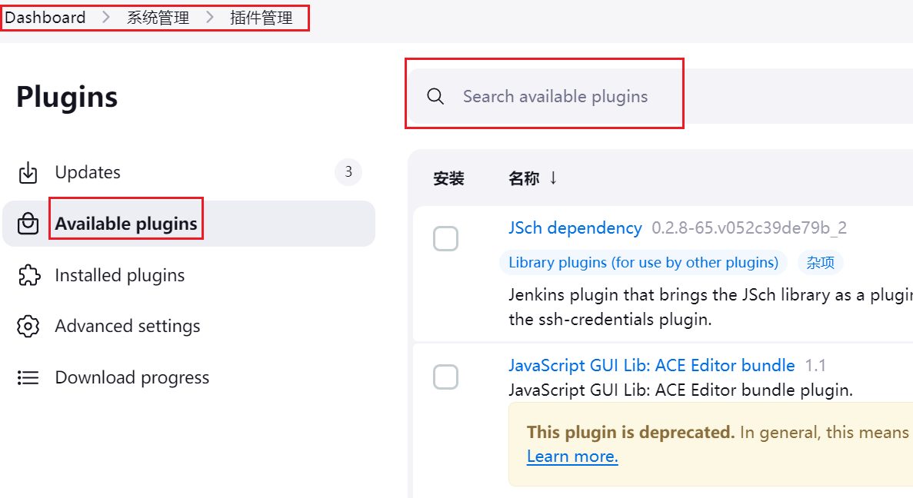

在上一小节中，我们介绍了如何使用`Jenkins`部署一个简单的`Gin`接口项目。但目前每次代码更新后，都需要手动在`Jenkins`平台上触发构建，这样不仅繁琐，还违背了`CI`的自动化理念。

为了解决这个问题，我们需要在`Git`仓库中进行相关配置，使得每次代码提交后，能够自动触发`Jenkins`的构建流程。

还记得我们之前在`Jenkins`中配置的`shell`命令吗？现在我们可以将这些命令写入一个脚本文件，并将该文件提交到远程仓库进行统一管理。下面就是`deploy.sh`文件内容：

```shell
kill -9 $(lsof -i:9000 -t)
go mod tidy
go build -o hello
export BUILD_ID=DONTKILLME
nohup ./hello > hello.log 2>&1 &
sleep 5
ps aux | grep hello
```

与之前的配置相比，该文件多了第一行，用于查找占用`9000`端口的进程的进程`ID`，并将其传递给`kill`命令，强制终止该进程。否则构建虽然是成功的，但是上次的进程没有杀掉，读不到代码的变化。

我们需要再下载一个工具`lsof`，用于列出系统中已经被打开的文件：

```shell
apt-get install lsof
```

这样操作后，`Jenkins`上执行`shell`那里只需这样一条命令：

```shell
bash ./deploy.sh
```

配置如下所示：


在插件管理页面的搜索框中输入`Gitee`，找到相关插件后点击安装：



安装完成：


然后我们先配置`Jenkins`对`Gitee`的`webhook`接收地址，进入系统设置：


拉到下面就能看到`Gitee`配置，按照下图进行操作：


接下来添加凭据：


点击`Gitee`配置界面右下角的“测试链接”，看到成功二字，即配置成功。点击保存，把这个配置保存下来。

进入之前建立的构建，点击“构建触发器”：


进入`Gitee`页面，点击对应项目的管理，找到`webhooks`，点击添加`webhook`：


配置上方在`Jenkins`页面中获取到的`URL`：


这里的`webhook`密码需要在`Jenkins`里手动生成：


这里添加会失败，因为`Gitee`只能接受公网地址，我这个是本地虚拟机环境，属于内网地址：


所以我需要使用一些方法让我的虚拟机`IP`地址可以被公网访问。或者使用同样是内网的`GitLab`，也可以访问内网的`Jenkins`。

这里我将创建一个`GitLab`项目，和`Jenkins`来一个更完整的演示。