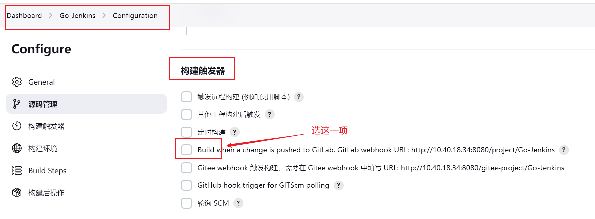
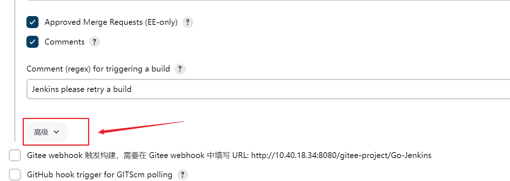

在上一节中讲到，在`Gitee`的`webhook`里添加在`Jenkins`里生成的`URL`地址后，添加失败了，因为`Gitee`只能接受公网地址，而我的`Jenkins`是安装在本地虚拟机里的，属于内网地址。

有以下两个解决办法：

1. 让我的虚拟机`IP`地址可以被公网访问。
2. 使用同样安装在内网的`Gitlab`。

因为我这只是学习，所以使用第二种方法会更便捷快速。这里我们安装好了`Gitlab`。

新建一个项目，页面如下所示：


> 这里我给仓库取的名不规范，正常规范下应该为小写中划线。

我们添加一下`SSH`密钥。在该项目根路径下，打开`Git bash`窗口，输入以下命令（邮箱换成自己的）：

```bash
ssh-keygen -t rsa -b 4096 -C "userwsj@126.com"
```

按三次回车，也就是文件名、密码、确认密码都不设置：


在`~/.ssh`目录下即可找到`id_rsa`和`id_rsa.pub`这两个文件，前者是私钥，后者是公钥：


我们使用`cat id_rsa.pub`命令查看`SSH`公钥，并复制：


`Gitlab`项目界面上面有一个添加`SSH`密钥，点击它：


选择“添加新密钥”：


把刚才复制的密钥粘贴在这里：


我们把远程仓库修改到我们`Gitlab`新创建的项目上，可以参照`Git`使用模块的“`Git`远程仓库修改”。

这里我们需要关注一点，在进行远程仓库绑定时，如果使用如下命令：

```bash
git remote add origin http://10.40.18.34/mundo/go-jenkins.git
```

在进行关联推送时，会报如下错误：

```bash
PS C:\wangsj\Go-Jenkins> git push -u origin master
fatal: unable to access 'http://10.40.18.34/mundo/go-jenkins.git/': Failed to connect to 10.40.18.34 port 80: Connection refused
```

这是因为我们的`Gitlab`是使用`Docker`创建出来的，在之前做端口映射的时候，是把宿主机的`8090`端口映射到了容器的`80`端口，所以我们不能使用默认端口`80`，而应该明确指定端口`8090`：

```bash
git remote add origin http://10.40.18.34:8090/mundo/go-jenkins.git
```

其余的配置信息都可以参照上一节的文件内容来做。修改下面这个地方为`Gitlab`的地址：


我们按照安装`Gitee`插件同样的步骤安装`Gitlab`插件：


安装时出现了一个错误，是由于一些插件的当前版本与`Gitlab`插件不兼容导致的。报错信息如下：

- `Credentials Plugin`需要更新到`1311.vcf0a_900b_37c2`或更高版本
- `Jenkins Git client plugin`需要更新到`4.6.0`或更高版本
- `Matrix Project Plugin`需要更新到`822.v01b_8c85d16d2`或更高版本

解决办法也很简单，在插件市场重新下载上面这三个插件。下载完成后需要重启一下`Jenkins`的`Docker`容器。

进入下面的“系统配置”页面：


这里就是我们配置`Gitlab`信息的地方，后续会继续讲解。

进入`Gitlab`，进入项目，在设置下找到“访问令牌”：


选择“添加新令牌”：


我们这里添加了所有权限，角色选择`Developer`：


访问令牌只能在页面查看一次，如果没有记录下来，只能删除重新创建。

接上文，在`Jenkins`的页面中，进入`Gitlab`的系统配置，我们点击添加凭证：


按照图示内容进行填充：


信息设置完成后，点击测试，看到显示`Success`，代表配置成功：


再进入之前建立的构建的配置，在“构建触发器”这里选择下面这项：



这里也是一样，把这个`webhook URL`记录下来：


在该页面往下翻，点击“高级”按钮：



最下面有一个`Secret Token`，点击生成按钮：


复制这个内容，在后面用得到。

点击保存，然后去`Gitlab`页面上，配置`webhook`。点击“添加新的`webhook`”：


按照图示内容进行填充，这里填充的内容都是上文中复制下来的：


这里的“触发来源”我们先选择“推送事件”。

添加失败，出现了这样一个问题：


这是`Gitlab`阻止了对本地网络的请求，是`Gitlab`的一个安全特性。首先用管理员账号登录`Gitlab`，按照下面步骤操作：


点击`Network`：


按照图示内容进行操作：


操作完成，保存，回到`webhook`页面，重新添加`webhook`：


创建成功！测试后，在`Jenkins`看到了构建记录。

我们再测试一下真实的推送事件，修改代码并推送至仓库，`Jenkins`执行了构建：


访问接口，也读到了这个变化。