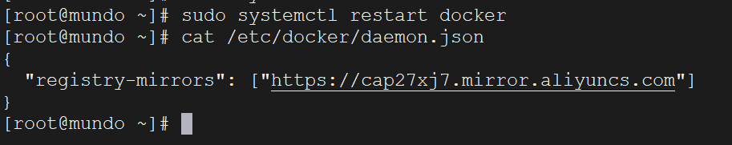
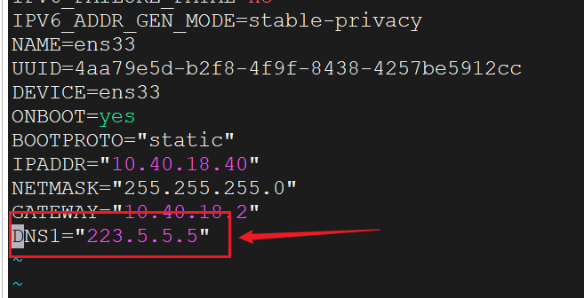
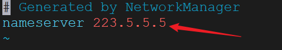

我们基于centos来安装docker。

```shell
# 1、yum 包更新到最新 
yum update
# 2、安装需要的软件包， yum-util 提供yum-config-manager功能，另外两个是devicemapper驱动依赖的 
yum install -y yum-utils device-mapper-persistent-data lvm2
# 3、 设置yum源
yum-config-manager --add-repo https://download.docker.com/linux/centos/docker-ce.repo
# 4、 安装docker，出现输入的界面都按 y 
yum install -y docker-ce
# 5、 查看docker版本，验证是否验证成功
docker -v
```

当发生如下报错：

```
Error: Failed to download metadata for repo 'appstream': Cannot prepare internal mirrorlist: No URLs in mirrorlist
```

依次执行：

```shell
cd /etc/yum.repos.d/
sed -i 's/mirrorlist/#mirrorlist/g' /etc/yum.repos.d/CentOS-*
sed -i 's|#baseurl=http://mirror.centos.org|baseurl=http://vault.centos.org|g' /etc/yum.repos.d/CentOS-*
yum makecache
yum update -y
```

安装完docker后，我们需要配置docker镜像加速器。原因：从dockerhub上下载镜像太慢。

dockerhub：https://hub.docker.com/

这里我们配置阿里云镜像加速器。

```shell
sudo mkdir -p /etc/docker
sudo tee /etc/docker/daemon.json <<-'EOF'
{
  "registry-mirrors": ["https://cap27xj7.mirror.aliyuncs.com"]
}
EOF
sudo systemctl daemon-reload
sudo systemctl restart docker
```

执行这些内容就可以了。

查看是否配置成功：

```shell
cat /etc/docker/daemon.json
```



还需要设置一步，docker的开机自启动：

```bash
systemctl enable docker
```

docker的启动

```
systemctl start docker
```

查看docker启动状态

```
systemctl status docker
```

问题解决：我们在使用`docker pull`命令拉取镜像时，如果遇到这样的问题：

```
Error response from daemon: Get "https://registry-1.docker.io/v2/": dial tcp: lookup registry-1.docker.io on 10.40.18.2:53: server misbehaving
```

解决方案：这是DNS服务器的配置问题

我们修改本机的网络配置文件

```bash
vim /etc/sysconfig/network-scripts/ifcfg-ens33
```



有这样一条DNS1的话，我们把它改成`223.5.5.5`

保存，重启，这样`docker pull`就没问题了。

我们可以去一个文件看它的DNS配置：

```bash
vim /etc/resolv.conf
```



