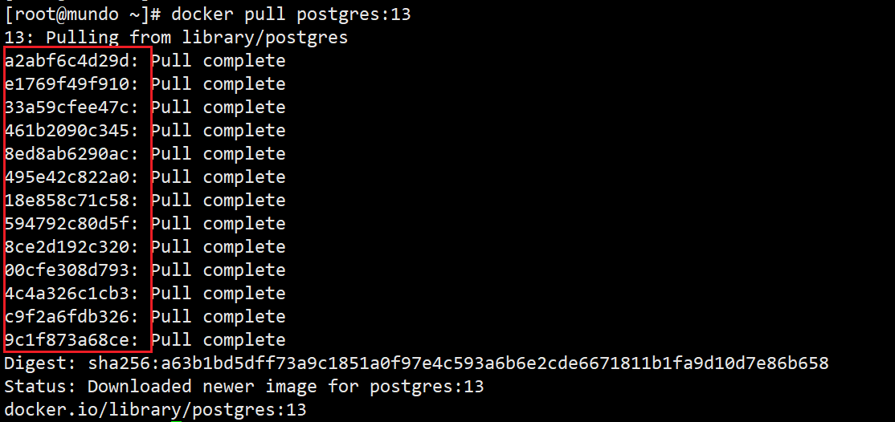

### bootfs和rootfs

Linux文件系统由bootfs和rootfs组成。

bootfs指包含bootloader（引导加载程序）和内核映像的文件系统，这个文件系统在被引导时加载到内存中，并由bootloader用于引导操作系统，用于**初始化系统**。

rootfs是在Linux中作为根文件系统的初始文件系统，它包含了操作系统的最基本文件和目录结构，提供了启动后的最初文件系统环境，也就是我们**操作的Linux文件结构**。

不同的Linux发行版（如centos、ubuntu）的bootfs基本一样，而rootfs不同。

### docker镜像原理

镜像是一种轻量级的、可执行的独立软件包，核心概念是将软件运行所需的一切打包在一起，形成一个封闭的环境，包含运行某个软件所需要的内容，包括代码、运行时、库、环境变量、配置文件等。

docker使用一种名为UnionFS（联合文件系统）的技术实现镜像的加载原理，它是一种**文件系统层叠技术**，允许将多个文件系统合并到单一的文件系统中，它提供文件系统的**联合视图**，使用户能够同时访问多个不同的文件系统层次结构，但是用户看起来就像是一个文件系统。

docker镜像实际上就是一层一层的文件系统叠加组成。

1. 最底端是bootfs，并且使用宿主机的bootfs。
2. 第二层是rootfs，由宿主机的Linux版本决定，也叫文件系统层。
3. 然后再往上，就是叠加其他的镜像文件，一个镜像可以放在另一个镜像的上面，位于下面的叫做父镜像。
4. 当从一个镜像启动容器时，docker会在最顶层加载一个读写文件系统作为容器，这就是容器层。

docker采用分层结构，最大的好处就是**资源共享**。

体现docker分层

