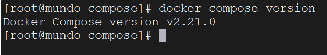

docker compose就是用于定义和运行多容器docker应用程序的工具，通过一个简单的yaml文件，配置应用的服务、网络和卷，使用一条命令轻松地启动整个应用。

下面是一个docker compose文件的例子：

```yaml
version: '3'
services:
  web:
    image: nginx:1.24
    ports:
      - "8080:80"
    restart: always
  database:
    image: postgres:13
    environment:
      POSTGRES_PASSWORD: 123456
```

这里我们定义了两个服务，一个是nginx:1.24镜像运行的web服务，一个是postgres:13镜像运行的database。

这个文件建议命名为 `docker-compose.yml`

`docker-compose`命令需要下载，我们这里使用国内镜像源下载：

```bash
curl -SL https://get.daocloud.io/docker/compose/releases/download/latest/docker-compose-linux-x86_64 -o /usr/local/bin/docker-compose
```

赋予执行权限：

```bash
chmod +x /usr/local/bin/docker-compose
```

查看版本：

```bash
docker compose version
```



也有一些版本，查看版本的命令是`docker-compose --version`，执行命令也是`docker-compose`，而我们这个的执行命令是`docker compose`，下同。

使用docker compose启动应用非常简单，首先我们切换到docker-compose.yml文件的目录下，运行以下命令：

```shell
docker compose up
```

如果文件名不叫 docker-compose.yml，也可以通过 -f 来指定文件名：

```shell
docker compose -f my-compose-file.yml up
```

想在后台运行，加上 -d 选项，通常都这么用。

```shell
docker compose up -d
```

想停止并移除所有容器，可以运行：

```bash
docker compose down
```

