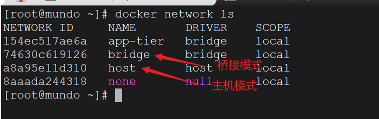

当使用Docker进行容器化应用开发时，网络是一个重要的组成部分。Docker提供了一系列命令用于管理容器间的网络。以下是一些常用的Docker网络命令：

查看当前系统的所有docker网络：

```bash
docker network ls
```



创建一个新的网络（默认为桥接模式bridge）：

```bash
docker network create <network_name>
```

可以通过添加参数来指定网络的驱动程序、子网、网关等选项：

```bash
docker network create \
  --driver bridge \
  --subnet 192.168.0.0/24 \
  --gateway 192.168.0.1 \
  --ip-range 192.168.0.128/25 \
  <network_name>
```

查看网络的详细信息：

```bash
docker network inspect <network_name>
```

将容器连接到网络：

```bash
docker network connect <network_name> <container_name>
```

将容器从网络中断开：

```bash
docker network disconnect <network_name> <container_name>
```

我们也可以在`docker run`创建容器的时候就指定我们连接哪个网络，加入下面这个参数：

```
--network <network_name>
```

删除一个网络：

```bash
docker network rm <network_name>
```

删除所有未使用的网络：

```bash
docker network prune
```
