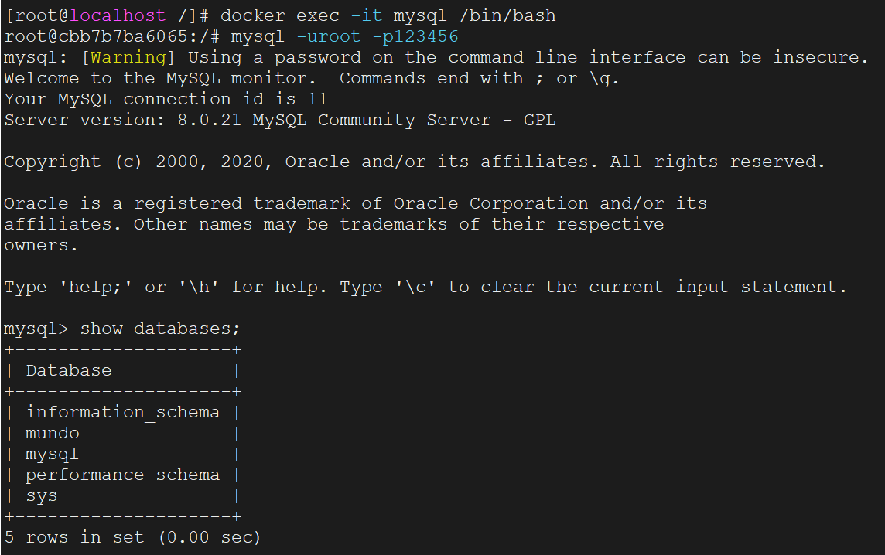

这里我们安装MySQL8.0

拉取MySQL8.0镜像

```bash
docker pull mysql:8.0.21
```

创建mysql的docker容器

```bash
docker run -d \
--name mysql \
-e MYSQL_ROOT_PASSWORD=123456 \
-p 3306:3306 \
--restart always \
mysql:8.0.21
```

使用`docker ps`查看容器是否启动成功

然后要把MySQL容器的几个配置文件复制到宿主机，这里我们复制到`/home/docker/mysql/conf`文件夹下

先把这个目录创建出来，因为`docker cp`命令不会自动在宿主机创建目录：

```bash
mkdir -p /home/docker/mysql/conf
```

然后执行下面命令：

```bash
docker cp mysql:/etc/mysql/. /home/docker/mysql/conf
```

复制完文件，停止并删除掉原容器，使用数据卷挂载新创建一个容器：

```bash
docker run -d \
--name mysql \
-e MYSQL_ROOT_PASSWORD=123456 \
-p 3306:3306 \
-v /home/docker/mysql/conf:/etc/mysql \
-v /home/docker/mysql/data:/var/lib/mysql \
-v /home/docker/mysql/log:/var/log/mysql \
--restart always \
mysql:8.0.21
```

进入容器内部

```bash
docker exec -it mysql /bin/bash
```

使用下面命令登录：

```
mysql -uroot -p123456
```



成功。

然后试试使用Navicat连接是否成功。