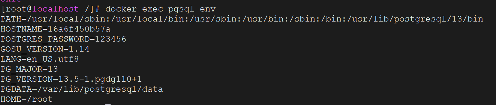
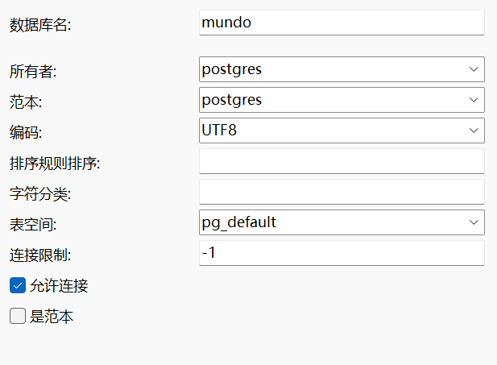

和安装MySQL一样的操作，先拉取镜像：

```bash
docker pull postgres:13
```

创建pgsql的docker容器

```bash
docker run -d \
--name pgsql \
-e POSTGRES_PASSWORD=123456 \
-p 5432:5432 \
--restart always \
postgres:13
```

使用`docker ps`查看容器是否启动成功

进入容器内部：

```bash
docker exec -it pgsql /bin/bash
```

使用下面命令查看pgsql环境信息

```bash
docker exec pgsql env
```



pgsql的默认用户名名称为postgres，且pgsql有一个默认的初始数据库也叫postgres。

使用Navicat连接上pgsql，密码为上面设置的123456

pgsql创建一个数据库挺费劲，跟着下图填就好



