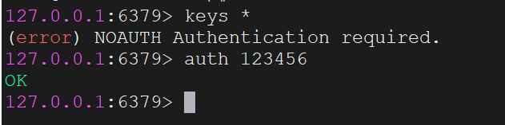

拉取redis镜像

```bash
docker pull redis
```

创建redis容器

```bash
docker run -d \
--name redis \
-p 6379:6379 \
--restart always \
redis \
--requirepass 123456
```

这里我们设置redis的密码为123456

进入redis容器

```bash
docker exec -it redis /bin/bash
```

使用下面命令进入到redis客户端：

```
redis-cli
```

需要输入密码：



再试试使用Redis Desktop Manager（RDM）能不能连上。

Redis不涉及用户名的概念，仅仅通过密码来进行身份验证。

这三个数据库，我展示的都是最简单的安装方式，还有一些挂载目录的，设置配置文件的，以后用到再补充。