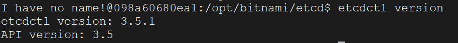

拉取镜像：

```sh
docker pull bitnami/etcd:latest
```

启动etcd服务器实例：

```sh
docker run -d --name etcd \
-p 2379:2379 \
-p 2380:2380 \
-e ALLOW_NONE_AUTHENTICATION=yes \
bitnami/etcd:latest
```

启动容器后，我们进入容器：

```sh
docker exec -it etcd /bin/bash
```

设置这个变量，以便让etcdctl可以连接上etcd服务器：

```sh
export ETCDCTL_API=3
```

然后查看etcdctl的版本信息：

```sh
etcdctl version
```



查看到上图结果，代表etcd启动成功！

"I have no name!"这个提示意味着在Docker容器中找不到一个有效的用户名。这可能是因为容器内部的用户和宿主机的用户不匹配，或者没有设置正确的用户身份。虽然这个提示会显示出来，但通常不会影响容器的正常运行。