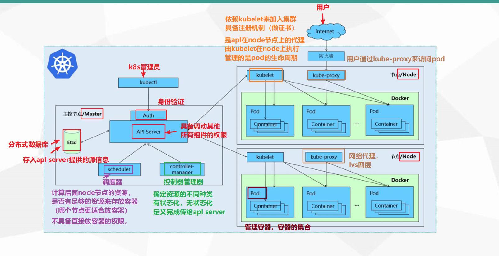

应用部署方式经历过三个时代：

1. **传统部署**：应用程序部署在物理服务器上，每个应用有独立的服务器。部署方式是在每个物理机上手动安装和配置，可伸缩性有限，部署速度较慢，资源利用率不高。
2. **虚拟化部署**：使用虚拟化技术，如VMWare，将应用程序隔离在虚拟机中。部署方式是将应用程序打包成虚拟机镜像，在不同环境中运行，提高了资源利用率，便于快速部署和迁移。
3. **容器化部署**：使用容器化技术，如Docker，将应用程序及其依赖打包成一个独立的容器。部署方式是以容器形式发布，在任意支持容器的环境中运行，相对虚拟化部署有更高的资源利用率，以及灵活性和可移植性，便于快速部署，并且有更好的隔离性。

但是容器化部署还是有一些需要解决的问题，例如：

1. **故障容忍与高可用性**：一个容器发生故障停机时，需要快速检测到故障并采取措施，让另一个容器迅速启动，替代停机的容器，确保应用的连续可用。
2. **横向扩展与负载均衡**：当并发访问数增加时，需要动态地增加容器数量，以应对高负载情况。同时，需要确保请求能够均匀分布到各个容器实例，实现负载均衡。

所以，我们就引入了一些容器编排工具，例如K8s。

kubernetes，我们通常叫他K8s，是一个开源的容器编排平台，用于自动化容器化应用程序的部署、扩展和操作。它提供了一套用于容器集群管理的强大工具。

K8s主要提供了以下功能：

- **自我修复：** K8s能够在极短时间内迅速检测并替代崩溃的容器，确保应用持续可用性。
- **服务发现：** 应用通过自动发现机制找到所需服务，简化配置和提升整体系统可靠性。
- **弹性伸缩：** 根据负载需求，K8s自动调整容器数量，实现高效资源利用和动态扩缩。
- **负载均衡：** 多容器服务自动实现请求均衡分配，优化性能和确保稳定的服务响应。
- **版本回退：** 支持快速回滚到稳定版本，应对新版本问题，确保系统的稳定性和可维护性。
- **存储编排：** K8s能根据容器要求动态创建和分配存储卷，提升应用数据的持久性。

K8s的本质是一组服务器集群，一个K8s集群主要是由一个控制节点（Master）和若干工作节点（Node）构成。

有关于Master节点和Node节点所拥有的组件的详细说明，写到了下面两个章节中。

下面讲一下K8s系统中各个组件的调用关系，例如我们要部署一个Nginx的容器：

当在Kubernetes系统中部署一个Nginx服务时，以下是各组件之间的调用关系：

1. Kubernetes环境启动后，Master和Node节点将自身信息存储到Etcd数据库。

2. 安装Nginx的请求首先发送到Master节点的APIServer组件。

3. APIServer组件调用Scheduler组件，决定将该服务安装到哪个Node节点上。

   在此过程中，Scheduler从Etcd中读取各个Node节点的信息，按照特定算法进行选择，并将这个决定写入Etcd，且通知给APIServer。

4. APIServer调动Node节点的Kubelet，进行Node节点的调度以安装Nginx服务。

5. Kubelet接收到指令后，通知Docker启动一个Nginx的Pod。

   Pod是Kubernetes的最小操作单元，容器必须运行在Pod中。

6. Nginx服务成功运行后，如果需要访问，外部用户可以通过Kube-Proxy来代理访问Pod。

   这样，外部用户就能够访问集群中的Nginx服务。

7. Controller-Manager负责监控集群的状态，并确保系统达到预期的状态。包含不同的控制器，达到保证Node节点的状态符合期望，维护Pod的数量等功能。

