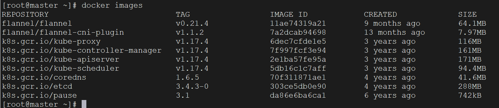
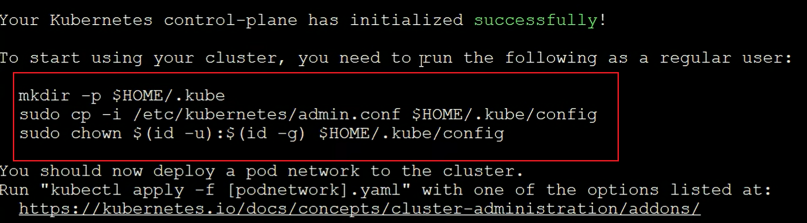
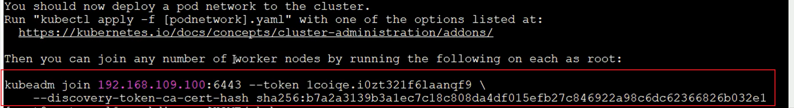
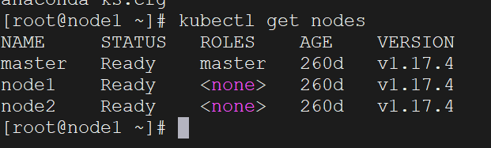
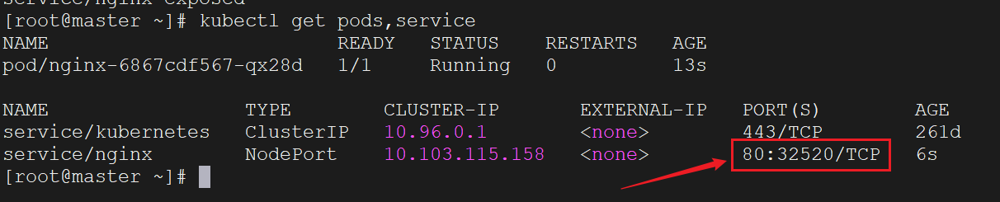

K8s集群分为两类：一主多从和多主多从


对于测试环境，或者中小型应用，一主多从足以满足要求。

对于大规模生产环境，追求更高的可用性和容错性，使用多主多从的架构。

对于我们个人学习来说，搭建一主多从就可以了，这里我们搭建一主二从的结构。

准备三台服务器

| 作用   | IP地址      | 操作系统                    | 配置                     |
| ------ | ----------- | --------------------------- | ------------------------ |
| Master | 10.40.18.16 | Centos7.5    基础设施服务器 | 2颗CPU  2G内存   50G硬盘 |
| Node1  | 10.40.18.17 | Centos7.5    基础设施服务器 | 2颗CPU  2G内存   50G硬盘 |
| Node2  | 10.40.18.18 | Centos7.5    基础设施服务器 | 2颗CPU  2G内存   50G硬盘 |

首先我们检查操作系统版本，必须是Centos7.5以上才行

```bash
cat /etc/redhat-release
```

下面的命令，三台机器都需要操作：

配置主机名解析，方便集群节点间直接调用，编辑 /etc/hosts 文件，添加下面内容

```
10.40.18.16 master
10.40.18.17 node1
10.40.18.18 node2
```

设置时间同步，K8s要求集群中的节点时间必须精确一致

```bash
systemctl start chronyd
systemctl enable chronyd
```

设置完后用 date 命令验证时间是否一致

禁用防火墙和iptables

```bash
systemctl stop firewalld
systemctl disable firewalld
systemctl stop iptables
systemctl disable iptables
```

禁用selinux，它是linux系统下的一个安全服务，如果不关闭它，在安装集群中会产生一些奇葩问题

```bash
vim /etc/selinux/config
SELINUX=disabled  # 修改这个值
```

禁用swap分区（虚拟内存分区）

它的作用是在物理内存使用完之后，将磁盘空间虚拟成内存来使用，会对系统性能产生负面影响。

```
vim /etc/fstab

# 注释掉下面这一行，然后重启Linux服务
# /dev/mapper/centos-swap swap                      swap    defaults        0 0
```

修改linux的内核参数，添加网桥过滤和地址转发功能

```bash
vim /etc/sysctl.d/kubernetes.conf

# 添加如下配置
net.bridge.bridge-nf-call-ip6tables = 1
net.bridge.bridge-nf-call-iptables = 1
net.ipv4.ip_forward = 1

# 重新加载配置
sysctl -p

# 加载网桥过滤模块
modprobe br_netfilter

# 查看网桥过滤模块是否加载成功
lsmod | grep br_netfilter
```

配置ipvs功能，手动载入ipvs模块

```bash
# 1 安装ipset和ipvsadm
yum install ipset ipvsadmin -y

# 2 添加需要加载的模块写入脚本文件
cat <<EOF >  /etc/sysconfig/modules/ipvs666.modules
#!/bin/bash
modprobe -- ip_vs
modprobe -- ip_vs_rr
modprobe -- ip_vs_wrr
modprobe -- ip_vs_sh
modprobe -- nf_conntrack_ipv4
EOF

# 3 为脚本文件添加执行权限
chmod +x /etc/sysconfig/modules/ipvs.modules

# 4 执行脚本文件
/bin/bash /etc/sysconfig/modules/ipvs.modules

# 5 查看对应的模块是否加载成功
lsmod | grep -e ip_vs -e nf_conntrack_ipv4
```

上述安装完成后，需要使用`reboot`命令重启Linux系统

K8s要依赖Docker，需要保证Docker已经安装完毕，使用下面命令查看

```bash
docker version
```

切换成国内镜像源

```bash
vim /etc/yum.repos.d/kubernetes.repo

# 添加以下配置
[kubernetes]
name=Kubernetes
baseurl=http://mirrors.aliyun.com/kubernetes/yum/repos/kubernetes-el7-x86_64
enabled=1
gpgcheck=0
repo_gpgcheck=0
gpgkey=http://mirrors.aliyun.com/kubernetes/yum/doc/yum-key.gpg
       http://mirrors.aliyun.com/kubernetes/yum/doc/rpm-package-key.gpg
```

安装K8s组件

```bash
# 安装kubeadm、kubelet和kubectl
yum install --setopt=obsoletes=0 kubeadm-1.17.4-0 kubelet-1.17.4-0 kubectl-1.17.4-0 -y

# 配置kubelet的cgroup
vim /etc/sysconfig/kubelet

# 添加如下配置
KUBELET_CGROUP_ARGS="--cgroup-driver=systemd"
KUBE_PROXY_MODE="ipvs"

# 设置kubelet开机自启
systemctl enable kubelet
```

安装kubernetes集群之前，必须要提前准备好集群需要的镜像，所需镜像可以通过下面命令查看

```bash
kubeadm config images list
```

使用国内的源，下载对应镜像

```bash
# 定义要下载的镜像
images=(
    kube-apiserver:v1.17.4
    kube-controller-manager:v1.17.4
    kube-scheduler:v1.17.4
    kube-proxy:v1.17.4
    pause:3.1
    etcd:3.4.3-0
    coredns:1.6.5
)

# 使用for循环，下载这些镜像
for imageName in ${images[@]} ; do
	docker pull registry.cn-hangzhou.aliyuncs.com/google_containers/$imageName
	docker tag registry.cn-hangzhou.aliyuncs.com/google_containers/$imageName 		k8s.gcr.io/$imageName
	docker rmi registry.cn-hangzhou.aliyuncs.com/google_containers/$imageName
done
```

安装完后，通过`docker images`命令查看到这些镜像



下面要对集群进行初始化，创建集群并将node节点加入集群

#### 下面的命令只需要在master节点执行

```bash
# 创建集群（最后的ip信息换成我们自己的master的ip）
kubeadm init \
--kubernetes-version=v1.17.4 \
--pod-network-cidr=10.244.0.0/16 \
--service-cidr=10.96.0.0/12 \
--apiserver-advertise-address=10.40.18.16
```

集群创建完后，会弹出这样一些信息，执行它们（对照着自己执行出的内容来）



```bash
mkdir -p $HOME/.kube
sudo cp -i /etc/kubernetes/admin.conf $HOME/.kube/config
sudo chown $(id -u):$(id -g) $HOME/.kube/config
```

给K8s安装网络插件，我们选用flannel，首先获取flannel的配置文件：

可以访问GitHub网址：https://github.com/flannel-io/flannel/blob/master/Documentation/kube-flannel.yml

下载这个`kube-flannel.yml`配置文件，放到master的服务器中，执行下面命令：

```bash
kubectl apply -f kube-flannel.yml
```

#### 下面的命令只需要在node节点执行

上面master创建集群后出来的结果有一句命令，长这个样子：



复制自己生成的，粘贴到所有的node节点中。

然后查看集群状态：

```bash
kubectl get nodes
```



出来这样的结果，表示K8s的集群搭建成功。

我们尝试部署一个Nginx程序，测试集群是否在正常工作，在master节点执行下面代码：

```bash
# 部署Nginx
kubectl create deployment nginx --image=nginx:1.14-alpine
# 暴露端口
kubectl expose deployment nginx --port=80 --type=NodePort
```

然后我们查看服务状态，列举出Pod和Service，这里可以在Master和Node都运行下：

```bash
kubectl get pods,service
```



部署成功！我们看到端口映射是32520，使用Master或者Node节点的`ip:port`访问一下：


出现此结果，表示部署成功了。

如何关掉上面创建的Pod和Service，使用以下命令：

```bash
kubectl delete deployment nginx
kubectl delete service nginx
```

