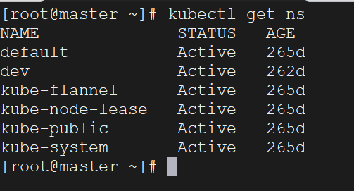
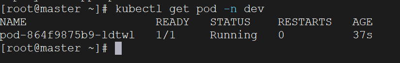

首先，我们要操作K8s的资源，就必须使用`kubectl`命令，kubectl是Kubernetes命令行工具，用于与Kubernetes集群进行交互，对集群进行管理。

`kubectl`的语法如下所示：

```bash
kubectl [command] [type] [name] [flags]
```

1. `command`：指定要对资源进行的操作，例如`create`、`get`、`delete`
2. `type`：指定资源类型，例如`pods`、`service`、`namespaces`
3. `name`：指定操作的资源对象的名称，名称的大小写敏感
4. `flags`：可选标志，提供额外的参数或选项。例如`-n`指定命名空间，`-o`指定输出格式

例如我想要查看所有Pod：

```bash
kubectl get pod
```

查看某个Pod：

```bash
kubectl get pod <pod_name>
```

查看某个Pod，并以`yaml`格式展示结果：

```bash
kubectl get pod <pod_name> -o yaml
```

下面是一些常见的资源类型名称、缩写以及作用：

| 资源名称              | 缩写   | 资源作用                                  |
| --------------------- | ------ | ----------------------------------------- |
| Pod                   | po     | 最小的可部署单元，用于托管容器            |
| Deployment            | deploy | 管理 Pod 副本的控制器，支持滚动升级和回滚 |
| Service               | svc    | 定义一组 Pod 的访问方式，提供网络服务发现 |
| Namespace             | ns     | 用于将集群划分成多个虚拟集群              |
| ConfigMap             | cm     | 存储非敏感的配置数据                      |
| Secret                | secret | 存储敏感的配置数据，如密码、API 密钥等    |
| PersistentVolume      | pv     | 存储集群中持久化数据的抽象层              |
| PersistentVolumeClaim | pvc    | 用于请求和使用持久存储资源                |
| ServiceAccount        | sa     | 为 Pod 中的进程提供身份和权限             |
| Ingress               | ing    | 允许外部流量访问集群中的服务              |
| StatefulSet           | sts    | 管理有状态应用程序的控制器                |
| DaemonSet             | ds     | 确保在集群中的每个节点上运行一个 Pod      |
| Job                   | job    | 管理一次性任务，可用于批处理工作          |
| CronJob               | cj     | 基于时间的作业调度，类似于定时任务        |

还有更多的资源类型，可以使用下面的命令查看：

```bash
kubectl api-resources
```

下面是一些常见的操作命令：

| 命令名称               | 命令作用                           |
| ---------------------- | ---------------------------------- |
| `kubectl get`          | 获取资源的信息                     |
| `kubectl describe`     | 显示资源的详细信息                 |
| `kubectl create`       | 创建资源                           |
| `kubectl apply`        | 使用配置文件创建或更新资源         |
| `kubectl delete`       | 删除资源                           |
| `kubectl edit`         | 编辑资源                           |
| `kubectl logs`         | 查看Pod的日志                      |
| `kubectl exec`         | 在Pod中执行命令                    |
| `kubectl port-forward` | 将本地端口转发到Pod                |
| `kubectl rollout`      | 管理应用的滚动更新                 |
| `kubectl scale`        | 调整Deployment的副本数             |
| `kubectl expose`       | 创建Service，并暴露应用的服务      |
| `kubectl attach`       | 连接到正在运行的容器               |
| `kubectl cluster-info` | 显示集群信息                       |
| `kubectl top`          | 显示节点或Pod的资源使用情况        |
| `kubectl cp`           | 在容器和本地文件系统之间复制文件   |
| `kubectl version`      | 显示Kubernetes客户端和服务器的版本 |

更多操作命令，可以使用下面的指令查看：

```bash
kubectl --help
```

我们这里创建一个`namespace`，在这个namespace下创建一个`pod`，然后删除pod和namespace。

创建namespace，命名为dev

```bash
kubectl create namespace dev
```

查看所有namespace

```bash
kubectl get ns
```



在此namespace下创建并运行一个nginx的pod

```bash
kubectl run pod --image=nginx -n dev
```

查看对应namespace下的所有pod

```bash
kubectl get pod -n dev
```



删除这个pod

```bash
kubectl delete pod <pod-name>
```

这里的`pod-name`就是上面查看pod查出来的：pod-864f9875b9-ldtwl

删除指定的namespace

```bash
kubectl delete ns dev
```

