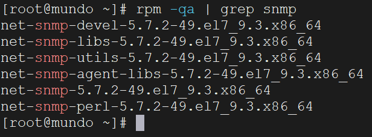
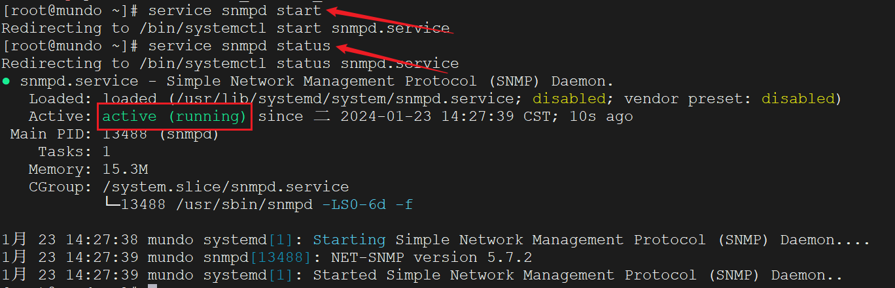
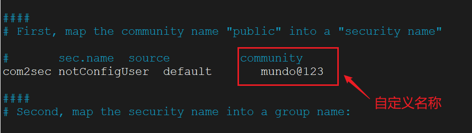
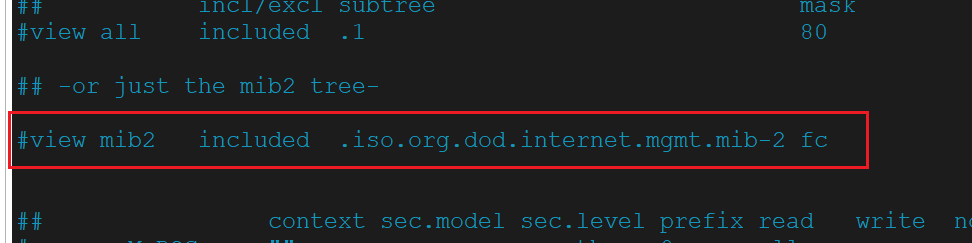
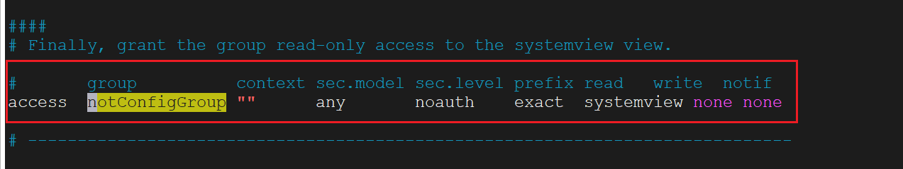
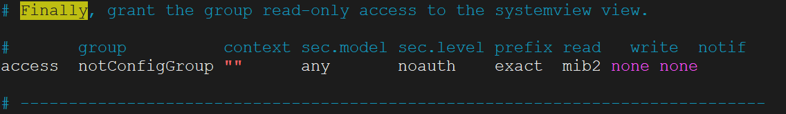
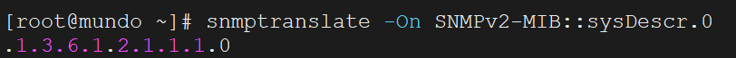
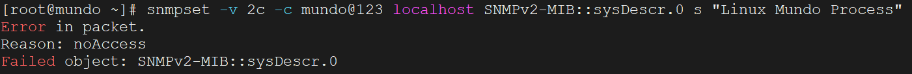

我工作中写完了一个SNMP的Set接口，现在想进行测试，但是没有好的测试机，我只能在本地虚拟机安装SNMP环境，进行测试。

这里我的环境是`CentOS Linux release 7.9.2009 (Core)`

首先先看一下你的Linux主机有没有配置安装了snmp服务：

```bash
rpm -qa | grep snmp
```


一般都是没有安装过的，我们就操作下面的命令进行安装：

```bash
yum install -y net-snmp
yum install -y net-snmp-devel
yum install -y net-snmp-libs
yum install -y net-snmp-perl
yum install -y net-snmp-utils
yum install -y mrtg
```

安装完成后，再使用`rpm -qa | grep snmp`看一下是否已成功安装：



出现这些内容，说明已经安装成功！

输入下面命令，启动SNMP服务，并查看SNMP服务的状态：

```bash
service snmpd start
service snmpd status
```



然后要修改一下配置文件：

```bash
vim /etc/snmp/snmpd.conf
```

找到这一行：



把这个public改为自定义的字符串，我这里就改为：mundo@123

这里的default字段如果想指定特定的服务器采集数据，就换成允许采集服务器的IP地址，我这里就不换了。

找到这一行，把这一行的注释打开：



然后再放开权限，找到这一行：



把它换成这个样子：



然后我们重启服务，并设置开机自重启：

```bash
systemctl restart snmpd.service
systemctl enable snmpd.service
systemctl is-enabled snmpd  // 显示enabled
```

因为我们这台机器已经关闭了防火墙，所以就不需要再开放防火墙端口了。

然后我们可以试着用命令去访问它，例如Get操作：

```bash
snmpget -v 2c -c mundo@123 localhost sysDescr.0
```

查到了这样一条信息，我们看一下：

```
SNMPv2-MIB::sysDescr.0 = STRING: Linux mundo 3.10.0-1160.105.1.el7.x86_64 #1 SMP Thu Dec 7 15:39:45 UTC 2023 x86_64
```

前面的`SNMPv2-MIB::sysDescr.0`就是OID的值，`STRING`就是类型（Type），冒号后面的内容就是值（Value）

这里我有些不解，不是说OID都是由数字和小数点组成的吗？例如`1.3.6.1.2.1.1.1.0`，这里怎么是一个字符串？其实是为了使OID更容易理解和使用，SNMP 使用了一种更加人类可读的文本表示法，即符号名（Symbolic Names）。这种表示法使用了 MIB（管理信息库）模块的名字和对象的符号名，使得 OID 更容易识别和记忆。

在上面的例子中：

- `SNMPv2-MIB` 是 MIB 模块的名字。
- `sysDescr.0` 是在该模块中的对象的符号名，表示系统描述信息。

在实际的 SNMP 操作中，系统会根据 MIB 模块来映射符号名到相应的数字 OID，我们也可以使用下面命令查看：

```bash
snmptranslate -On SNMPv2-MIB::sysDescr.0
```



在使用Postman等接口工具测试时，只能使用这样的数字+小数点格式。

我们这里再执行一下Set操作：

```bash
snmpset -v 2c -c mundo@123 localhost SNMPv2-MIB::sysDescr.0 s "Linux Mundo Process"
```

有问题：



这是因为这个OID不允许修改，就这么简单。

再看看Walk操作，我想查看指定MIB下的所有OID，例如`IPV6-MIB::ipv6IfPhysicalAddress`下的：

```bash
snmpwalk -v 2c -c mundo@123 localhost IPV6-MIB::ipv6IfPhysicalAddress
```

之后我再看看自己创建OID的内容吧，再做补充。