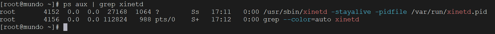
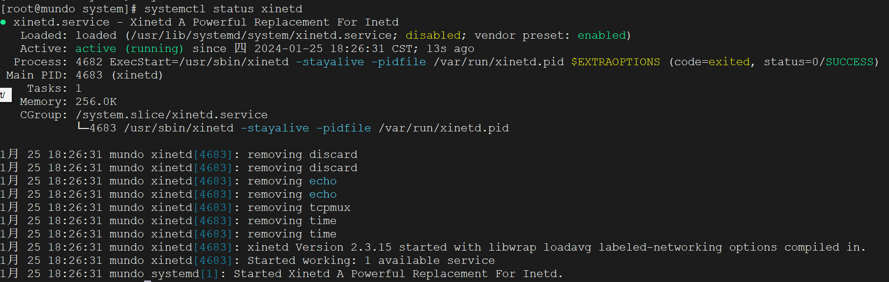
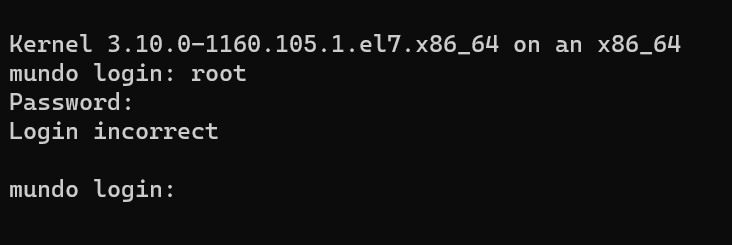
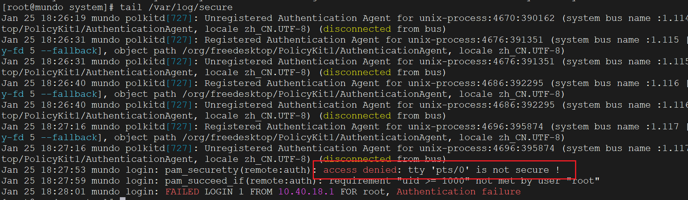
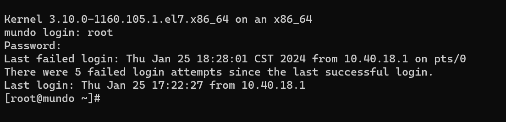

Centos7默认是不安装telent命令的，所以我们需要手动安装一下Telnet

首先确认一下是否安装了telnet和依赖的xinetd：

```bash
rpm -qa | grep telnet
```

安装下Telnet的服务端、客户端、xinetd：

```bash
yum install xinetd
yum install telnet
yum install telnet-server
```

为什么需要`xinetd`，它是什么？`xinetd`的全称为extended Internet services daemon，是一个运行在Unix系统的守护进程，它用于管理网络服务的启动和停止。`xinetd` 可以用于启动 Telnet 服务。当你需要在系统上提供 Telnet 服务时，通常会通过 `xinetd` 来启动 Telnet 服务器。 `xinetd` 会监听对 Telnet 端口的连接请求，并在需要时启动 Telnet 服务器以处理这些连接。

telnet默认不开启，我们修改下面文件来开启服务，修改disable = yes 为 disable = no

```bash
vim /etc/xinetd.d/telnet
```

如果显示为“新文件”，说明此文件不存在，手动创建它，并添加以下内容：

```
service telnet
{
  flags = REUSE
  socket_type = stream
  wait = no
  user = root
  server =/usr/sbin/in.telnetd
  log_on_failure += USERID
  disable = no
}
```

启动xinetd：

```bash
systemctl start xinetd.service
```

查看是否启动：

```
ps aux | grep xinetd
```



或者使用下面命令：

```bash
systemctl status xinetd
```



设置xinetd为开机自启动：

```bash
systemctl enable xinetd.service
```

使用Windows的powershell访问Centos：

```bash
telnet 10.40.18.40
```

输入正确的用户名和密码，登录却失败了：



我们查看Centos上的安全日志：

```bash
tail /var/log/secure
```



看到了这一行，它说`pts/0`这个tty是不安全的，我们给它设置到安全tty里。

在 `/etc/securetty` 文件中列出的 TTY 设备，只有在这些设备上登录的用户才能成为 root 用户。这有助于提高系统的安全性，限制了能够登录为 root 的物理位置。

```
vim /etc/securetty
```

在文件末尾添加上`pts/0`，保存即可。再次访问：



成功了！