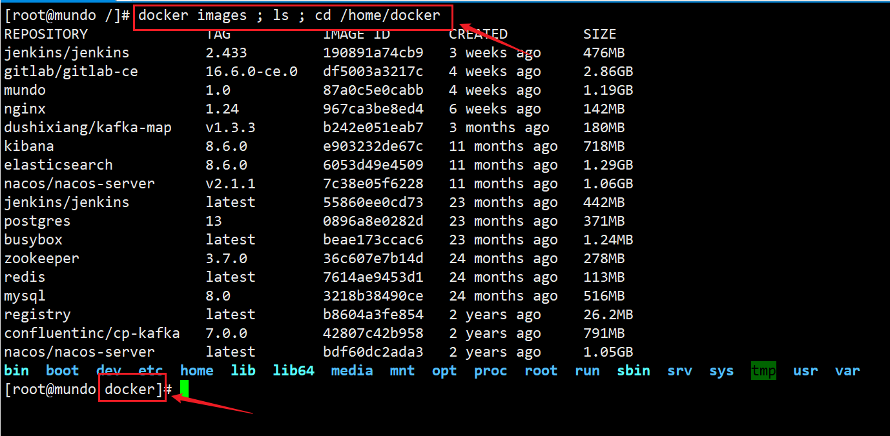
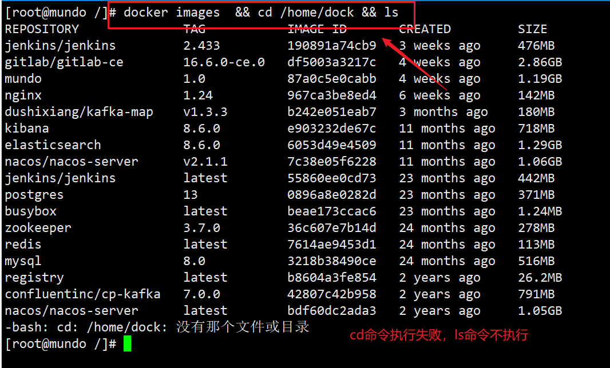
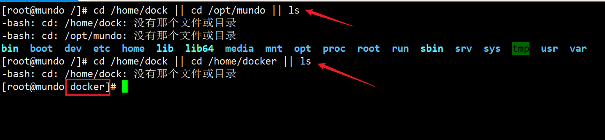

这个是在做定时任务监控的任务中所用到的知识，做一下整理。

我想在Linux里用一条命令完成多条操作，命令该如何写？

可以使用分号把多个命令串联在一起；

```bash
command1 ; command2 ; command3
```



用分号分隔，无论前一个命令执行成功还是失败，后面的命令都会继续执行。

如果希望前一个命令执行成功才执行后一个命令，可以使用 && 串联命令

```
command1 && command2 && command3
```



如果希望只有前一个命令执行失败了，后面的命令才继续执行，如果前一个命令成功，后面命令不执行，可以使用双竖线 || 来串联命令。

```
command1 || command2 || command3
```



如果想在一台主机，通过ssh连接到另一台主机，然后在那台主机执行命令，想用一行指令完成的话，应该这么写：

```bash
ssh [username]@[remote_host] "[remote_command]"
```

这里的 [remote_command] 也可以使用上面的命令串联方式，把多条命令串联到一块。