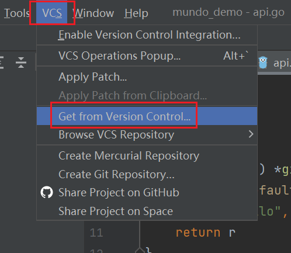
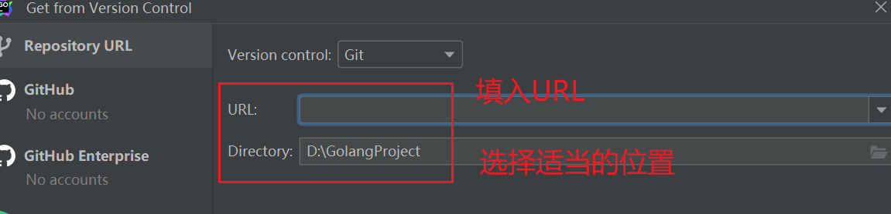

### 拉取代码

首先你要知道公司代码的地址（例如https://example.com），然后电脑里需要下载好git。

如果使用命令行，你想把代码放到哪个路径下，就在哪个路径下执行下面命令：

```shell
git clone https://example.com
```

会生成一个新的文件夹，一般与远程代码库名相同，代码就在这个文件夹下。

如果使用IDE，如Goland，顶部菜单栏选择VCS（或者Git），选择 "Get from Version Control"，粘贴代码地址，选择目标文件路径，点击clone即可。





有的公司对代码拉取环节要求做一些额外的操作，比如配置公钥和私钥，这里先解释一下概念：

首先，每个开发人员都有自己的公钥和私钥，它们都属于秘钥，公钥需要放到公共平台上，而私钥自己保留。

**公钥：**加密数据，只有对应的私钥才能解密数据，这确保了在拉取或推送代码时，系统可以确认你的身份。

**私钥：**生成签名，只有对应的公钥才能验证签名，这就保证了在推送代码的数据传输过程中不会被篡改。

一般，我们需要用SSH密钥生成工具（如ssh-keygen），生成ssh密钥对，然后把生成的公钥放到代码托管平台上；在本地配置SSH时，将私钥与代码托管平台上的公钥相关联，配置完成，就可以正常使用Git了。

### 多分支开发

这个地方因公司而异，主要看公司对于代码分支的控制是怎样的，**需要看公司关于这个方面的文档**。

以我的上一家公司为例，分支是以任务为单位的，命名规范是：`feature_20231029_errorcode`

所有开发分支都需要以 feature_ 开头，然后加上创建分支当天的日期，最后加上任务的大致描述。

发行分支是release，我们在feature分支开发的代码经过联调、测试后，就可以合并到release分支了。

如果使用命令行操作，拉取新分支以及合并到release步骤如下：

1. 切换分支到release

    ```shell
    git checkout release
    ```

2. 拉取release分支的最新代码

   ```shell
   git fetch
   git pull
   ```

2. 创建并切换到新分支：

   ```shell
   git checkout -b [branch_name]
   ```

3. 推送新分支到远程仓库：

   ```shell
   git push origin [branch_name]
   ```

4. 建立上下游关系：

   ```shell
   git branch --set-upstream-to=origin/[branch_name]
   ```

6. 也可以把上面两步骤合并，直接这样写：

    ````bash
    git push --set-upstream origin [branch_name]
    ````

8. 查看当前分支关联的远程分支

    ```bash
    git status -sb
    ```

8. 完成代码修改后，拉取release分支修改进行变基操作：

    ```shell
    git pull origin release --rebase
    ```

9. 解决上面变基操作中可能出现的代码冲突，然后找更高权限的人把本分支的内容合到release。

10. 这个分支一旦合并到主分支，就作废了，如果要再次做修改，重新从release拉个分支下来。