### git log

要查看特定分支的提交日志，可以使用以下命令：

```shell
git log [branch_name]
```

使用  --oneline  选项简化提交历史的输出，只显示提交的哈希值和提交信息：

```shell
git log --oneline [branch_name]
```

如果只想查看最近的几个提交，可以使用以下命令：

```shell
git log --oneline -n 5 [branch_name]
```

比如这样就是看前五条提交。

如果不填 [branch_name] ，默认是查看当前分支的。

### git reflog

这个命令可以查看当前仓库的所有操作记录，包括提交、合并、删除分支等一切操作，拿到他们的哈希值，以便在需要时找回之前误操作的提交，恢复之前的工作状态。

你可以查看某一分支的reflog，可以看到当前分支所有操作的哈希值。

```shell
git reflog <branch_name>
```

同样，你也可以指定看最近的几条操作记录，例如查看最近5条操作。

```bash
git reflog <branch_name> -n 5
```

例如，如果意外删除了某分支，可以这样操作恢复：

```shell
git checkout -b new-branch-name <hash>
```

在使用 git reflog 时，建议**后面跟着分支名**，不然可能会出现不同操作拥有同一哈希值，造成混淆。

**git reflog 和 git log 的区别是什么？**

git log只能看到你当前分支的提交记录，以及merge、rebase的记录。

git reflog可以看到所有分支的记录，包括commit、merge、rebase、checkout、pull、reset、新建分支、删除分支等所有操作记录。

### git reset

git reset有三种模式：soft、mixed（默认）和hard

我们这里用编译器演示一下这三种情况的区别：

```bash
git reset --soft <hash>
```

首先我们这里做了两次本地提交，第一次提交了hello.go，第二次提交了duck.go，使用 git reflog 查看操作记录。

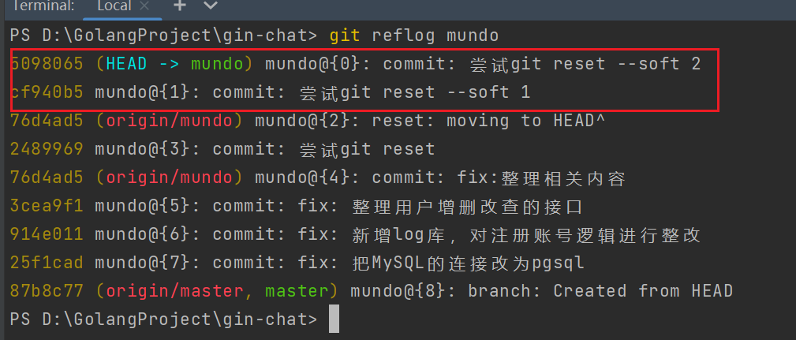

使用 git log -n 5 --oneline 查看提交记录

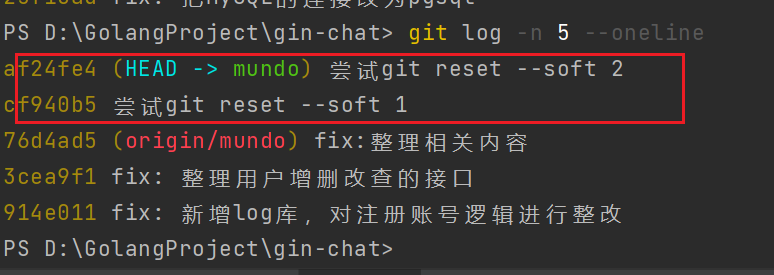

然后我们想把这两次本地提交都用soft模式撤销掉，要使用想撤销的第一条指令**前面那条**的哈希值

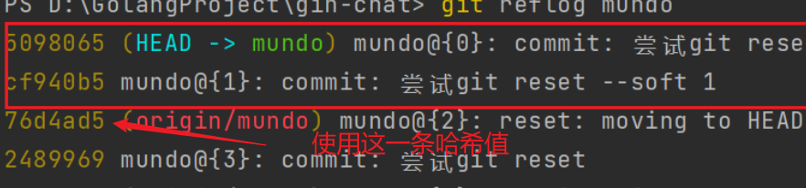

```bash
git reset --soft 76d4ad5
```

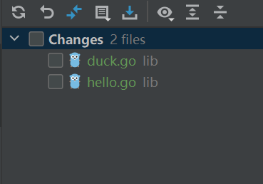

这两次提交回到了未add的阶段。

再次查看 git reflog ，看到了这条操作记录

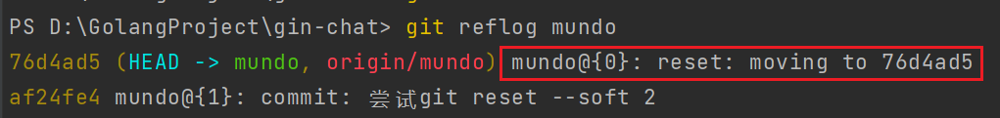

查看`git log -n 5 --oneline`：

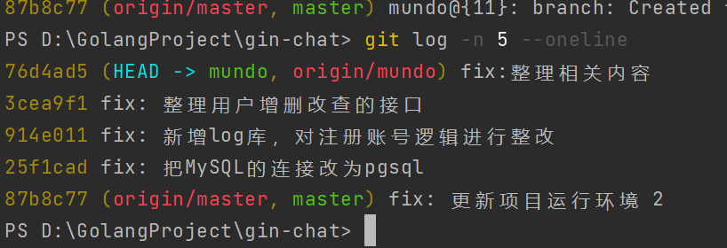

最新的两条提交记录已经没了。

重新提交，测试mixed模式，还是要注意使用的是提交记录之前的那一条操作的哈希值

mixed模式是 git reset 的默认模式，所以可以不用加参数

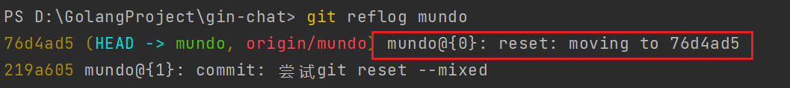

恢复完毕

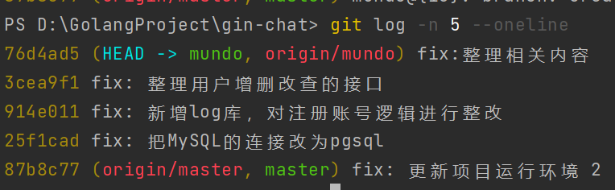

提交记录也恢复了

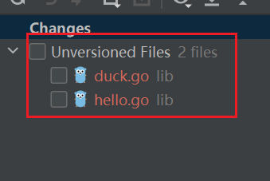

这里多出了两条 Unversioned Files，我们可以选择添加它们到git，或者是丢弃它们。

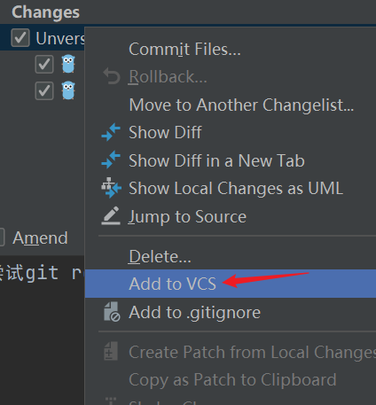

最后测试hard，使用 git reset --hard后：

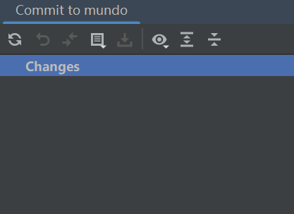

提交记录彻底没有了。

如果我们在 git commit 后又执行了 push 操作，你的 reset 操作只会影响本地，而不会影响远程。

但是这时候，因为你把提交记录收回了，所以你再往远程推的时候，远程会拒绝，因为远程有一条你本地没有的提交记录。

这种情况，也可以使用下面命令进行强制push：

```bash
git push --force
```

`git reset`不仅可以回退提交，还可以回退 merge、cherry-pick 拉来的更改。

### git revert

git revert 用于撤销一个或多个**已经提交**的Git命令，它会创建一个新的提交，该提交是原有提交的逆操作，从而不会改变原有的提交记录，它是一种安全的回滚提交的方式。

我们这里进行了三次 commit 和 push 操作，使用 git reflog 和 git log 看到了这些提交操作。

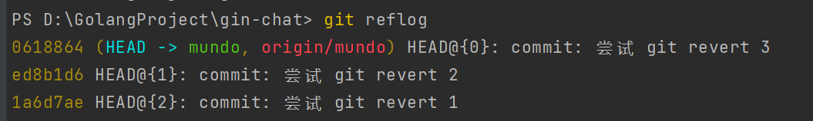

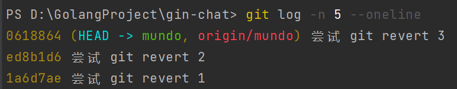

现在想撤销最近一条提交

```bash
git revert 0618864
```

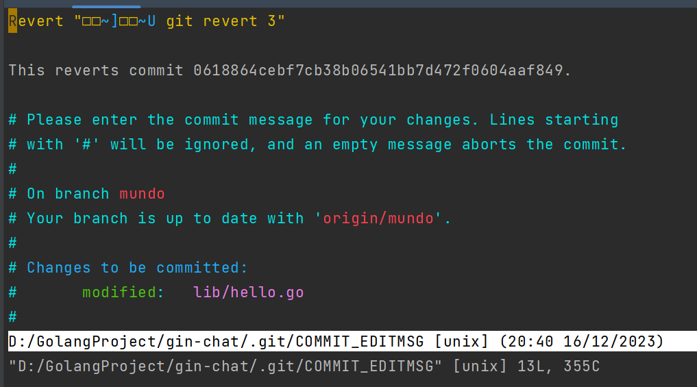

会出现一条这样的框，按照Linux对vim的退出操作，冒号+Q退出即可。

然后我们看 git reflog 的结果，是产生了一条新的 revert 纪录。

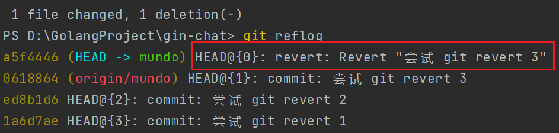

git log 也是如此，是产生了一条新的 revert 记录

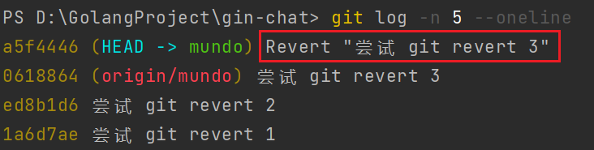

这样我们使用 git push 再去进行推的操作，就不会产生冲突了。

建议使用 git revert 代替 git reset 操作，因为前者产生的提交记录更加清晰线性，也避免了提交拒绝的问题。

接下来我们也要撤销剩余的两条提交，可以使用下面的语句：

```bash
git revert ed8b1d6 1a6d7ae
```

如果在一开始，我们就想一起撤销这三个提交，也可以这样进行区间操作：

```bash
git revert <start-commit-SHA>^..<end-commit-SHA>
```

这里的顺序是：先提交的为start，后提交的为end。

注意一个问题，如果我们在上面这种情况，想撤销的不是最近一次提交，或者不包含最近一次提交，或者跳跃了中间的某次提交，可能会出现冲突问题，例如这种情况中，这三个提交都是同时修改了同一个文件，就会产生冲突。

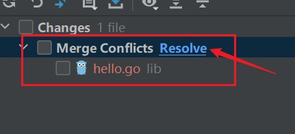

这里会弹出冲突文件，我们点击resolve，选择merge

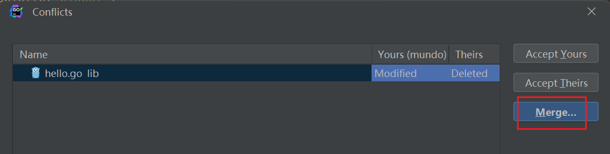

解决冲突后，我们使用下面命令，继续 revert

```bash
git revert --continue
```

当然，如果我们不想解决冲突，想终止这次 revert，也可以使用下面命令

```bash
git revert --abort
```

