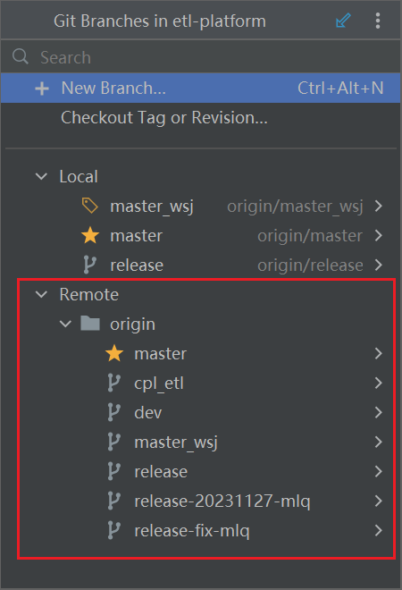
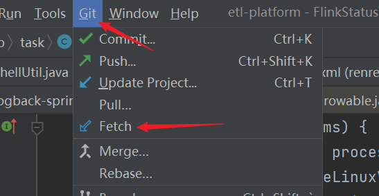

### git stash

临时存储当前工作目录中的更改，在临时切换分支或中断工作时很好用。

临时存储修改未commit的信息

```bash
git stash
```

需要message的临时存储修改

```bash
git stash save "stash message"
```

列出所有存在的stash

```bash
git stash list
```

查看指定stash的更改文件

```bash
git stash show stash@{1}
```

恢复最后一次stash并从list中删除

```bash
git stash pop
```

应用某一次的stash

```bash
git stash apply stash@{1}
```

删除某一个stash

```bash
git stash drop stash@{1}
```

清空stash

```bash
git stash clear
```

注意，在`PowerShell`中，`@`和`{\}`是元字符，需要用引号把整个参数包裹起来，例如这样：

```bash
git stash apply 'stash@{1}'
```

### git cherry-pick

例如，要将某特性分支（feature）上的某个提交应用到主分支（release）上，执行以下步骤：

1. 切换到主分支：

   ```shell
   git checkout release
   ```

2. 查看特性分支上的提交历史，并找到要 cherry-pick 的提交的哈希值：

   ```shell
   git log --oneline feature
   ```

3. Cherry-pick 特性分支上的某个提交：

   ```shell
   git cherry-pick <commit-hash>
   ```

如果出现冲突，Git会中止流程并提示冲突的文件。需要手动解决冲突，然后使用下面命令继续提交。

```bash
git cherry-pick --continue
```

或者使用下面命令放弃 cherry-pick 操作。

```bash
git cherry-pick --abort
```

### git fetch

git fetch 用于从远程仓库获取最新的代码更新，但不会合并到你的当前工作分支。它更新你本地仓库的**远程分支引用**，使你能够查看远程仓库的最新提交情况。

相当于对下图部分的更新。



然后你可以选择使用 git pull（在可视化界面叫update）更新你的代码。

默认情况下 git fetch 只会更新你当前所在分支的远程分支引用，如果想更新全部分支，使用以下命令：

```bash
git fetch --all
```

在获取最新代码的同时，删除本地不存在于远程仓库的分支

```bash
git fetch --prune
```

在IDE中，选择这个选项，可以起到 git fetch --all 的效果。



