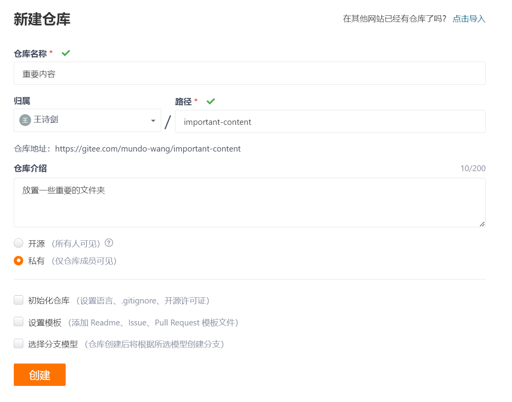
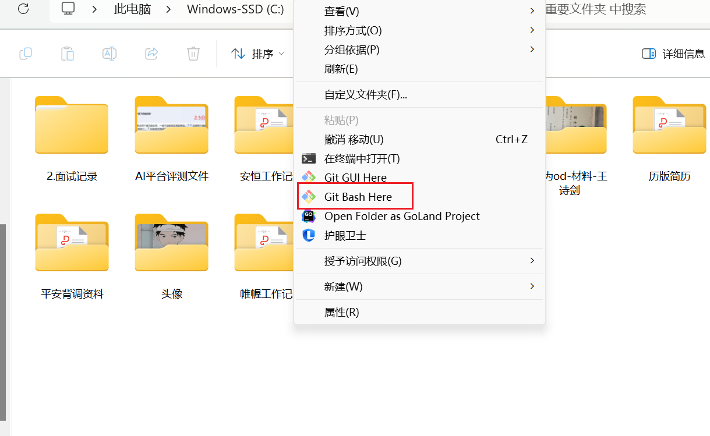
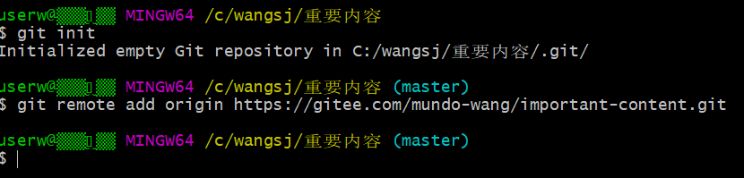
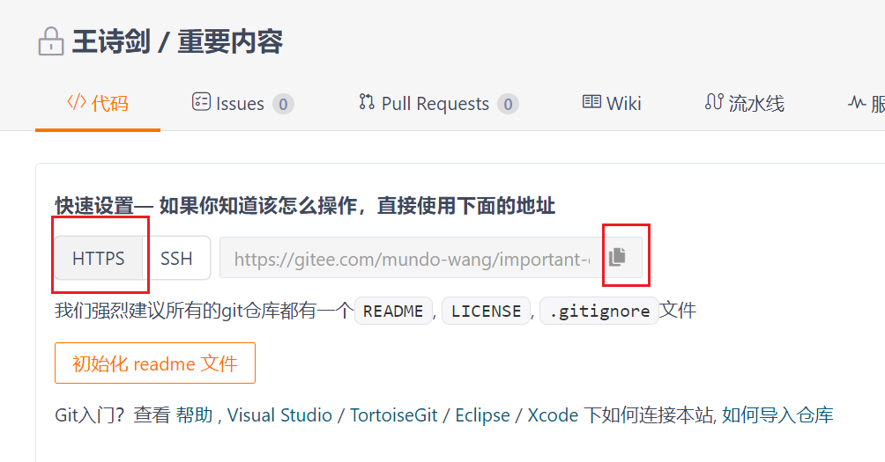
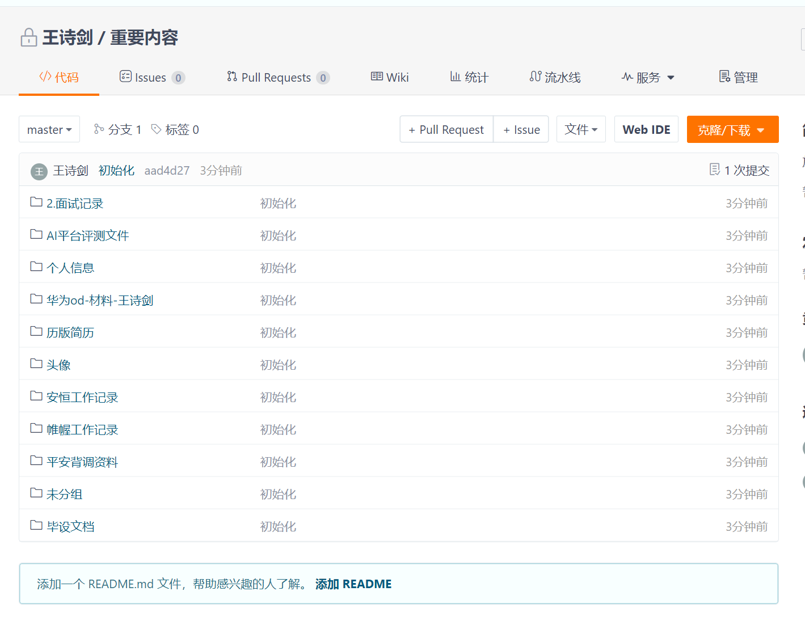

以gitee为例，首先建立一个仓库



这里，如果是要存一些私密内容，记得要选择私有。

找到想保存到git的文件夹，右键，选择 git bash



操作以下命令：

```shell
git init
git remote add origin https://gitee.com/mundo-wang/important-folders.git
```



一般在执行完git init后，本地git就会生成一个分支，名字叫master。

里的地址就是gitee仓库的地址，这一步也许需要输入密码，输入gitee密码即可。



然后把该文件夹内容提交到远程仓库

```shell
git add .
git commit -m "你的提交消息"
git push -u origin master
```

这里的 git push -u origin master 将远程分支与本地分支关联，只需要操作一次，之后直接 git push就行。

执行完毕后，检查gitee内容，看看是否推上去了。



完成。

如果想在其他地方拿到这个gitee地址的内容，参考 readme.md 的内容。