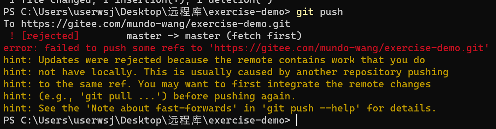
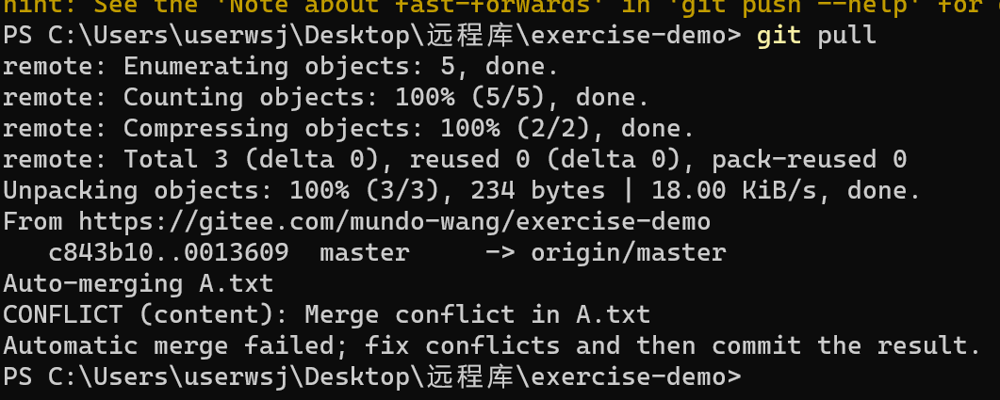
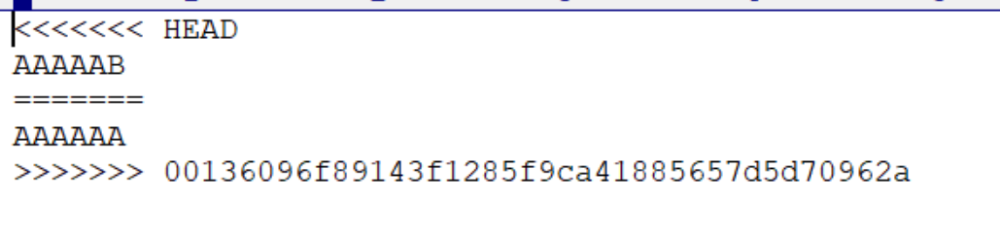
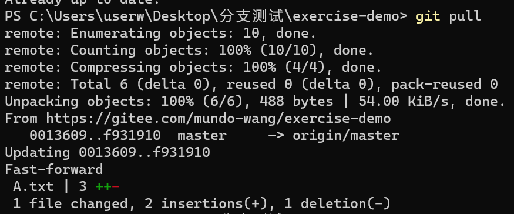

本地1修改A文件为AAAAAA，提交。本地2修改A文件为AAAAAB，执行提交操作。

远程服务器拒绝



提示表明，远程仓库包含了你本地没有的提交，所以需要你先把其他的提交拉取过来。



执行git pull操作时，发生了合并冲突，需要我们手动解决冲突。

打开A.txt文件，看到以下内容。



HEAD 到 ======= 之间的是本地2（当前分支）的本地修改，======= 下面的是远程仓库（本地1）的更改。

需要把文件修改为期望的状态，这里我们修改为 AAAAAB

然后重新 执行提交、push操作 ，就可以顺利把更新内容推到远程了。

建议在本地修改完代码后，就执行 git pull ，然后处理完冲突后再执行提交、push操作。

我们在本地1可以直接使用 git pull 拉取到本地2提交的修改。



在编译器（如Goland）里，解决冲突的步骤可以更加便捷高效地通过可视化界面执行。

这里讲一下，遇到这种远程分支有本地分支没有的提交，导致 push 失败的情况，都可以用以下命令解决

```bash
git push --force
```

但是不建议使用这个命令，因为可能会覆盖他人的提交。