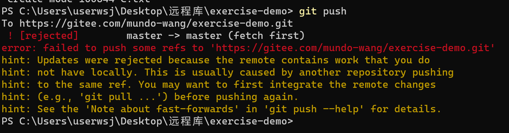
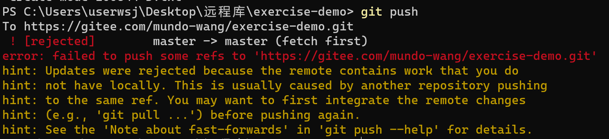

### 情况1

本地1创建文件C，输入内容CCCCC，推到远程。

本地2创建文件C，输入内容CCCCCD，尝试推到远程的动作。

远程服务器拒绝了。

其实这种情况，和上一节说到的“修改文件冲突”是一个类型的问题。出现这种情况后，解决冲突，重新提交即可。

### 情况2

本地1创建文件C，输入内容CCCCC，推到远程

本地2创建文件D，输入内容DDDDD，尝试推到远程的动作。

远程服务器拒绝了。

解决方法：还是一样，先git pull拉取一下远程代码，然后重新执行提交、推远程的动作。

思考：为什么明明两个本地不是新增或更改了同一个文件，不会产生冲突，但是推到远程时，也会被拒绝？

其实被拒绝的原因并不是有文件冲突，而是远程分支有当前本地分支没有的提交，分支间存在差异。试想一下，如果这种情况，远程服务器没有拒绝提交，那么远程分支应该是A、B、C、D四个文件，还是A、C、D三个文件呢？有歧义。

所以我们在本地做修改后，想推到远程分支前，一定要记得先拉取一下最新的远程代码，如果有冲突要先解决冲突，然后再推到远程分支，这样就不会出错了。