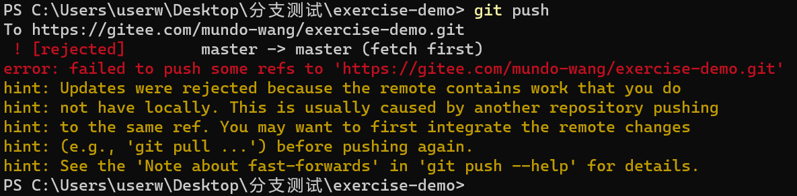
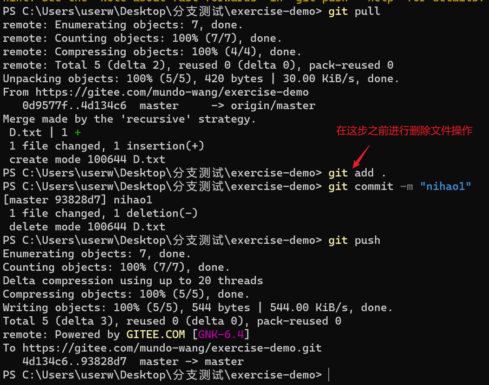

在上一节的 情况2 中，本地1新增了C文件，推到了远程，远程是A、B、C三个文件；本地2新增了D文件，那么本地2使用git pull拉取远程分支文件后，它的文件结构是怎样的？文件D会消失吗？

答案是不会，本地2会有文件A、B、C、D四个文件。

本地2推到远程后，我在本地1里，把文件C删除掉，只留下文件A、B，提交代码，推到远程。

被远程服务器拒绝了。

这里被拒绝的原因，并不是本地1删掉了文件，而是本地2做了推的操作，在远程分支有一条操作记录，而这条记录并不在本地1中，所以本地1需要先git pull，，把这条操作记录拉取过来，再删除文件，执行提交与推的操作。

这样就可以提交上去了。

所以，同理可知，如果本地1操作后，本地2没有进行git pull，就新增、修改或删除内容进行了提交，也会出现被远程服务器拒绝的提示。

现在本地2是有A、B、C、D四个文件，而远程服务器只有A、B这两个文件，那么本地2执行git pull后，本地2的C、D文件将会被减掉，和远程分支保持同步，这一点和开头说的那个情况有所不同。