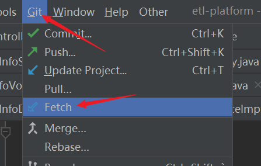
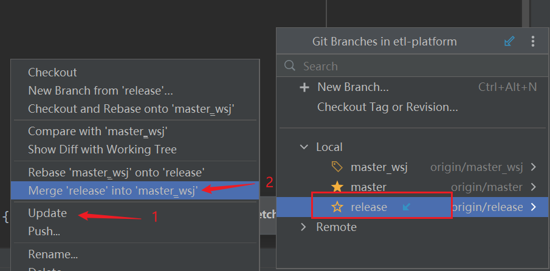
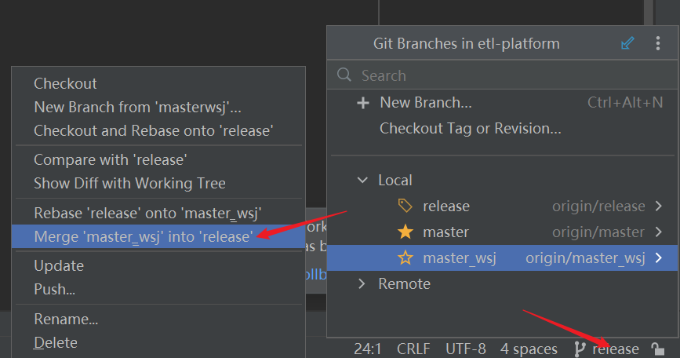

上节我们说到一个会引起 push 失败的情况，这种情况要避免，要在本地就处理好这个事情。

在本地1修改代码，提交远程，合并到master之后，本地2应该做的操作是：

1. 切换到master分支，git pull **更新**本地2的master分支代码。
2. 切换到dev_local2分支，git merge master，如果有冲突需要解决冲突，然后再push到远程。
3. 切换到master分支，git merge dev_local2，然后push到远程。

总结下来就是一次 pull，两次 merge。

冲突放到个人分支解决，不要放到master分支解决。

如果是在编译器上，如IDEA，需要这样操作：

提交自己分支代码前，先执行

然后如果看到这里有蓝色向下小箭头，代表远程有更新，需要先 update 再 merge。

操作完上面步骤后，执行commit、push操作，把本地代码修改与从 release 分支 merge 过来的内容推到远程。

然后切换分支到release，把个人分支的更改merge过来

这个步骤有些公司会有规范，要在平台提交工单去合并个人分支到release，按照公司要求操作就行。

删除、新增同理，只要记住这个操作步骤，一般都不会错。