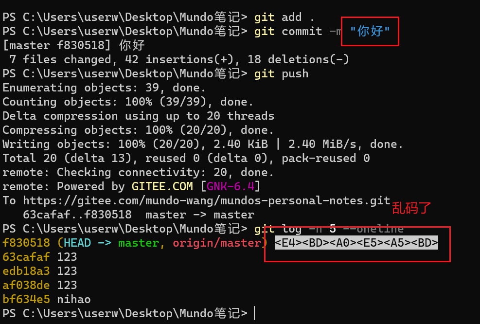
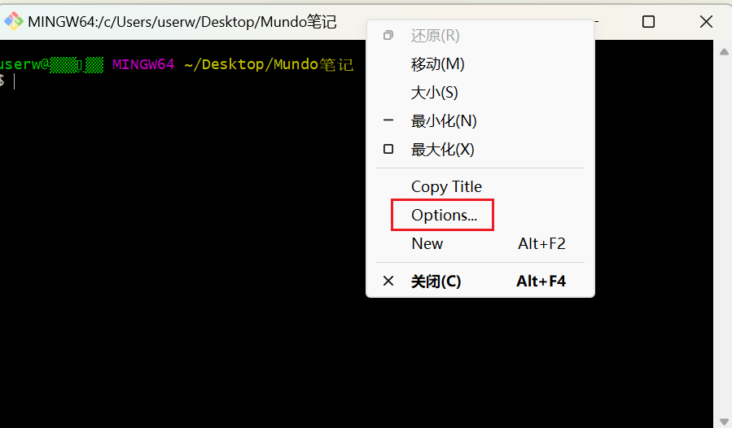
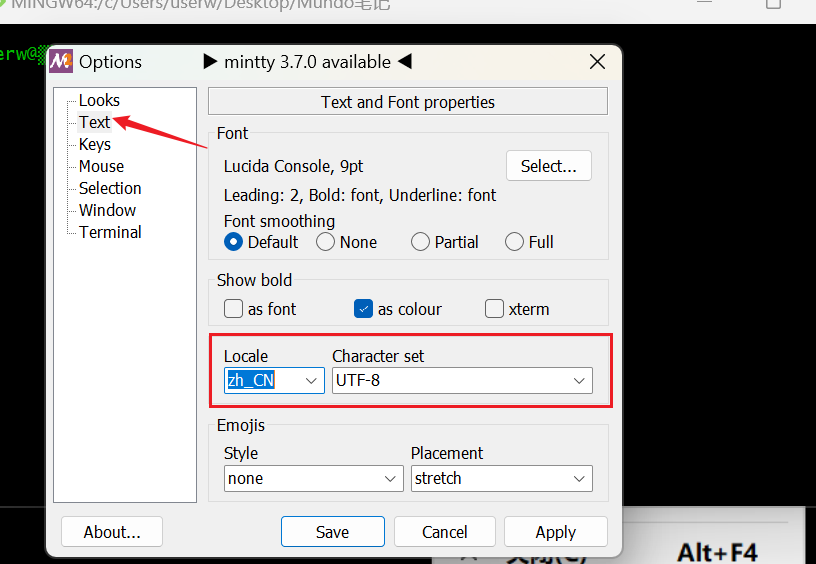
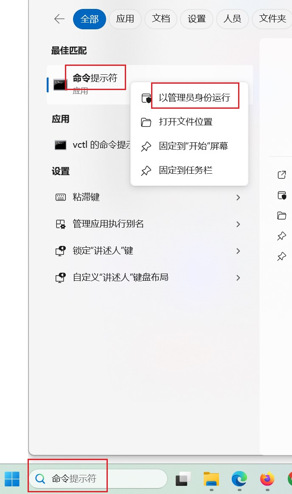
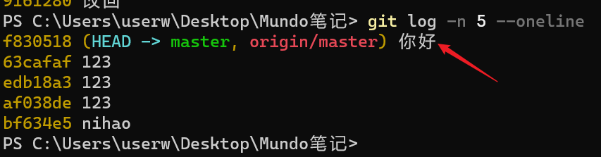
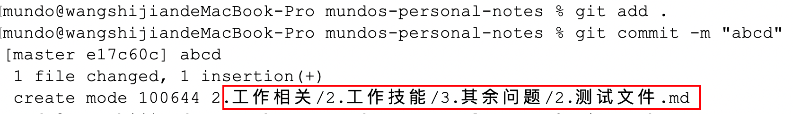

使用 git commit 提交的内容如果有中文，在使用 git log 查看提交记录时，可能会出现乱码



打开 git bash ，选择options



按照下面的操作，选择



然后在终端执行以下几行命令：

```bash
git config --global core.quotepath false 
git config --global gui.encoding utf-8
git config --global i18n.commit.encoding utf-8 
git config --global i18n.logoutputencoding utf-8 
```

想在Windows cmd环境永久生效，需要再执行以下命令：

```bash
setx "LESSCHARSET" "utf-8" /m
```

这个需要管理员权限，首先在Windows11搜索框搜索一下“命令提示符”，以管理员身份运行。



在出现的窗口运行上面的命令，完成操作。

然后重启cmd窗口，或者IDEA等编译器，再次操作



中文正常显示


Mac环境如果出现乱码问题，如何解决？解决方式非常简单！

只需要执行这样一行命令：

```bash
git config --global core.quotepath false
```



直接让中文正常显示！