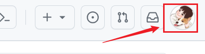
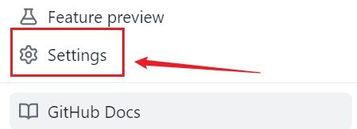
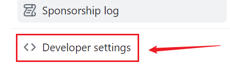
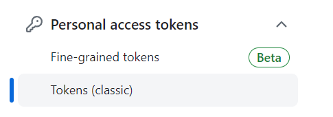
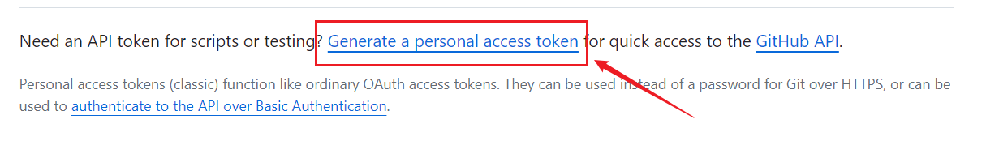
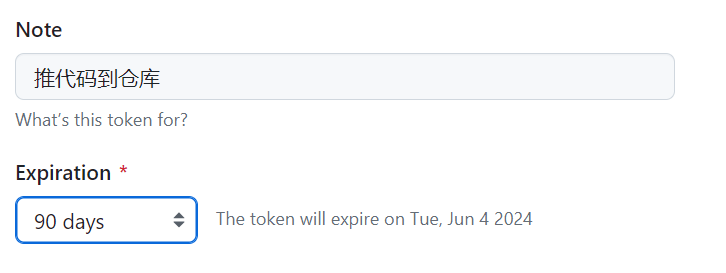
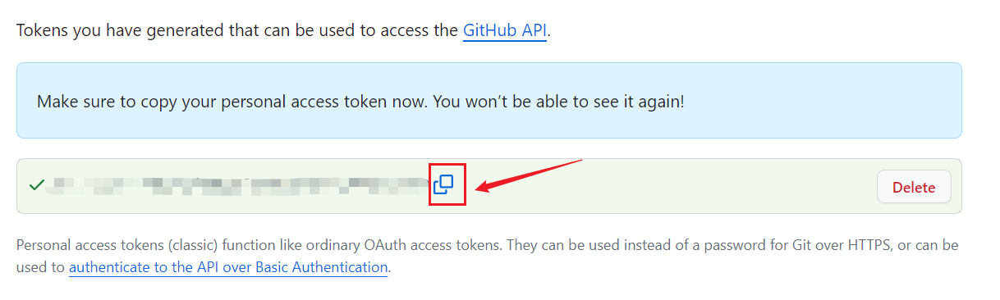
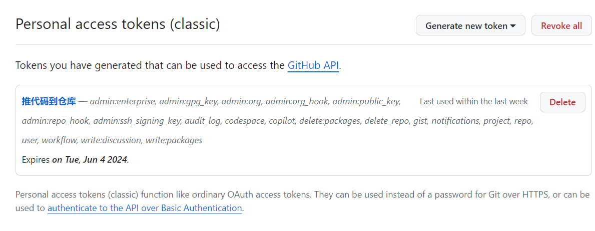

参考文章：https://docs.github.com/en/authentication/keeping-your-account-and-data-secure/managing-your-personal-access-tokens


当我把一些文件内容托给GitHub平台管理时，在初始化仓库时出现了这样的报错。

具体的报错信息在下方：

```sh
PS C:\Users\userw\Desktop\technical-notes> git push -u origin main
libpng warning: iCCP: known incorrect sRGB profile
libpng warning: iCCP: known incorrect sRGB profile
Logon failed, use ctrl+c to cancel basic credential prompt.
Username for 'https://github.com': userwsj@126.com
Password for 'https://userwsj@126.com@github.com':
remote: Support for password authentication was removed on August 13, 2021.
remote: Please see https://docs.github.com/get-started/getting-started-with-git/about-remote-repositories#cloning-with-https-urls for information on currently recommended modes of authentication.
fatal: Authentication failed for 'https://github.com/mundo-wang/technical-notes.git/'
```

查阅资料，分析到这个报错是因为GitHub为了提高安全性，在2021年8月13日停止了对密码验证的支持，转而变为更安全的认证方法，例如个人访问令牌或者SSH密钥（公钥和私钥）。

我们这里采用个人访问令牌的方式。

具体要找到这个地方，首先先点击右上角的头像：



找到 settings：



拉到最后一个，找到开发者设置这一项：



选这个地方，第一个是细粒度token，不知道和第二个有什么区别，我先选第二个了。



点击这个地方进行获取：



这里需要输入一下密码。

设置备注和token有效期：



在底下选择这个token的权限，我这里就全选了。

然后点击生成，它自动给我们生成token，我们复制即可。



这个复制后要保存在一个安全的地方，因为退出这个页面后，这个token不会再显示了，如果没有记住token，需要重新生成。



这样，再往远程库推的时候，要求我们输入密码时，我们输入上面的token即可。