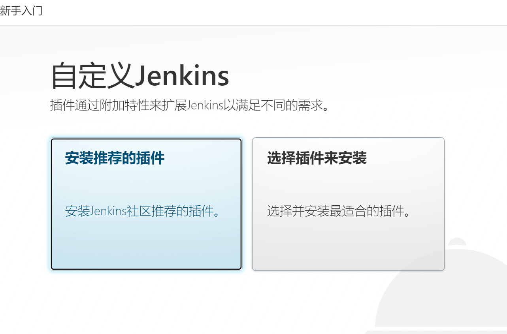
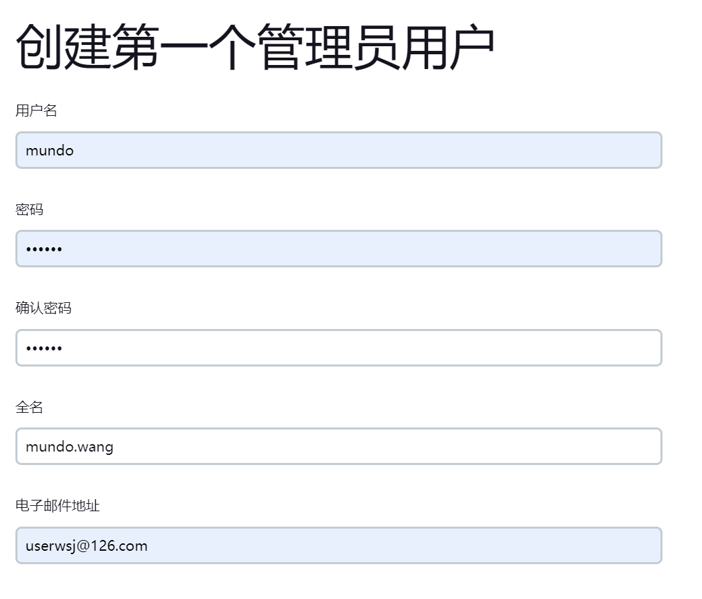
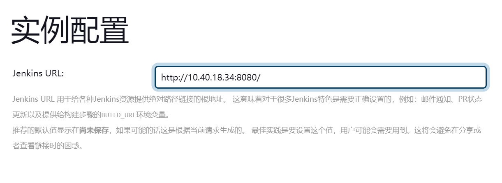

首先打开Linux终端，运行命令，拉取Jenkins镜像（这里先选择这个版本不要动）：

```shell
docker pull jenkins/jenkins:2.433
```

创建Jenkins容器，设置开机自启动：

```shell
docker run -d --name jenkins \
  -p 50000:50000 \
  -p 8080:8080 \
  -v /srv/jenkins:/var/jenkins_home \
  -v /var/run/docker.sock:/var/run/docker.sock \
  -v /usr/bin/docker:/usr/bin/docker \
  -u root \
  -e JAVA_OPTS=-Duser.timezone=Asia/Shanghai \
  --restart always \
  jenkins/jenkins:2.433
```

| 参数                                         | 描述                          |
| -------------------------------------------- | ----------------------------- |
| -p 50000:50000                               | 用于集群部署                  |
| -p 8080:8080                                 | 用于浏览器访问                |
| -v /srv/jenkins:/var/jenkins_home            | 设置主要数据目录              |
| -v /var/run/docker.sock:/var/run/docker.sock | 挂载宿主机的Docker套接字文件  |
| -v /usr/bin/docker:/usr/bin/docker           | 挂载宿主机的Docker可执行文件  |
| -u root                                      | 以root用户身份运行Jenkins容器 |
| -e JAVA_OPTS=-Duser.timezone=Asia/Shanghai   | 把时区修改为Asia/Shanghai     |
| --restart always                             | 设置容器开机自启动            |
| jenkins/jenkins:2.433                        | 使用的Jenkins镜像及版本       |

运行以下命令，获取Jenkins初始管理员密码

```shell
docker exec jenkins cat /var/jenkins_home/secrets/initialAdminPassword
```

这里的 jenkins 替换成自己对应的容器名。

打开浏览器访问宿主机的8080端口，例如

```
http://10.40.18.34:8080
```

输入上面获取到的初始管理员密码，完成登录，出现这样的页面。

这里我们点击“安装推荐的插件”，就可以了。



安装完成，创建账户：



实例配置这里不用动：



完成后，就可以使用Jenkins了！