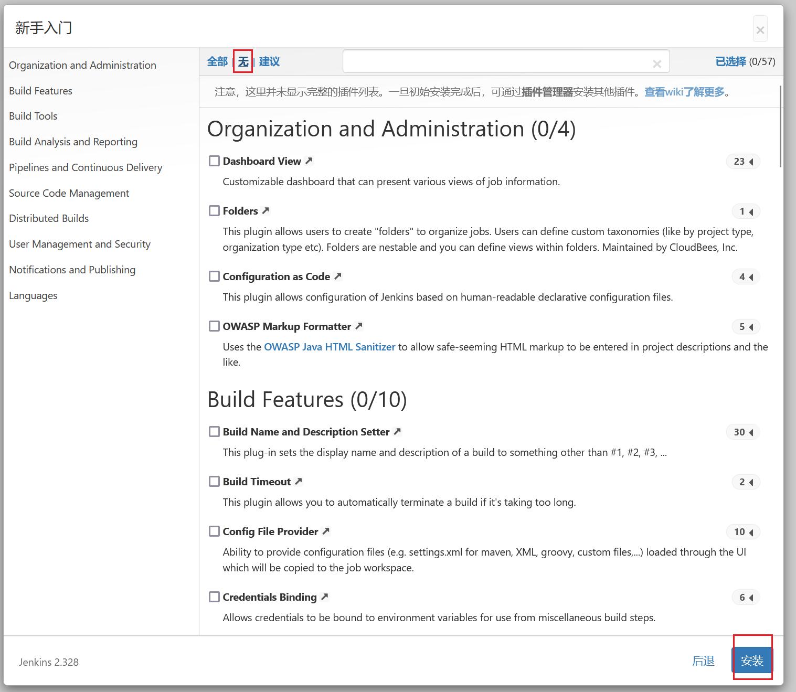
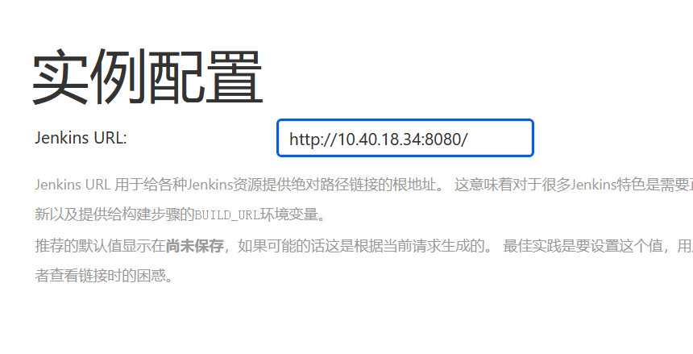
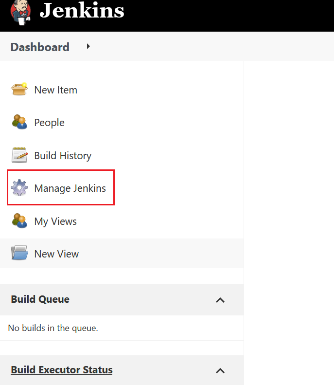
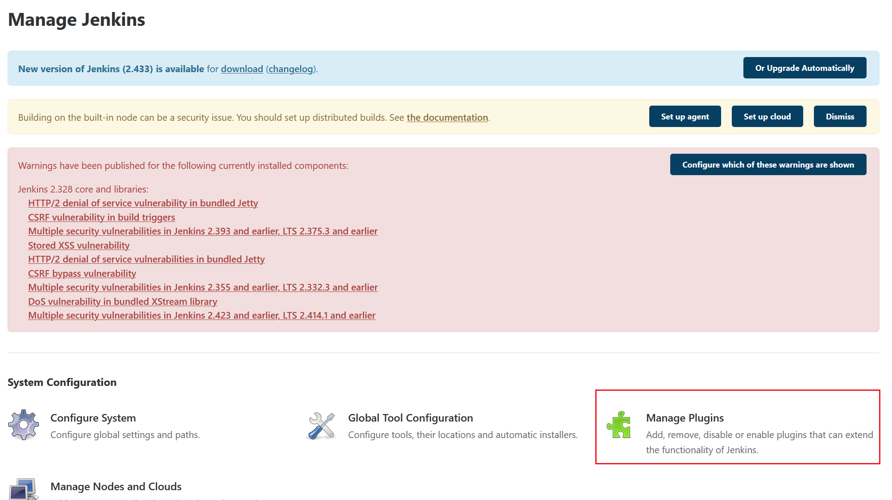
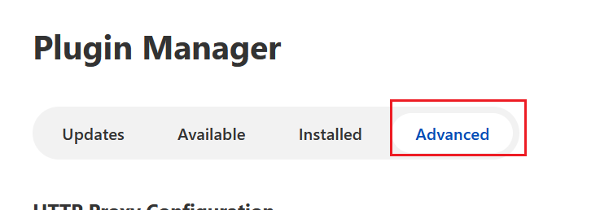
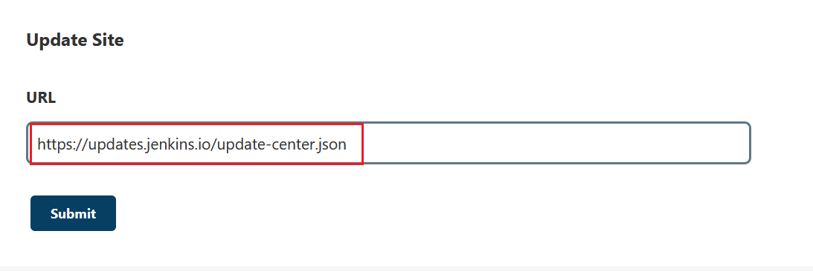
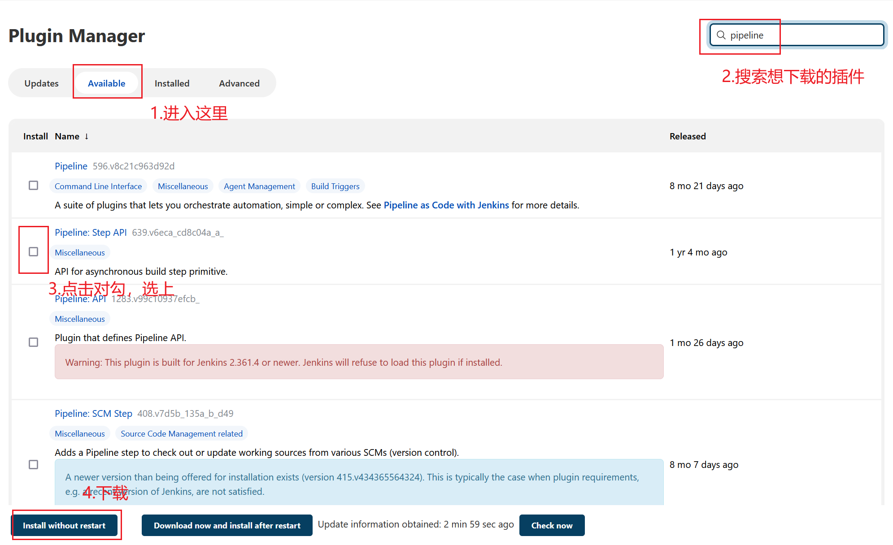

如果点击“安装对应的插件，出现插件安装失败的问题，**先检查一下是不是由于Jenkins版本导致的问题**。

如果不是版本问题，可以参考下面的内容进行处理：

可以重新启动一个容器，我们先点击“选择插件来安装”，然后点击“无”，先不安装任何插件。



接下来要我们创建管理员用户，自行创建即可。



实例配置这里不用动。

Jenkins启动后，我们修改Jenkins插件安装设置：








翻到最底下，把这个配置改了：



改成：

```
https://mirrors.tuna.tsinghua.edu.cn/jenkins/updates/update-center.json
```

然后修改服务器设置：

执行以下命令：

```shell
docker exec -it jenkins /bin/bash
cd /var/jenkins_home/updates
sed -i 's|updates.jenkins-ci.org/download|mirrors.tuna.tsinghua.edu.cn/jenkins|g' default.json
sed -i 's|updates.jenkins.io/download|mirrors.tuna.tsinghua.edu.cn/jenkins|g' default.json
sed -i 's|www.google.com|www.baidu.com|g' default.json
```

重启容器，重新登录Jenkins。

还是进入到插件管理，按照下面步骤操作：



