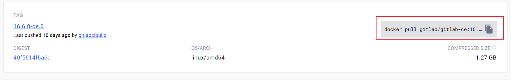
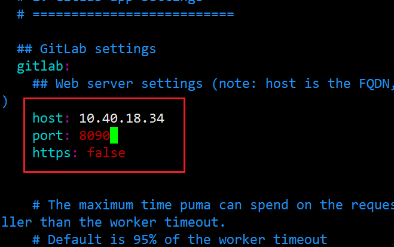
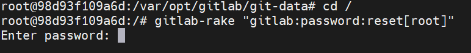
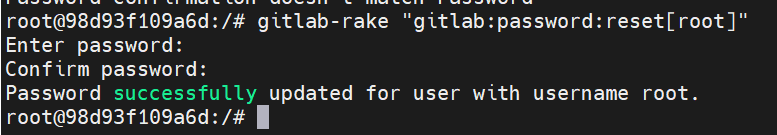
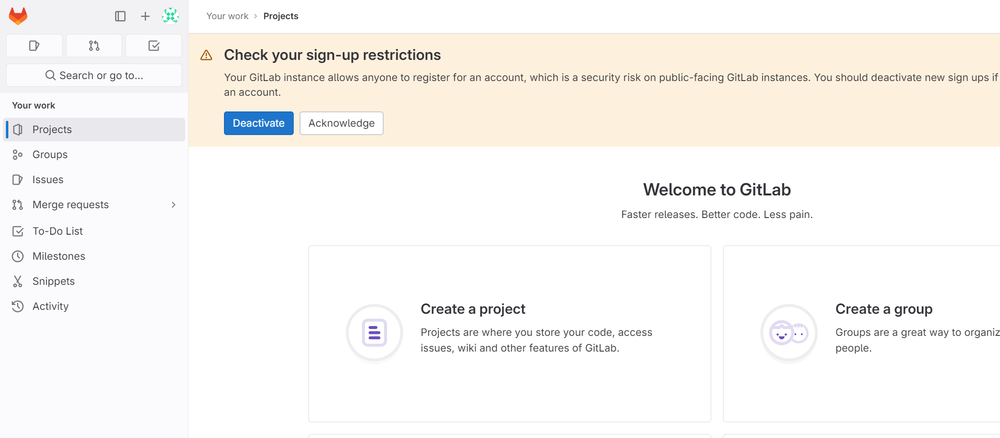
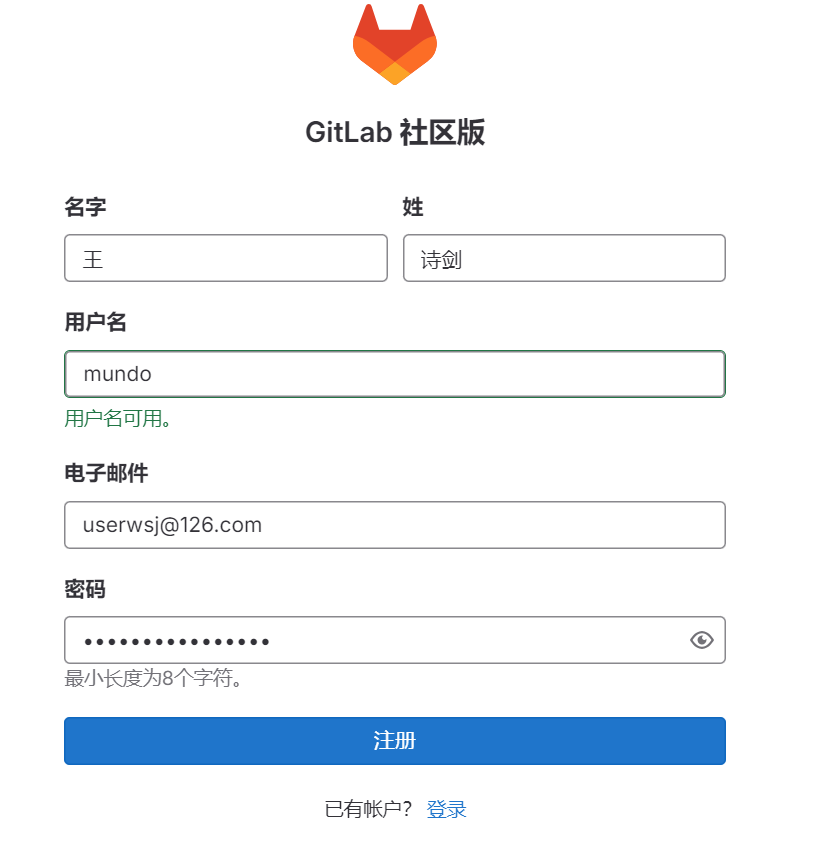
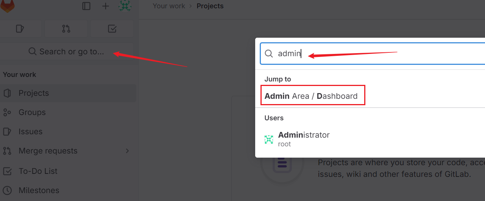
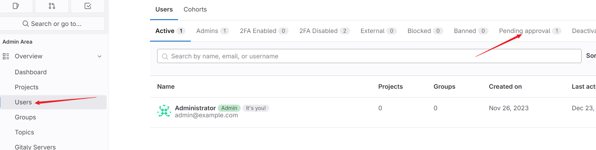
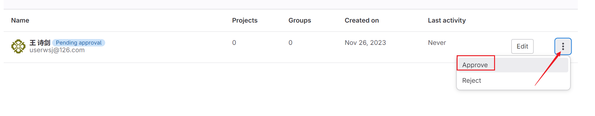

GitLab是一个基于Git的版本控制和协作平台，提供代码仓库管理、CI/CD集成、问题跟踪、团队协作等功能。它支持多种工作流程，包括敏捷开发和持续集成。

开源项目一般都放在GitHub，公司内部的项目就要放在GitLab。

下面说一下如何通过docker安装GitLab。

首先我们去 Docker Hub 上查一下gitlab的docker镜像


我们下载这个，这个也是stars数最多的。



我这里找了一个数字稳定版本的，复制docker命令，执行，拉取镜像。

```shell
docker pull gitlab/gitlab-ce:16.6.0-ce.0
```

启动gitlab容器：

```shell
docker run -d \
 -p 8443:443 \
 -p 8090:80 \
 -p 8022:22 \
 -v /home/docker/gitlab/etc:/etc/gitlab \
 -v /home/docker/gitlab/log:/var/log/gitlab \
 -v /home/docker/gitlab/opt:/var/opt/gitlab \
 --restart always \
 --privileged=true \
 --name gitlab \
 gitlab/gitlab-ce:16.6.0-ce.0
```

| 参数                                       | 描述                             |
| ------------------------------------------ | -------------------------------- |
| -p 8443:443                                | https通信通道                    |
| -p 8090:80                                 | http访问GitLab的入口             |
| -p 8022:22                                 | SSH访问GitLab的入口              |
| -v /home/docker/gitlab/etc:/etc/gitlab     | 容器目录挂载到宿主机，配置文件等 |
| -v /home/docker/gitlab/log:/var/log/gitlab | 容器目录挂载到宿主机，日志文件等 |
| -v /home/docker/gitlab/opt:/var/opt/gitlab | 容器目录挂载到宿主机，数据文件等 |
| --restart always                           | 设置容器开机自启动               |
| --privileged=true                          | 让容器获取宿主机root权限         |
| --name gitlab                              | 给容器起名                       |
| gitlab/gitlab-ce:16.6.0-ce.0               | 使用的GitLab镜像及版本           |

这样，docker容器就启动了。

接下来要对gitlab进行一些配置，首先，我们先在容器里安装vim

```shell
apt-get update
apt-get install vim
```

执行如下命令：

```shell
cd /etc/gitlab
vim gitlab.rb
```

修改文件中的IP和端口号，在文件最上方添加如下配置：

```shell
external_url 'http://10.40.18.34'
gitlab_rails['gitlab_ssh_host'] = '10.40.18.34'
gitlab_rails['gitlab_shell_ssh_port'] = 8022
```

host就是宿主机的ip地址，port就是上面创建容器时设置的ssh访问端口。

然后配置gitlab.yml文件

```shell
cd /opt/gitlab/embedded/service/gitlab-rails/config
vim gitlab.yml
```



改这个地方，host是宿主机的ip地址，port是创建容器时设置的http访问端口。

在容器内重启服务：

```shell
gitlab-ctl restart
```

输入：http://10.40.18.34:8090  登录gitlab，我们先改一下管理员的密码，因为第一次需要管理员登录。

首先，进入gitlab容器内部

```bash
docker exec -it gitlab /bin/bash
```

然后执行下面命令，执行后需要等待一段时间：

```bash
gitlab-rake "gitlab:password:reset[root]"
```

出现下图界面，连续输入两次密码：



改密成功，去gitlab进行登录

用户名：root

密码：userWsj445566!!!



出现此页面，表示登录成功！




这里注册一个用户账号：



注册后，登录管理员账号进行审核，审核通过后才可登录。

如何进行用户注册的审核？

登录admin账号，按照下面步骤操作，点击进入这个页面



选择下面这个界面



就看到我刚才注册的那个账号了，选择approve即可



退出admin账号，登录我自己注册的账号，即可进入gitlab。

gitlab启动要慢一些，开启宿主机后需要等5分钟再访问。

