在上一小节我讲了使用Jenkins进行一个简单gin接口的部署，但是我们每次更新代码，都要手动去Jenkins平台上重新进行构建，非常麻烦，这也和CI的要求不符。

所以我们要在Git上配置一个东西，保证能在代码提交操作之后，执行Jenkins的构建。

还记得之前我们在Jenkins上配置的shell命令吗？我们把这些命令写到文件中，推到远程仓库。

下面就是 deploy.sh 文件

```shell
kill -9 $(lsof -i:9000 -t)
go mod tidy
go build -o hello
export BUILD_ID=DONTKILLME
nohup ./hello > hello.log 2>&1 &
sleep 5
ps aux | grep hello
```

比之前在Jenkins里配置的多了第一行，这一行代码的作用是查找占用9000端口的进程的进程id，传递给kill命令进行强制终止。

我们需要再下载一个工具（lsof是用于列出系统中已经被打开的文件的工具）

这个务必下载，否则构建虽然是成功的，但是上次的进程没有杀掉，读不到代码的变化

```
apt-get install lsof
```

这样的话，Jenkins上执行shell那里改为

```shell
bash ./deploy.sh
```

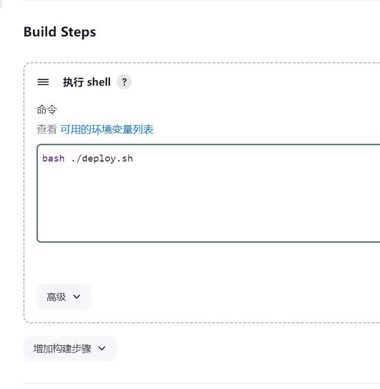

在插件搜索，搜索gitee进行安装

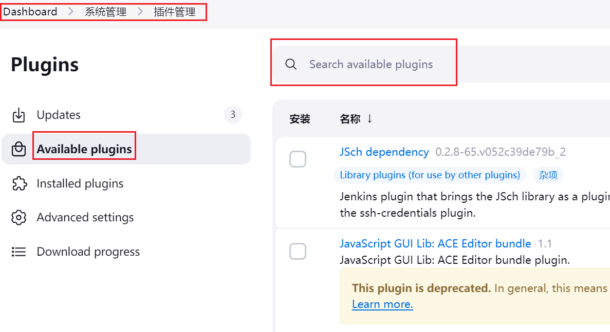

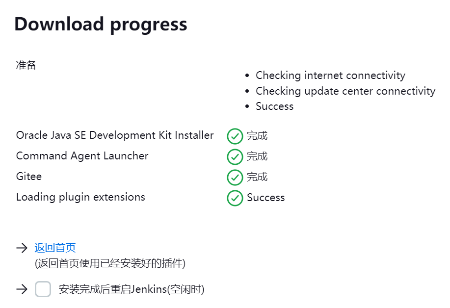

安装成功！

然后先配置Jenkins对Gitee的webhook接收地址

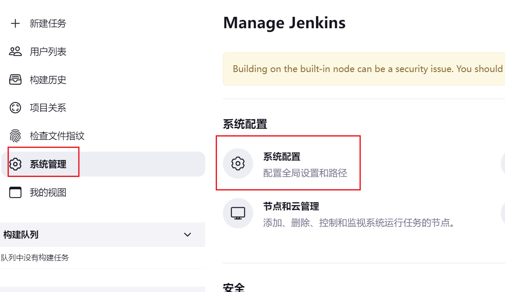

拉到下面就能看到Gitee配置，按照下图进行操作

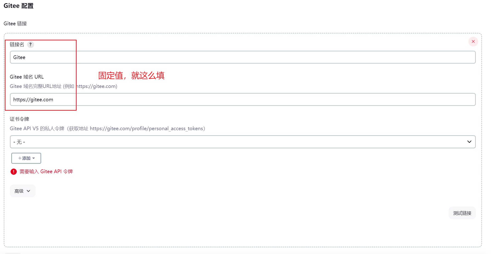

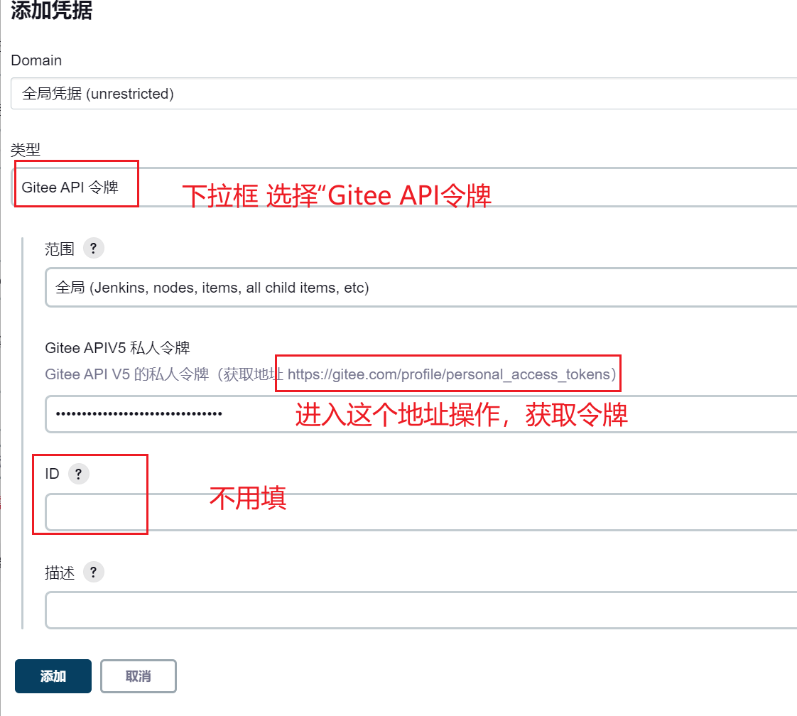

然后点击右下角的“测试链接”，看到成功二字，说明配置成功了。

点击保存，把这个配置保存下来。

然后进入之前建立的构建，配置“构建触发器”

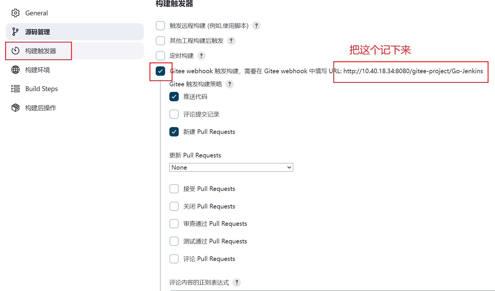

进入Gitee，找到webhooks，点击添加webhook

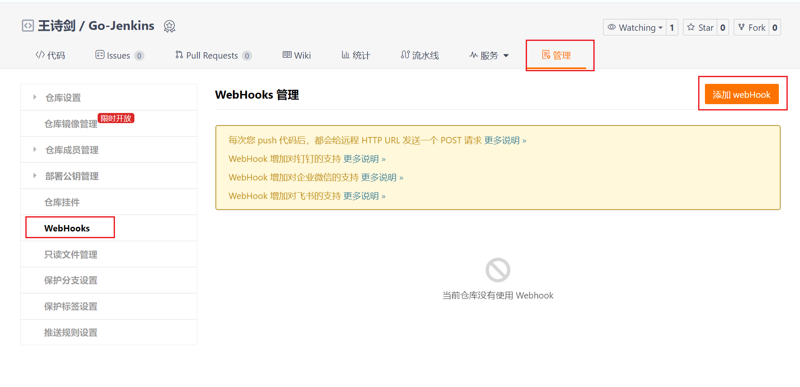

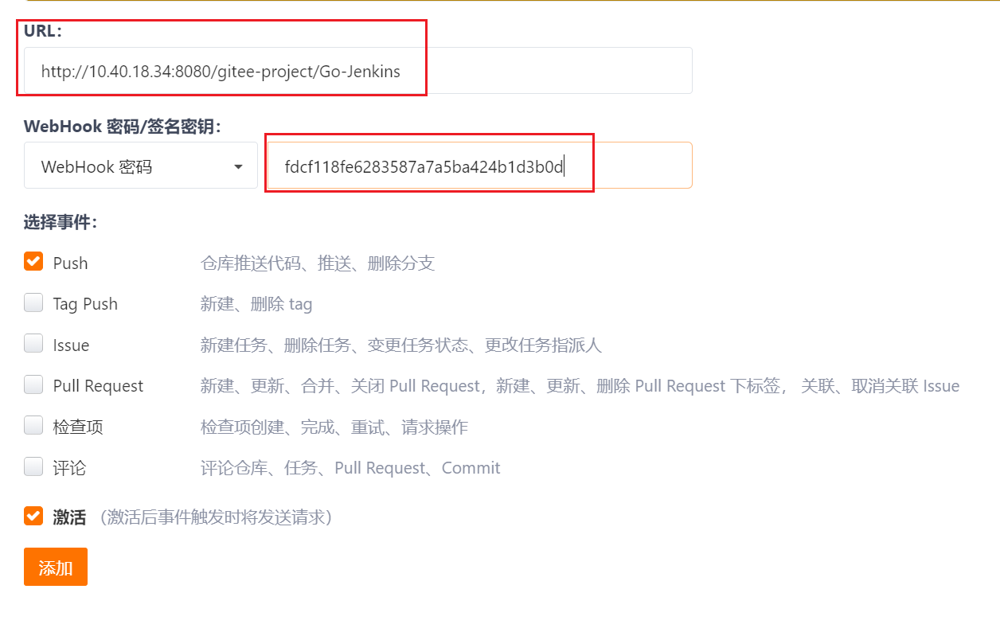

这里的webhook密码是在Jenkins里手动生成的。

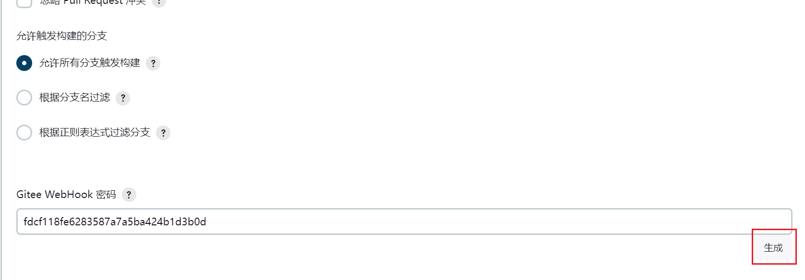

这里添加会失败，因为Gitee只能接受公网地址，我这个是我的虚拟机，属于内网地址。

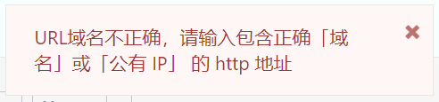

所以我需要使用一些方法让我的虚拟机ip地址可以被公网访问。

或者使用同样是内网的gitlab，也可以访问内网的Jenkins。

这里我将创建一个gitlab项目，和jenkins来一个更完整的演示。